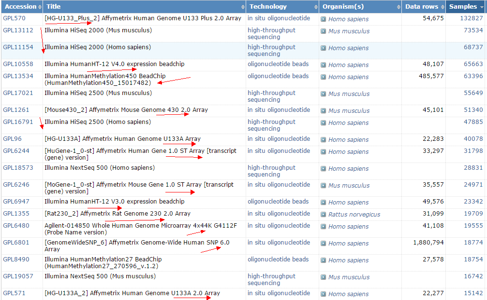
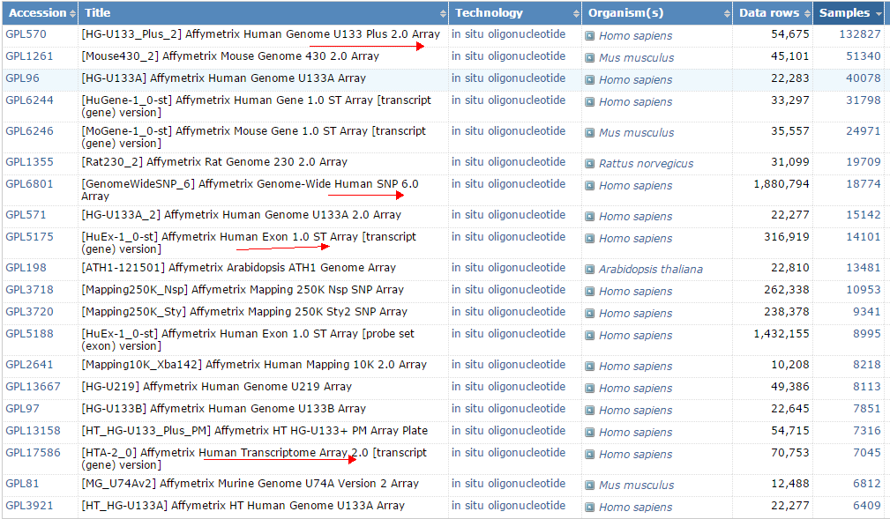
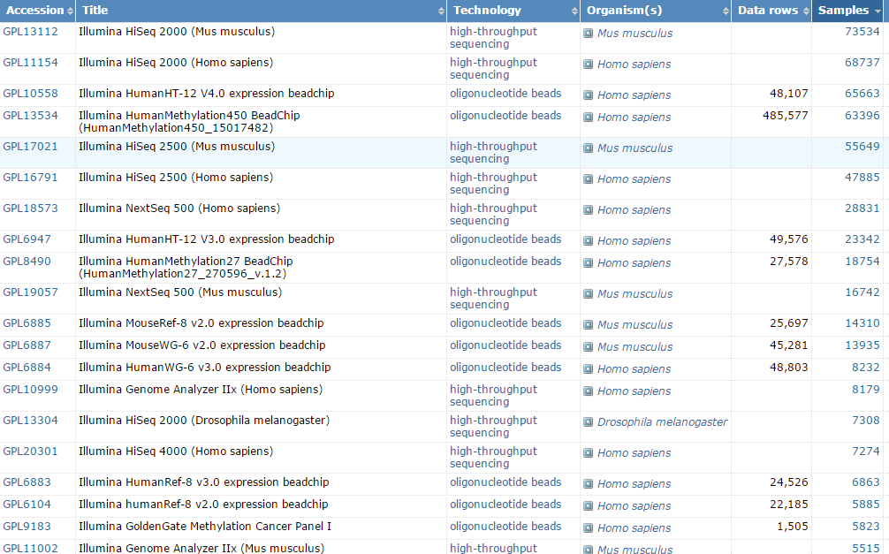
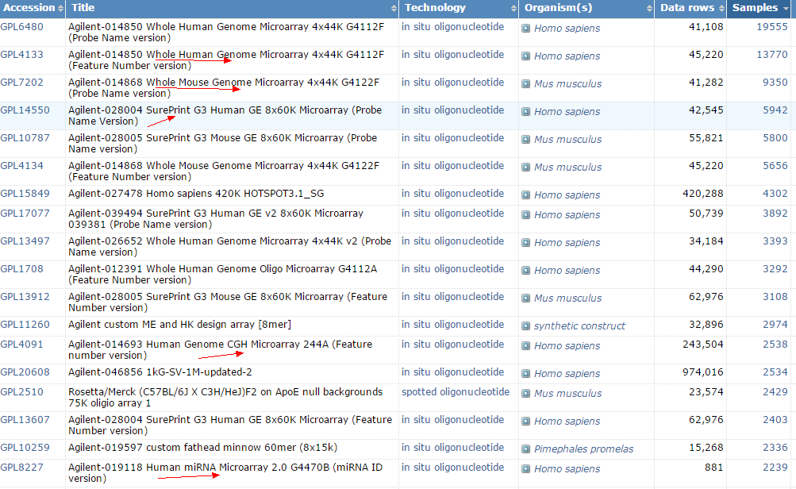
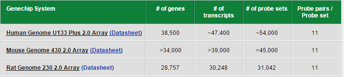
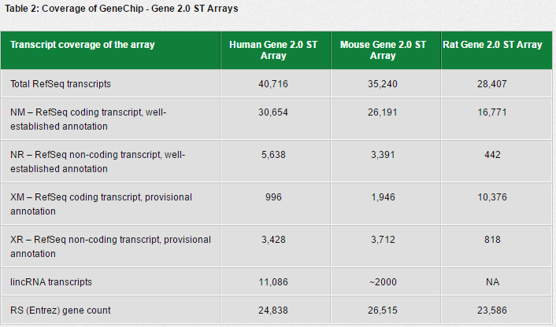
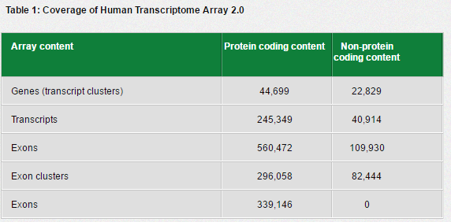
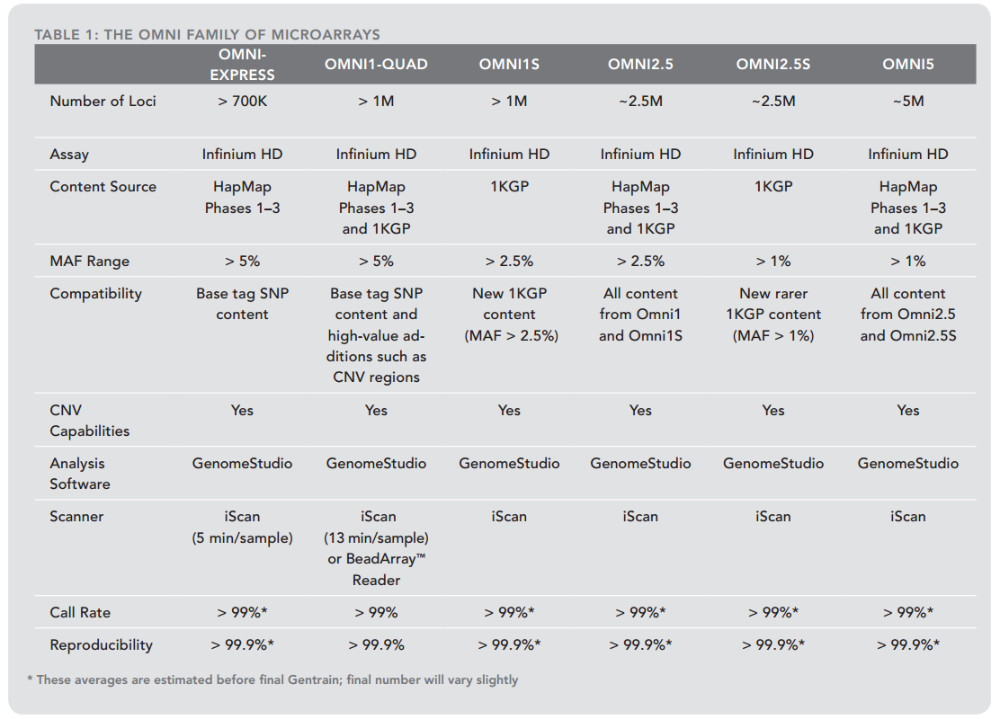

\mainmatter

# 数据产生 {#sequencing}

做软件开发和建模的毕竟是少数，大部分人进入生物信息学领域的第一步就是数据处理，有经验的分析者各种各样的数据都会遇到，本章节会一一谈到。 

其中大部分生物信息学相关数据都会由全世界各地的科研工作者上传到GEO数据库，包括各种芯片数据及针对各种物种的测序数据，它们的[样本数排序](https://www.ncbi.nlm.nih.gov/geo/browse/?view=platforms&display=20&zsort=samples)如下：



由上表可以看出，到目前为止（2017年）**累积应用**最广泛仍然是mRNA的表达谱检测芯片，以affymetrix的 Human Genome U133 Plus 2.0 Array和illumina的HumanHT-12 V4.0 expression beadchip为代表。
高通量测序作为后起之秀已经逐渐在超过芯片数据样本量了，而且高通量测序几乎都是illumina的测序仪产出的，包括HiSeq 2000/2500，nextSeq500,MiSeq等等。虽然HiSeq X10并没有排在前面，原因其实是GEO公布的数据与现实有两到三年的时差，因为测序数据需要发表文章之后才会公布，而且可以设置一到两年的释放期限。

值得一提的是HiSeq X10作为目前通量最高的测序仪，其大多测的是人类癌症病人相关数据，而这些数据因为隐私问题，很多都是不予公开的，需要注册申请才能下载。

下面我们就GEO里面存放的数据进行分门别类的介绍，分首先是芯片数据，包括各种生物学应用的芯片，然后是高通量测序数据，包括二代三代测序数据。

## 芯片技术

> 早期的生物信息学数据都是由芯片产生，2001年做两百多个mRNA表达谱芯片数据分析都可以发nature，虽然现在逐渐被NGS替代了，但是成本方面却还是它们的优点，所以仍然会有不少科研项目选择芯片来检测样本。

这样，做生物信息学数据分析的我们还是得掌握它们的基本分类，历史，以及处理方法。而且已经发表的芯片数据量非常庞大，在里面进行一些探索性挖掘也会有意想不到的收获。当然，前提是要下功夫了解芯片，学习它们。

### 三大芯片制造商

> 在GEO数据库里面查看GPL信息，就可以看到芯片厂商出品的数据排名，基本上就是 affymetrix , illumina , agilent 这3家公司为主。

#### Affymetrix 

昂飞（Affymetrix）公司，基因芯片行业的先驱，全球销量第一的基因芯片厂家。它是第一款商业化基因芯片的诞生之地，它是全球基因芯片行业标准的制定者。

上个世纪八十年代，Stephen P.A. Fodor博士与他的科学家团队将组合化学技术与半导体制造技术结合，尝试在小玻璃芯片上建立大量生物数据。这一革命性的想法经过他们十多年的钻研尝试，成为了现实——他们发明出革命性的基因芯片GeneChip®技术。这一技术迅速进行商业转化，由Affymax公司的Affymetrix部门专职运营。

1992年，Stephen P.A. Fodor博士带领Affymetrix部门从Affymax公司独立出来，在硅谷中心单独成立公司，名字仍采用Affymetrix，也就是现在的Affymetrix公司。公司最初的发展受到美国政府先进技术计划项目的经费支持，而公司也没辜负联邦政府的期望，1994年就开始将GeneChip®专利技术进行商业化运营，并于1996年在纳斯达克上市。Affymetrix以基因芯片为立家之本，陆续收购包括分子生物学试剂USB、免疫学试剂公司eBioscience等多家生物医学公司，形成了环绕基因组学和蛋白组学的庞大产品生态群。

Affymetrix公司致力于研发能够在细胞、蛋白和基因水平对生物系统进行多重和平行分析的技术，促进科研人员研究成果的转化，使科学家和临床医生能够将其研究成果更快地转化为对疾病的治疗技术，并在农业领域促进基因标记辅助育种技术的发展。

Affymetrix公司的客户遍布于生物学科研工作的各个领域，包括生物制药、临床诊断、农业育种、食品安全和消费品行业，同时还包括科研院所、政府实验室和其他非盈利性研究机构等。

Affymetrix公司曾入围全球50个最具创新能力公司和2011年度Frost & Sullivan北美产品领袖奖。公司于1996年在美国纳斯达克(NASDAQ)上市，总市值超过30亿美元，20年来，凭借在美国股票市场上的融资，Affymetrix公司在企业并购的路上一路狂奔。

```
2000年2月，Affymetrix 收购了DNA芯片仪器公司Genetic MicroSystems；
2000年10月，Affymetrix收购了计算基因组学公司Neomorphic；
2005年，Affymetrix收购了基因研究公司 ParAllele BioScience，随后又收购了分子生物学和生物化学试剂产品公司USB及膜蛋白提取纯化产品公司Anatrace；
2008年，Affymetrix收购了基因标记公司True Materials 和芯片公司Panomics；
2012年，收购了免疫肿瘤研究和诊断公司eBioscience。
```

然而，Affymetrix公司也逃不过被并购的命运。在2016年1月9日，全球最大的科学仪器生产商赛默飞世尔科技公司表示，同意13亿美元现金收购美国芯片制造商Affymetrix，以加强其基因分析产品相关业务。

在GEO数据库里面，[Affymetrix芯片的样本排序是](https://www.ncbi.nlm.nih.gov/geo/browse/?view=platforms&search=Affymetrix&display=20&zsort=samples)：



#### Illumina 

> Illumina总部位于美国加州圣地哥。它们的二代测序技术太出名以至于掩盖掉了其芯片产品的关辉，在GEO数据库可以查到它们的芯片科研市场占有率也不可小觑。
Illumina的核心技术是光纤微珠芯片平台和Solexa测序平台，广泛应用于基因组学研究。
其新一代激光共聚焦光纤微珠芯片技术，具有高密度，高灵敏度，高重复性，定制灵活等特点。
该平台主要应用于功能基因组学基因表达的研究和SNP基因分型研究，可高精度地对数千甚至数万个SNP位点及基因表达谱、LOH、染色体片段重复等进行检测和分析。

芯片优点有：

```
•杂交效率高-每个微珠连有约80万条同种探针，加之微珠的空间效应，杂交效率高。
•数据质量高-每个珠子在芯片上随机分布，且高达15~30倍重复，数据质量高。
•完全的质控-独特的解码技术，使得每个珠子每种探针都能得到质控。
•良好的重复性-芯片具有良好的重复性，相关系数R2大于0.99。
•高灵敏度低上样量-低至ng级的核酸样本就即可有效检测。
•定制灵活-可根据不同使用者研究需求量身打造芯片产品。
•广泛的应用范围-光纤微珠芯片广泛应用于SNP基因分型研究、基因表达的研究和甲基化研究。
```

在GEO数据库里面，[Illumina芯片的样本排序是](https://www.ncbi.nlm.nih.gov/geo/browse/?view=platforms&search=Illumina&display=20&zsort=samples)：




不得不提的是Illumina公司的产品线除了上面提讲解的通量生物芯片，更为流行的其实是高通量测序仪，当然，还有少量定量PCR仪。

高通量生物芯片技术是Illumina公司成长的第一个里程碑，在人类基因组计划完成后，生命科学研究进入后基因组时代，对于SNP的研究成了基因功能研究的主要技术手段，国际上也有了专门针对SNP研究的Hapmap计划，而Illumina公司的高通量芯片称为Hapmap计划的主要技术平台，所有Hapmap的数据，80％以上都来自于Illumina的高通量芯片平台，全世界科学家选择Illumina芯片平台的主要原因也在于此。

高通量测序仪可谓是Illumina最大的产品线，高通量测序技术的出现和发展可以说是近五年时间内生命科学领域最具有革命性发展的技术之一，它极大的加速了整个科学研究的进程，也改变了应用领域和临床研究及诊断的思路。目前，公司主打产品有MiSeq测序仪、HiSeq X Ten测序仪、Miseq FGx测序仪、NextSeq 500/550桌上型测序仪、MiniSeq台式测序仪等等。

定量PCR仪Eco，是Illumina公司在2010年收购另外一个定量PCR仪厂家而扩增的产品线。定量PCR仪是目前分子生物学实验中常用的核苷酸检测设备，已经被广泛应用于生命科学领域的各个方面，包括新药开发研究、药物疗效研究、药物预后指标研究等等。

#### agilent

Agilent的生物芯片（系统）和别的公司的生物芯片（系统）一样，同样由：扫描仪、生物芯片、分析软件，三部分组成。

Agilent的芯片扫描仪，叫SureScan DX。SureScan DX已经取得了欧洲的CE认证，和中国的CFDA认证，可以应用于临床。

Agilent的CGH生物芯片，在细胞遗传学中有着很广泛的接受度，并可以临床应用。
Agilent的表达谱芯片，是用荧光素直接标记的，检测灵敏度高、检测速度快、检测的线性范围大，很受欢迎。另外比较受欢迎的就是Agilent的miRNA相关芯片了。

在GEO数据库里面，[Agilent芯片的样本排序是](https://www.ncbi.nlm.nih.gov/geo/browse/?view=platforms&search=agilent&display=20&zsort=samples)：




### 表达谱芯片

> 最初的芯片就是为了检测mRNA的表达量而设计开发的，而affymetrix就是其中的佼佼者。

表达谱DNA芯片（DNA microarrays for gene expression profiles）是指将大量DNA片段或寡核苷酸固定在玻璃、硅、塑料等硬质载体上制备成基因芯片.
待测样品中的mRNA被提取后，通过逆转录获得cDNA，并在此过程中标记荧光，然后与包含上千个基因的DNA芯片进行杂交反应30min~20h后，将芯片上未发生结合反应的片段洗去，
再对玻片进行激光共聚焦扫描，测定芯片上个点的荧光强度，从而推算出待测样品中各种基因的表达水平。
用于研究基因表达的芯片可以有两种：① cDNA芯片；② 寡核苷酸芯片。


早期的表达谱芯片主要是Affymetrix公司的hgu系列，包括95,133 出货量最大的应该是**hgu133plus2系列**了，如下



统称为旧版的affymetrix芯片，用R语言的affy包即可读取进行数据处理，我曾经写过教程：[用affy包读取affymetix的基因表达芯片数据-CEL格式数据](http://www.bio-info-trainee.com/1580.html) 就是下面的代码：

```
## 把所有的cel文件都放在一个文件夹(比如/home/jmzeng/your/celfiles文件夹)下面，文件夹地址赋给变量 dir_cels
dir_cels='/home/jmzeng/your/celfiles'
library(affy)
#perform mas5 normalization
affy_data = ReadAffy(celfile.path=dir_cels)
eset.mas5 = mas5(affy_data)
exprSet.nologs = exprs(eset.mas5)
exprSet = log(exprSet.nologs, 2)  #transform to Log_2 if needed
### 上面是是mas5)，下面是rma，两种不同的芯片数据处理方法，最后都是要生成表达矩阵。
library(affy)
data <- ReadAffy(celfile.path=dir_cels) 
eset <- rma(data)
write.exprs(eset,file="data.txt")
```

还有新版的表达谱芯片，比如Human Gene 1.0 St Array  



用R语言的oligo包来进行数据处理，我曾经写过教程：[用oligo包来读取affymetix的基因表达芯片数据-CEL格式数据](http://www.bio-info-trainee.com/1586.html)，把芯片数据转换为表达矩阵的核心代码如下：

```
library(oligo)
celFiles <- list.celfiles()
affyRaw <- read.celfiles(celFiles)
library(pd.mogene.2.0.st)  
## 根据芯片平台来载入芯片设计包，没办法自动选择
## 不同的芯片探针包不一样：mogene20sttranscriptcluster.db
eset <- rma(affyRaw)
write.exprs(eset,file="data.txt")
```

affymetrix还开发了**更新版**的表达谱检测芯片，比如针对人类的HST2.0，据文献报道其很多方面都优于转录组测序，这款芯片设计比较复杂，如下：



不过，illumina的表达谱芯片也是非常出名的，比如Illumina HumanHT-12 V4.0 expression beadchip。 

需要用R包lumi来处理illumina的bead系列表达芯片，[见我博客教程](用lumi包来处理illumina的bead系列表达芯片)

上述表达谱芯片在GEO里面的代表性数据有：

| GEO地址                                    | 数据描述                                     |
| ---------------------------------------- | ---------------------------------------- |
| [GSE11072](https://www.ncbi.nlm.nih.gov/geo/query/acc.cgi?acc=GSE11072) | 2009-gastric cancer SBC Human 16K cDNA Microarray |
| [GSE42872](https://www.ncbi.nlm.nih.gov/geo/query/acc.cgi?acc=GSE42872) | 2015-melanoma-vemurafenib HuGene-1_0-st  |
| [GSE2467](https://www.ncbi.nlm.nih.gov/geo/query/acc.cgi?acc=GSE24673) | 2015-hub-gene-mcode-retinoblastoma  HuGene-1_0-st |
| [GSE22863](https://www.ncbi.nlm.nih.gov/geo/query/acc.cgi?acc=GSE22863) | 2011-NSCLC HuGene-1_0-st                 |
| GSE622221, GSE4180414, GSE5140122        | A total of 117 samples (54 cases and 63 controls) Affymetrix Human Genome U133 Plus 2.0 Array  2015-HCC |
| [GSE21815](https://www.ncbi.nlm.nih.gov/geo/query/acc.cgi?acc=GSE21815) | 2016-CRC Agilent-014850 Whole Human Genome Microarray 4x44K |

公布这些数据的文章里面都有对这些数据处理的方法的详细描述，以及对应的分析结果。


### 基因分型芯片

> 在人类基因组中，基因变异以许多不同的形式存在，包括体细胞突变、单核苷酸多态性（SNP）、拷贝数变异（CNV）和结构改变（插入缺失，Indel）。研究这些变异需要强大的基因分型工具。
其中最出名就是Affymetrix的SNP6.0芯片以及illumina的OMIN系列，下面是详细介绍：


一、基于GeneChip平台的基因分型芯片

* 芯片推荐： Genome-Wide Human SNP Array 6.0
* 芯片介绍： Affymetrix Genome-Wide Human SNP 6.0芯片产品涵盖超过1,800,000个遗传变异标志物：包括超过906,600个SNP和超过946,000个用于检测拷贝数变化（CNV, Copy Number Variation）的探针。


* 芯片推荐：DMET™ Plus
* 芯片介绍：人类基因组上的差异（SNP、插入、缺失、复制等）会导致不同个体对同一药物产生不同的反应。针对这种情况，Affymetrix推出了DMET（Drug-MetabolizingEnzymes and Transporters）Plus完整解决方案。它能检测225个基因中与药物代谢和转运有关的1936个分子标记。这些分子标记已经在不同种族、至少1200个个体中验证。通过检验不同个体分子标记的差异，研究者们可以发现药物发挥不同作用的遗传机制，从而决定药物的剂量和使用对象。

二、基于GeneTitan平台的Axiom®基因分型芯片

Axiom®基因分型解决方案为您提供多种芯片。您可以选择要研究物种的自定义内容，也可以选择来自Axiom®基因组数据库的基因型经过验证的内容。

芯片推荐：Infinium OmniZhongHua-8 Kit

覆盖了中国人特有常见和稀有变异，是第一款人类种群特异的全基因组芯片。经过优化的标签SNP内容来自HapMap所有三个阶段以及千人基因组计划（1kGP），可用于在中国人种群中探索全新的疾病和性状关联。特别覆盖中国人81%的常见变异（MAF>5%）和60%的稀有变异（MAF> 2.5%），适合全基因组关联研究（GWAS）。采用Illumina专利的BeadArrayTM技术，可提供非常高的数据质量，平均检出率>99%，重复率>99.9%。

illumina的Omni系列芯片经过了许多年的市场迭代，能检测的位点也越来越多，下面是它的一个简单的汇总表格。
 


参考：https://www.illumina.com/Documents/products/datasheets/datasheet_gwas_roadmap.pdf

### CNV芯片

> 拷贝数变异（CNV）是由基因组发生重排而导致的，一般指长度为1 kb 以上的基因组大片段的拷贝数增加或者减少，主要表现为亚显微水平的缺失和重复。
CNV 是基因组结构变异 ( SV ) 的重要组成部分。CNV 位点的突变率远高于SNP，是人类疾病的重要致病因素之一。
大量研究表明，尤其是肿瘤，与拷贝数变异密切先关。

能检测CNV的手段主要有：全基因组测序、生物芯片、CNVseq、CNVplex、AccuCopy、质谱法、Taqman法。

#### Affymetrix SNP6.0 array

其中最出名的要属Affymetrix SNP6.0 array这款芯片 ，在TCGA计划和CCLE里面都有。芯片特有超过180万个遗传变异标记，包括单核苷酸多态性（SNP）以及拷贝数变异（CNV）。对CCLE数据库可以做的分析非常多，强烈建议初学者花时间好好了解一下，[我博客也写过教程](http://www.bio-info-trainee.com/1327.html)
 
值得一提的是拷贝数变异的检测目前是以芯片技术为标准，NGS技术仍然是落后于芯片技术，在这一点上面。对于Affymetrix SNP6.0 array这款芯片得到也是CEL文件的原始数据，可以走PICNIC软件的流程来进行分析，得到最后的拷贝数变异的片段。

#### affymetrix公司的OncoScan平台

> 使用Affymetrix OncoScan FFPE芯片对肿瘤相关样品(包括cfDNA与FFPE样本)进行试验与数据分析，并通过OncoScan 3.01软件找到与临床相关的拷贝数变异（CNV）和杂合性缺失（LOH）。


突破性的技术：在短短48小时内完成全基因组范围的实体瘤拷贝数分析，仅需80ng起始DNA。
全新的OncoScan FFPE芯片利用Affymetrix独特的分子倒置探针（MIP）技术，能够快速经济地分析来自FFPE样本的少量的高度降解的DNA，让实体瘤癌症分析向前迈进了一大步。
这一新产品在一次实验中即可提供全基因组范围的拷贝数数据，且在全基因组内大约900个已知的癌基因、杂合性缺失（LOH）上的分辨率极高，同时可以提供临床相关的获得性突变的数据。在分析软件方面，研发人员升级了早一代的BioDiscovery Nexus软件，增加了许多转为癌症分析设计的功能，命名为OncoScan™ Nexus Express软件，它实现了几分钟内数百个样本的拷贝数分析能力，也将随产品免费提供。
此项技术之前是通过Affymetrix研究服务实验室的OncoScan™ Express 2.0服务来提供的，展现出空前的成功率，在过去两年已有70多篇文章发表。该平台实现了高度降解样本的DNA检测，从保存了十年或以上的FFPE样本中挖掘出丰富的信息。

目前Affymetrix的OncoScan在GEO平台的地址是：https://www.ncbi.nlm.nih.gov/geo/query/acc.cgi?acc=GPL18602

| Status          | Public on Apr 23, 2014                   |
| --------------- | ---------------------------------------- |
| Title           | [OncoScan] Affymetrix OncoScan FFPE Assay |
| Technology type | in situ oligonucleotide                  |
| Distribution    | commercial                               |
| Organism        | [Homo sapiens](https://www.ncbi.nlm.nih.gov/Taxonomy/Browser/wwwtax.cgi?mode=Info&id=9606) |
| Manufacturer    | Affymetrix                               |

截止到目前(2017年09月07日)仅有22个实验数据，共355个样本的公共数据被上传。是非常新的平台


### 甲基化芯片

> DNA甲基化对基因表达调控起着重要作用，而且这种调控作用可以随着细胞分裂在世代间稳定遗传。
甲基化多发生于胞嘧啶位置，在细胞和组织分化、发育、衰老、疾病发生以及适应环境等过程中，甲基化状态可能随时发生变化。
非正常的DNA甲基化及其导致的基因表达往往与疾病相关联，例如肿瘤、精神性疾病、X-染色体沉默、自身免疫疾病等。

DNA甲基化已成为当前分子生物学的研究热点之一。而芯片是探索DNA甲基化程度的一大利器，在通量，覆盖度，性价比方面都优于二代测序技术。
且主要由illumina公司生产，产品进化路线是 27k --> 450K --> 850K。 
在TCGA计划的早期使用过不少27K的芯片，但是其覆盖位点太少，中后期全面转向为450K，同时也是GEO数据库里面被发表最多的甲基化芯片数据。

下面着重介绍一下最新款的IlluminaInfinium Methylation EPICBeadChip（850K）

该款芯片全面覆盖表观基因组的关联研究，可以基于单核苷酸分辨率定量检测基因组中的甲基化位点，主要优势如下

* ``高通量的定量检测``：可同时检测>850,000个位点；
* ``全面的全基因组覆盖范围``：覆盖>95%的CpG岛，99%的RefSeq基因，保留了>90%的450K甲基化位点；
* ``覆盖了增强子区域``：在增强子区域新增了350,000个甲基化位点（包括ENCODEenhancers，ENCODEopenchromatin，>80% ofFANTOM5 Enhancers，GENCODEgenes，promoters，UTRs）；
* ``分辨率高``：单碱基分辨率，可以直接检测到发生甲基化的准确位点；
* ``可重复性高``：技术重复的重现性>98%，与450K芯片的重复性>98%；
* ``DNA起始量低``：仅需250ng，相比于450K芯片的1ug DNA，大大节约了样品量；
* ``高质量的实验数据``：使用Infinium技术，无其它甲基化DNA捕获方法常有的偏向性，同时采用Infinium I和Infinium II探针设计，进一步保证高质量的实验数据；
* ``兼容FFPE样本``，支持LIMS及自动化系统。

一个基因会设计多个探针，尤其是结构复杂的基因，一般会在启动子区域，utr区域，外显子，内含子等genebody上面设计探针，如果想把探针ID对应到具体的基因的具体区域，需要去其芯片官网找**manifest文件**。

### miRNA芯片

> microRNA(microRNA)是一种小的内源性非编码RNA分子，大约由21-25个核苷酸组成。通过与靶基因的3’UTR配对，促进mRNA的降解或抑制mRNA的翻译，从而抑制靶基因的表达。

现在，miRBase共收录223个物种的28645个microRNA前体，35828个成熟microRNA (miRBase, v21, 2014年6月)。这些数据可以在它的[官网](ftp://mirbase.org/pub/mirbase/21/)直接下载.

为miRNA研究设计芯片的主要是Agilent公司，比较成熟的产品是Agilent microRNA芯片（V21.0）产品信息

| pecies|Name| P/N  |Design ID | Format  |
| -----|:-------------:| -----:| :-------------:| -----:| 
| Human| SurePrint G3 Human miRNA Microarray, Release 21 |  G4872A| 070156| 8 x 60K  |
| Mouse|SurePrint G3 Mouse miRNA Microarray, Release 21 |G4872A|070155| 8 x 60K  |
| Rat| SurePrint Rat miRNA Microarray, Release 21|  G4471A|070154| 8 x 15K  | 
  
  

## 二代测序技术

>又称下一代测序，就是NGS啦

2005年454公司的 Genome Sequencer 20 System，2006年illumina公司的Solexa和2007年ABI公司的SOLiD标志着第二代测序技术的诞生。
之后陆续在2006年推出454 FLX系统、2010年推出illumina HiSeq系统和同年推出的基于半导体芯片测序技术的Ion PGM已经陆续成为当前基因测序的中坚力量。

### NGS先行者：454及其序列数据

说到二代测序，454公司可谓是不折不扣的吃螃蟹的人。早在2005年，454就推出了第一个基于焦磷酸测序原理的高通量基因组测序系统——Genome Sequencer 20 System，这也是NGS领域的第一台测序仪。随后，454被罗氏收购，并在2006年推出了名动测序界的GS FLX测序系统。

454的技术核心在于乳液PCR和焦磷酸测序法，该技术能获得较长的序列，平均读长可达400 bp；相对于illumina平台其主要缺点是无法准确测定单碱基重复序列的长度。

454 GS-FLX测序仪产生的序列文件格式为SFF (Standard Flowgram Format)，是一种二进制文件。虽然目前有很多软件可以直接读取SFF格式文件进行分析，但更多的软件还是需要把SFF格式转换为Fna-Qual格式，这种格式把序列和与序列对应的碱基质量分别放在以Fna和Qual为后缀的文件里(文本文件)。

①.fna数据文件保存碱基序列   

```
>HKSD5CR01D6P3Ilength=70 xy=1599_2828 region=1 run=R_2012_03_15_01_23_26_GGAGTAGCATGCGTGACGAATCGTAGTTCCGACCATAACGATGCCGACCTTTGACCA
```

②qual数据文件保存碱基质量值
```
>HKSD5CR01D6P3Ilength=70 xy=1599_2828 region=1 run=R_2012_03_15_01_23_26_40 40 40 40 40 40 4040 40 40 40 40 40 40 40 40 40 40 40 40 39 39 39 40 40 40 34 34 34 34 40 30 3030 40 39 39 39 38 38 37 40 40 38 38 32 24 17 17 20 20 26 30 30 36 36 37
```

随着测序成本的不断降低，尽管读长偏长，但成本过于昂贵的454测序技术逐渐退出了科研界。
然而，虽然454的生命科学测序业务早已关停，454带来的影响却仍不容磨灭。
来自众多大型科研项目（例如人类微生物组计划）中的海量454序列信息，仍是当今研究中不可或缺的重要参考数据和引用来源。

### 渐行渐远：SOLiD及其序列数据

再来谈谈几乎快被遗忘的ABI公司。事实上，在454和illumina走入市场之前，ABI一直处理测序市场上傲视群雄的霸主地位。
在454和illumina初亮相后，由于SOLiD系统采用的是连接法而非PCR反应，因此对于高GC含量的样本具有非常大的优势。
然而，后续SOLiD系统通量难以提升，且读长短、成本高，也已慢慢退出历史舞台。

SOLiD技术，其主要核心是油包水PCR和基于“双碱基编码原理”连接测序法。
该技术主要优势在于每个位置的碱基均被检测两次，测序准确性高达99.9999%，算是第二代测序技术中准确性最高的。
但是该技术的读长仅为2X50 bp，后续序列拼接等比较复杂，且由于是双碱基对应一个荧光信号，一旦发生错误，容易在荧光解码阶段产生连锁错误。

SOLiD技术的原始数据格式是csfasta及与其匹配的qual，可以利用[python脚本](http://edison.cremag.org/resources/seq-analysis/tools/solid2fastq/solid2fastq.py)或者[perl脚本](http://www.bbmriwiki.nl/svn/bwa_45_patched/solid2fastq.pl)
将其转为csfastq(color space fastq)，与fastq格式一致，四行记录一碱基序列，区别在于第二行不是碱基序列，而是color的编码，如下：

```
@SRR2967009.1 100_1000_1168_F3
T10011023211201220121202030102221012302121010131001
+
2@@@@>@?@@@@<@@//;@@/@9?@8@=@@@6;6@66;<@6@67?2?;/@
```

colorspace编码规则为：

虽然csfastq与目前流行的fastq格式记录的测序序列不同，但是csfastq文件也可作为fastqc的输入文件进行质控,并可利用多款软件进行后续分析，如SHRiMP、Sequel、BFAST和Bowtie等等。
 
### 一家独大：illumina及其数据

illumina在NGS乃至整个测序市场中的霸主地位已毋庸置疑。引用illumina官方说法：“世界上90%以上的测序数据都由Illumina仪器产生”，不较真的话，这句话确实在某种程度上反应了illumina雄踞NGS市场的现状。尤其是HiSeq系列测序仪的问世，以通量高，产量大，生产规模著称，能够快速、经济的进行大规模平行测序，在大型全基因组测序，全转录组，全外显子组测序，靶向基因测序方面优势明显。

下面是illumina测序仪产品发布的时间线：

发布日期|测序仪型号
---|---
2010.01| HiSeq 2000
2011.02| MiSeq
2012.01| HiSeq 2500
2013.11| MiSeq Dx
2014.01| HiSeq X Ten，NextSeq 500
2015.01| HiSeq X Five，HiSeq 3000，HiSeq 4000，NextSeq 550，MiSeq FGx
2016.01| MiniSeq
2017.01| NovaSeqTM系列


HiSeq 3000/4000系统则基于成熟的HiSeq 2500系统，采用创新的有序流动槽技术最大限度提高效率，3.5天内可完成12个基因组、100个转录组或180个外显子组测序。HiSeq 3000/HiSeq 4000测序系统为生产级测序能力设立了一个全新的标准。

HiSeq X Ten系统的问世完成了人类历史上一大里程碑事件——千元基因组时代的到来。HiSeq X Ten系统是由一套共10台超高通量的HiSeq X仪器组成，每年能带来超过18,000个人类基因组，而每个基因组的价格约为1000美元，让癌症和复杂疾病的研究达到新的水平。虽然目前GEO里面的数据HiSeq X Ten测序仪产出的数据并不是独占鳌头，但也只是时间问题。

NovaSeq系列测序仪问世，毫无疑问标志着测序新纪元的到来，旨在将基因组测序的价格进一步降至100美元。全新的NovaSeq系列测序系统，突破技术革新，具有可扩展的通量、灵活简便的配置和简化的操作流程，允许以更大的深度来发现罕见的遗传变异，为大规模发现复杂疾病变异打开了全新的市场。**NovaSeq 测序平台单次运行最多可检测48个人类基因组，产出 6Tb 的数据量，运行时间缩短至40个小时。**


illumina技术核心在于桥式PCR和边合成边测序（SBS）。illumina测序系统的碱基读取也是基于化学发光法来的，给每一个碱基加入荧光基团，通过拍照捕捉发光的碱基，如此就得到了DNA的原始序列信息。

也就是说，illumina原始读取的是图像数据文件，解析后才形成碱基序列文件。对应到序列文件，其测序源文件为BCL格式文件（per-cycle BCL basecall file），BCL是一种包含碱基信号和图块质量信息的二进制文件，在进入下游分析前，BCL文件会经由Casava碱基识别(Base Calling)转化为原始测序序列（Sequenced Reads），转化得到的序列我们称之为Raw Data或Raw Reads，格式为Fastq。

Fastq是一种文件文件，如果Fastq文件大小在M级，一般可以直接用文本编辑器（如Notepad++）打开。打开之后，就可以看到类似下面表格中第二列的内容，每四行记录一段序列，这个序列也是有名字的，叫reads。如果采用的是illumina MiSeq PE250，则第二行碱基和第四行碱基质量值均为250个，即reads长度为250 bp。


|Illumina Seqence identifier|\@HWUSI-EAS100R:6:73:941:1973#0/1|  
|---------------------------|:------------------------------:| 
|Read bases	|GATTTGGGGTTCAAAGCAGTATCGATCAAATAG...|
|+	|+|
|Phred quality scores(ASCII)|	!''*((((***+))%%%++)(%%%%).1***-+。。。|
 
首行*illumina sequence identifier**记录的信息比较复杂

illumina sequence identifier中包含了此次测序的信息，根据平台不同包含的信息有所区别，一般来说可能包含以下的部分元素：
```
@<instrument>:<run number>:<flowcell ID>:<lane>:<tile>:<x-pos>:<y-pos>:<UMI> <read>:<is filtered>:<control number>:<index>
```

我们再回头看上面的例子，就可以对应查看这条序列文件中的测序信息了： 

|标识符|解释|  
|-----|:---:|
|@|必须以\@开头|
|HWUSI-EAS100R|	the unique instrument name|
|6|flowcell lane|
|73|tile number within the flowcell lane|
|941|'x'-coordinate of the cluster within the tile|
|1973|'y'-coordinate of the cluster within the tile|
|#0|index number for a multiplexed sample (0 for no indexing)|
|/1|the member of a pair, /1 or /2 (paired-end or mate-pair reads only)|

注：Run、Flowcell、Lane和tile的详细辨析，我们在第2章节还会更详细的讲解fastq格式的数据。


## 2.5代测序

> Ion Torrent  测序仪是第一个不需要光学系统的商业测序仪，所采用的技术为半导体测序，通过半导体芯片直接将化学信号转换为数字信号。是非常适合扩增子测序的革命性技术。它是一种经济、快速、简单、规模可扩展的测序技术。因为测序时间短，仪器设备便宜等特点而被各种研究所采用。

**一、前世今生**

Ion Torrent平台最初由Jonathan Rothberg于2007年开发，几经转手，2013年后归属Thermo Fisher，是他们家的掌中宝。目前有2010年发布的PGM，2012年发布Proton，2015年发布了Ion S5/XL。主要利用半导体芯片（无需荧光标记）技术，具有经济、快速、简单、规模可扩展的特点，适用于临床诊断和医学等使用场景，目前国内已有达安OEM版本DA8600。值得一提的是部分ion torrent测序仪受到了CFDA的认证。

**二、半导体测序原理** 

Ion Torrent的核心是半导体芯片测序技术，该技术采集的信号为pH值的变化，其他第二代测序技术主要是通过拍照采集荧光信号。该技术的主要优点是快速，主要缺点与Roche公司的454技术相同，在判读单碱基重复序列时存在困难。

自然情况下，DNA聚合酶将一个核苷酸渗入到DNA分子中就会释放出一个H+，导致局部可检验的PH值发生变化。如果发生结合，就会释放H+,相应的溶液PH值会发生改变，被离子传感器检测到，从而转换为数字信号。


如果检测DNA链上有两个相同的碱基，检测到的电压双倍，芯片则记录两个相同的碱基。

如果模板到的下个核苷酸与微芯片流的核苷酸不匹配，则检测不到电压，也不会记录碱基。


**三、优缺点** 

torrent测序仪拥有图形化的用户界面，便捷的操作方式，商业化的试剂盒，这肯定是专门为医院的朋友们准备的，他们不需要具体的代码与分析原理，只需要按照protocol一步步照着做，点点按钮就能生成可用的临床报告了，应该说想法是好的，客户定位是准确的。但是我觉得NGS从实验到分析那么多步骤，如果不懂NGS分析原理与流程，对图形化的参数与文件不了解，很可能得不到理想的分析结果从而对torrent丧失信心。而torrent软件相对比较封闭，专业的数据分析人员不太好下手，所以普遍对torrent数据敬而远之。


## 三代测序

层出不穷的三代小鲜肉中，表现最为亮眼的莫过于2010年推出的PacBio RS系列和2012年推出的Nanopore MinION。2015年PacBio又推出了万众瞩目的Sequel。
能进入三代测序仪队列的还有Nanopore公司，也在2017年推出了GridION，为更方便、快捷、准确、经济的测序提供了无限可能。

### 异军突起的pacbio

PacBio SMRT技术其实也应用了边合成边测序的思想，并以SMRT芯片为测序载体。测序时，不需要对目标DNA进行PCR扩增，而是直接在目标片段两端加上两个发卡结构的接头，形成一个连续的环状结构。也因此，PacBio系统在读长上显示了极大的优势。目前比较受市场热捧的三代测序是PacBio的RSⅡ和2015年推出的Sequel。

PacBio下机产生的序列文件以HDF5格式存储。可以采用h5dump命令来查看H5文件内容。

**1. 查看碱基序列：**

用代码``h5dump –d /PulseData/BaseCalls/Basecall raw.h5 > Basecall.info`` ,文件内容如下：

```
DATA {(0): 67, 71,67, 67, 65, 71, 67, 71, 65, 65, 84, 71, 71, 67, 84, 71, 67, (17): 71, 71, 71,71, 65, 65, 71, 67, 65, 71, 65, 65, 65, 84, 84, 65, 84, (34): 67, 67, 71, 84,65, 65, 65, 67, 84, 71, 84, 84, 71, 67, 84, 71, 67,
```

该文件采用的ASCII码的编码方式存储的碱基序列：A=> 65, C=>67, G=>71, T=>84。

**2. 查看碱基质量值：**

用代码``h5dump -d /PulseData/BaseCalls/QualityValue raw.h5 > Basecall.quality``,文件内容如下,其碱基质量值采用与illumina技术一致：

```
DATA {(0): 51, 44,42, 44, 24, 24, 51, 51, 51, 51, 50, 20, 20, 20, 50, 51, 51, (17): 48, 48, 48,47, 9, 9, 9, 51, 51, 46, 31, 31, 31, 31, 44, 51, 51, 30, (35): 30, 51, 51, 7,7, 7, 7, 51, 51, 44, 44, 44, 51, 51, 50, 27, 27, 26,
```


### 长到天际的Nanopore 


Oxford Nanopore 公司2005年在英国牛津成立，其运用的纳米孔测序技术使得DNA链在一个单通道中就能够被解码和识别，而不需要将长链打断成小短链。由于实现了DNA聚合酶内在自身的延续性和反应速度，Nanopore读长更长速度更快；同时由于能直接检测每个碱基的特征性电流，因而能对修饰碱基进行测序，对于表观遗传学研究具有极高的价值；因此，这款长到天际的测序仪，非常有潜力横扫当前测序格局。

2014年春天推出U盘大小的便携式MinION测序仪，仪器售价仅需$1000，据官网报道最长Reads可长达960 Kb，2014年10月推出平板大小的台式测序仪PromethION，有48个flow cell，可以单独运行也可以并行，2017年推出桌面式GridION X5测序仪。

Nanopore目前还主要在测试和生产阶段，尚未大规模应用，其应用主要体现在微生物等小基因组生物上。推出至今，其最亮眼的表现莫过于2014年西非埃博拉病毒爆发，MinION以最快的速度破译病毒序列，名噪一时。随着独特的纳米孔技术的成熟和完善，未来在即时检测、太空应用、大众检测等方面会有很大的想象空间。

Nanopore测序得到的序列文件的格式基础也是[HDF5](https://support.hdfgroup.org/HDF5/)，下机产生后缀为Fast5的序列文档。Fast5文件可经由[Poretools软件](http://poretools.readthedocs.io/en/latest/)转换为Fastq文件或Fasta，然后进行后续数据分析。

-  ①  应用Poretools将fast5转换为fastq，示例见：
http://poretools.readthedocs.io/en/latest/content/examples.html#poretools-fastq
- ②  应用Poretools将fast5转换为fasta，示例见：
http://poretools.readthedocs.io/en/latest/content/examples.html#poretools-fasta


在测序市场中，一代测序因其准确度高，仍作为突变检测、单菌鉴定等的金标准而存在。
以illumina HiSeq和MiSeq为代表的二代测序势头强劲，主打低成本和高通量，2017新机型NovaSeq更宣称已将测序成本降至百美金。
科研市场上三代测序最常见的莫过于PacBio，辅以冉冉上升的新星Nanopore等，主打长读长策略，直击二代测序碎片化序列的软肋，在基因组de novo上表现不俗，错误率较高，但可被矫正。


