# 生物学基础知识{#biology}

## 中心法则

中心法则是指遗传信息经过DNA转录成信使RNA(mRNA),再由转运RNA（tRNA）和核糖体将mRNA翻译成蛋白质（Protein）,完成遗传信息经DNA—RNA—蛋白质的传递。
也可以由DNA自我复制成DNA,即完成遗传信息由DNA—DNA的传递。
这是所有具有细胞结构的生物所遵循的法则。另外在某些病毒中的RNA自我复制和在某些病毒中以RNA为模版逆转录成DNA的过程，是对中心法则的补充。


### DNA 与 复制

脱氧核糖核酸又称去氧核糖核酸，是一种生物大分子，可组成遗传指令，引导生物发育与生命机能运作。主要功能是信息储存，可比喻为“蓝图”或“食谱”。其中包含的指令，是建构细胞内其他的化合物，如蛋白质与核糖核酸所需。带有蛋白质编码的DNA片段称为基因。脱氧核糖核酸又称去氧核糖核酸，是一种生物大分子，可组成遗传指令，引导生物发育与生命机能运作。主要功能是信息储存，可比喻为“蓝图”或“食谱”。其中包含的指令，是建构细胞内其他的化合物，如蛋白质与核糖核酸所需。带有蛋白质编码的DNA片段称为基因。

DNA是一种长链聚合物，组成单位为四种脱氧核苷酸，即：
腺嘌呤脱氧核苷酸（dAMP ）、胸腺嘧啶脱氧核苷酸（dTMP ）、胞嘧啶脱氧核苷酸（dCMP ）、鸟嘌呤脱氧核苷酸（dGMP ）。

而脱氧核糖（五碳糖）与磷酸分子借由酯键相连，组成其长链骨架，排列在外侧，四种碱基排列在内侧。每个糖分子都与四种碱基里的其中一种相连，这些碱基沿着DNA长链所排列而成的序列，可组成遗传密码，指导蛋白质的合成。读取密码的过程称为转录，是以DNA双链中的一条单链为模板转录出一段称为mRNA（信使RNA）的核酸分子。多数RNA带有合成蛋白质的讯息，另有一些本身就拥有特殊功能，例如rRNA、snRNA与siRNA。

在细胞内，DNA能与蛋白质结合形成染色体，整组染色体则统称为染色体组。对于人类而言，正常的人体细胞中含有46条染色体。染色体在细胞分裂之前会先在分裂间期完成复制，细胞分裂间期又可划分为：G1期-DNA合成前期、S期-DNA合成期、G2-DNA合成后期。对于真核生物，如动物、植物及真菌而言，染色体主要存在于细胞核内；而对于原核生物，如细菌而言，则主要存在于细胞质中的拟核内。染色体上的染色质蛋白，如组织蛋白，能够将DNA进行组织并压缩，以帮助DNA与其他蛋白质进行交互作用，进而调节基因的转录。

DNA是高分子聚合物，DNA溶液为高分子溶液，具有很高的粘度，可被甲基绿染成绿色。DNA对紫外线（260nm）有吸收作用，利用这一特性，可以对DNA进行含量测定。当核酸变性时，吸光度升高，称为增色效应；当变性核酸重新复性时，吸光度又会恢复到原来的水平。较高温度、有机溶剂、酸碱试剂、尿素、酰胺等都可以引起DNA分子变性，即DNA双链碱基间的氢键断裂，双螺旋结构解开—也称为DNA的解螺旋。


### RNA 与 转录

[转录（Transcription）](https://en.wikipedia.org/wiki/Transcription_(biology) )是遗传信息由DNA转换到RNA的过程，即信使RNA（mRNA）以及非编码RNA（tRNA、rRNA等）的合成步骤。转录中，一个基因会被读取、复制为mRNA；这个过程由RNA聚合酶（RNA polymerase）和转录因子（transcription factor）所共同完成。

两个真核生物转录必备基础名词：
 - [顺式调控元件](https://en.wikipedia.org/wiki/Cis-regulatory_element)，Cis-regulatory elements (CREs) ：增强或抑制其附近基因转录活性的非编码区域。通常是转录因子结合位点（TFBS）: promoter,  enhancers, silencers, and insulators. 
 - [反式作用因子](https://en.wikipedia.org/wiki/Trans-regulatory_element)：能够特异结合顺式作用元件的因子，多数为蛋白质，如RNA聚合酶，能和RNA聚合酶结合稳定转录起始复合物的蛋白质等。


#### 1. 转录和转录调控 {-}

转录组即某个物种或特定细胞在某一功能状态下产生的所有RNA的总和，可以揭示基因组序列中哪些序列能够表达，而且还能揭示在何时何处表达，以及转录活跃程度。

在每个细胞中，只有一部分基因是能够转录，此处染色质多为开放状态，其余的基因则处于抑制状态，对应的染色质状态较为紧密。在细胞中，保持一类基因的关闭，而另一类基因开启的状态称为基因调控，基因调控是动态的，在生物生长发育中起重要作用。基因表达的调控包含诸多维度比如信号转导，转录前（包括染色质构象和表观调控等），转录调控，转录后调控（剪切、编辑、转运等等），翻译和翻译后调控。其中多个步骤都是围绕着基因序列（DNA序列—传统的认为是顺式元件Cis）和其结合因子包括蛋白和非蛋白因子（传统地认为反式作用因子Trans）而发生。wiki中给出了转录因子可能参与转录调控的所有途径，见下图：


基因的表观和转录调控可以分为两个层面，顺式元件和反式因子，技术方法学也可以简单粗暴地分为以研究顺式元件或反式因子为主的两类方法学：

 1. 已知或候选反式因子（表观和转录因子）和顺式元件的研究手段较成熟，比如经典的EMSA，报告基因，ChIP等。 

 2. __如何研究在native状态下与之相互作用的未知反式因子？__ 基因组非编码区域含有大量的组织特异性的调控序列，包括基因转录增强子(enhancer)、沉默子（silencer）、绝缘子（insulators） 等。这些调控序列通常结合几个，几十个，甚至几百个调控因子（包括转录因子，染色质调控蛋白，组蛋白，RNA分子）以及他们形成的三维结构。用来分离纯化单个调控序列的传统的方法面临的最大的挑战是无法区分结合调控序列的特异性调控因子和细胞内大量的非特异性因子。现有的技术包括locked nucleic acids (LNAs)和transcription activator-like (TAL)蛋白只能用在分离纯化多拷贝的基因组重复序列，比如染色体端粒(telomere)。而其他的常规技术，比如ChIP-seq和ChIA-PE则依赖于单个调控因子或组蛋白修饰，而并不能纯化和分析单个调控序列所结合的多个调控因子以及三维结构。在今年8月刚被cell报道的In Situ capture of chromatin interactions by biotinylated dCAS9中，作者首次利用了“biotinylated dCAS9”的方法建立了高分辨率，位点特异原位DNA-蛋白质以及其他元件的互作网络，为攻克这一难题揭开了序幕 [^ref1]。
 


#### 2. 转录与NGS  {-}

转录组测序的分析流程大致可以分成三类，包括基因组比对（Genome mapping）、转录组比对（Transcriptome mapping）、转录组组装（Reference-free assembly。其中第三种主要是用于分析没有参考基因组和基因注释的物种，应用场合较少且不适合新手入门。对于人、小鼠、大鼠等模式物种，通常用前两种方法进行分析。

转录组测序一般是在你有了一部分生理生化的实验结果，如表型差异、生理指标发生明显变化或有效物质含量出现明显差异等等，在这个基础上你可能会问自己，这些现象内在的机制如何。所以，转录组测序核心回答的是那些基因组存在表达差异，这些存在差异的基因都涉及什么功能，是如何发挥作用的。可以根据实验的目的确定需要转录组测序还是表达谱测序。

##### 转录组测序和表达谱测序的区别{-}

 1. 转录组测序 RNA-seq（Transcriptome）
    - 定义： 通过RNA测序，既想得到样本中序列的信息，又需要对序列的表达进行定量和分析。
        - 没有参考基因组的物种，RNA-seq (Transcriptome) 需要进行de novo拼接，对拼接得到的Unigene进行注释；
然后计算de novo得到的Unigene的表达量。所以，这个分析就包含了核酸序列分析和核酸表达定量分析。
        - 对于已有参考基因组的物种，RNA-seq (Transcriptome) 会对测序结果进行基于参考基因组的比对和拼接，从而分析样本中转录本的可变剪切、基因融合、SNP变异等此类针对转录本序列的分析；在序列分析的基础上，在分析转录本的表达量。所以，这个分析也包含了核酸序列的分析和核酸表达量的分析。
    - 对测序的要求：因为涉及到序列的拼接和组装，所以转录组测序对数据量的要求较高（一般单个样本的测序量> 4G），同时一般要求使用双末端测序（Paired end）的数据。

 2. 表达谱测序 RNA-seq（Qualification）
    - 定义：Qualification，顾名思义，这个产品的定义就是只对样本中mRNA进行定量分析，而不需要分析mRNA序列的变化。通常此类分析，需要参考序列。参考序列可以是：基因组序列（有参考基因组的物种）或转录组序列（无参考基因组物种，转录组de novo拼接的结果）。
    - 对此类产品的分析要求仅仅是：将测序得到的数据比对到参考序列上，然后计算参考序列的在样本中的对应表达，而不需要去分析参考序列在样本中是否发生了序列变化（可变剪切、基因融合、SNP等）。一般单个样本的测序量2~3G足够，同时单末端测序（single End）和双末端测序（paired End）的数据均可以分析。


#### 3. 转录调控与NGS  {-}

##### 常用的转录调控测量技术 {-}

参考上文提及的转录因子的调控路径，2012 Shirley Liu 的[Minireview: Applications of Next-Generation Sequencing on Studies of Nuclear Receptor Regulation and Function](https://www.ncbi.nlm.nih.gov/pmc/articles/PMC3458226/) 总结得很好，主要有Gene Expression Profiling, Transcription Factor Cistrome Mapping, Epigenome Profiling, Interactions in Three Dimensions, 也直接上图表示：


(Next-generation sequencing applications in studies of transcriptional regulation. Applications in red make use mainly of the quantification of abundance, whereas applications in blue make use of sequence-based observations.)

##### NGS分析手段 {-}

对于可以直接参考HOMER提供的教程，学会了就能分析`ChIP-Seq, GRO-Seq, RNA-Seq, DNase-Seq, Hi-C and numerous other types of functional genomics sequencing data sets`。
入门应不成问题，官网在此<http://homer.ucsd.edu/homer>。

#### 总结 {-}
转录是在DNA和蛋白质之间传递信息的关键，调控途径多样，分析手段因此也层出不穷，多结合生物学背景，多看文献，才能想到idea再找数据去分析，光会用却不明白相关关系还是不行的。 
 

### protein {#biology-protein}

### 其它 {#biology-others}

## 组学

介绍常见的6种组学技术，有待完善

### 基因组

基因组学是一个非常广的概念，研究的可以是全基因组的重测序，比如对人类来说，基因组大小是3G(30亿个碱基)，我的全基因组测序共8.9亿条150bp的reads，那么全基因组范围的平均测序深度就是8.9亿*150/30亿~45X。

当然并不是每个实验对象都需要测多达10亿条reads，可以只选择基因组上面的编码基因的外显子设计好特异性的探针后捕获它们进行集中测序，这个就是外显子测序。外显子测序一般测几千万条reads就可以了，虽然测序总量只有全基因组测序的1%，但是外显子区域(30M)也只有全基因组(3G)的1%，所以测序深度仍然可以达到50X以上，足以做大部分的数据分析。

即使是只测全外显子，单个样本的数据量的确不大，但是要推广到千千万万的实验样本，这个累积数据量就可观了，同时分析速度也是一个限制，而且所有的外显子包含的信息量也太多，并不是每一个人都需要。这个时候有针对性的靶向捕获测序就显示出它的优点了。可以是针对十几个基因，或者几百个有明确意义(一般是疾病等性状相关)的基因panel。当然，捕获测序的最终目标也是找到跟参考基因组不一致的位点，来解释为什么这个样本有这样的变异。

如果是癌症研究，那么测序策略也会稍有不同，上面提到的全基因组，全外显子组，靶向测序都可以应用到癌症研究。但是癌症研究有个特色，就是对每个个体不只是要测癌症部位的DNA信息，还需要提取该个体的正常组织进行对照。去除那些个体特异性的变异位点，或者那些没有太大的临床表型意义的germline mutation位点。

最后，值得一提的是，上面的分析都是建立在测序个体的物种参考基因组是已知的前提，所以只需要跟参考基因组进行比较，来找差异。但即使是在测序数据已经海量的今天，也不是每个物种都有了参考基因组，这个时候基因组的de novo测序就可以大展身手了。它的分析流程也完全不一样。

#### 全基因组重测序分析流程分享

> 这里选取的是[ GATK best practice](https://www.broadinstitute.org/partnerships/education/broade/best-practices-variant-calling-gatk-1) 是目前认可度最高的全基因组重测序分析流程，尤其适用于``人类``研究。


##### 流程介绍 {-}

 - [x] bwa(MEM alignment)
 - [x] picard(SortSam)
 - [x] picard(MarkDuplicates)
 - [x] picard(FixMateInfo)
 - [ ] GATK(RealignerTargetCreator) 
 - [ ] GATK(IndelRealigner)
 - [ ] GATK(BaseRecalibrator)
 - [ ] GATK(PrintReads)
 - [x] GATK(HaplotypeCaller)
 - [ ] GATK(GenotypeGVCFs)

在本文，我将会把我的``全基因组重测序``数据走完上面所有的流程，并给出代码和时间消耗情况。

##### 准备工作 {-}
###### 首先是软件安装 {-}
```shell
## Download and install BWA
cd ~/biosoft
mkdir bwa &&  cd bwa
#http://sourceforge.net/projects/bio-bwa/files/
wget https://sourceforge.net/projects/bio-bwa/files/bwa-0.7.15.tar.bz2 
tar xvfj bwa-0.7.15.tar.bz2 # x extracts, v is verbose (details of what it is doing), f skips prompting for each individual file, and j tells it to unzip .bz2 files
cd bwa-0.7.15
make

## Download and install samtools
## http://samtools.sourceforge.net/
## http://www.htslib.org/doc/samtools.html
cd ~/biosoft
mkdir samtools &&  cd samtools
wget https://github.com/samtools/samtools/releases/download/1.3.1/samtools-1.3.1.tar.bz2 
tar xvfj samtools-1.3.1.tar.bz2 
cd samtools-1.3.1 
./configure --prefix=/home/jianmingzeng/biosoft/myBin
make 
make install 
~/biosoft/myBin/bin/samtools --help
~/biosoft/myBin/bin/plot-bamstats --help
cd htslib-1.3.1
./configure --prefix=/home/jianmingzeng/biosoft/myBin
make 
make install
~/biosoft/myBin/bin/tabix 


## Download and install picardtools
## https://sourceforge.net/projects/picard/
## https://github.com/broadinstitute/picard
cd ~/biosoft
mkdir picardtools &&  cd picardtools
wget http://ncu.dl.sourceforge.net/project/picard/picard-tools/1.119/picard-tools-1.119.zip
unzip picard-tools-1.119.zip
mkdir 2.9.2 && cd 2.9.2 
wget https://github.com/broadinstitute/picard/releases/download/2.9.2/picard.jar

## GATK 需要自行申请下载，不能公开
```
###### 其次是必备数据的下载  {-}

```shell
cd ~/reference
mkdir -p  genome/human_g1k_v37  && cd genome/human_g1k_v37 
# http://ftp.1000genomes.ebi.ac.uk/vol1/ftp/technical/reference/ 
nohup wget http://ftp.1000genomes.ebi.ac.uk/vol1/ftp/technical/reference/human_g1k_v37.fasta.gz  &
gunzip human_g1k_v37.fasta.gz
wget http://ftp.1000genomes.ebi.ac.uk/vol1/ftp/technical/reference/human_g1k_v37.fasta.fai
wget http://ftp.1000genomes.ebi.ac.uk/vol1/ftp/technical/reference/README.human_g1k_v37.fasta.txt
java -jar ~/biosoft/picardtools/picard-tools-1.119/CreateSequenceDictionary.jar R=human_g1k_v37.fasta O=human_g1k_v37.dict

cd ~/reference
mkdir -p index/bwa && cd index/bwa   ~/reference/index/bwa/human_g1k_v37  ~/reference/genome/human_g1k_v37/human_g1k_v37.fasta 1>human_g1k_v37.bwa_index.log 2>&1   &
 
mkdir -p ~/biosoft/GATK/resources/bundle/b37
cd ~/biosoft/GATK/resources/bundle/b37
wget ftp://gsapubftp-anonymous@ftp.broadinstitute.org/bundle/b37/1000G_phase1.indels.b37.vcf.gz
wget ftp://gsapubftp-anonymous@ftp.broadinstitute.org/bundle/b37/1000G_phase1.indels.b37.vcf.idx.gz
wget ftp://gsapubftp-anonymous@ftp.broadinstitute.org/bundle/b37/Mills_and_1000G_gold_standard.indels.b37.vcf.gz
wget ftp://gsapubftp-anonymous@ftp.broadinstitute.org/bundle/b37/Mills_and_1000G_gold_standard.indels.b37.vcf.idx.gz
gunzip 1000G_phase1.indels.b37.vcf.idx.gz
gunzip 1000G_phase1.indels.b37.vcf.gz
gunzip Mills_and_1000G_gold_standard.indels.b37.vcf.gz
gunzip Mills_and_1000G_gold_standard.indels.b37.vcf.idx.gz

mkdir -p ~/annotation/variation/human/dbSNP 
cd ~/annotation/variation/human/dbSNP 
## https://www.ncbi.nlm.nih.gov/projects/SNP/
## ftp://ftp.ncbi.nih.gov/snp/organisms/human_9606_b147_GRCh38p2/
## ftp://ftp.ncbi.nih.gov/snp/organisms/human_9606_b147_GRCh37p13/
nohup wget ftp://ftp.ncbi.nih.gov/snp/organisms/human_9606_b147_GRCh37p13/VCF/All_20160601.vcf.gz &
wget ftp://ftp.ncbi.nih.gov/snp/organisms/human_9606_b147_GRCh37p13/VCF/All_20160601.vcf.gz.tbi

```

> 上述代码都是可以直接在linux/MAC里面运行的，只有当软件安装完毕，还有参考基因组等必备文件准备齐全了，才能正式进入全基因组重测序分析流程！
 

> 上面是我的全基因组数据fastq文件的截图，测序分成了5条lane，每条lane的数据量不一致。

##### 数据分析 {-}

数据分析的主线就是 fastq-->bam-->vcf  这样的数据转换，中间选择不同的工具已经使用不同的参数，所以流程得到的结果会略微不同。这里仅介绍我多年实践的最佳流程，希望对读者有所启发。

###### 首先是fastq2bam步骤 {-}
####### 代码 {-}

```shell
module load java/1.8.0_91
GENOME=/home/jianmingzeng/reference/genome/human_g1k_v37/human_g1k_v37.fasta
INDEX=/home/jianmingzeng/reference/index/bwa/human_g1k_v37
GATK=/home/jianmingzeng/biosoft/GATK/GenomeAnalysisTK.jar
PICARD=/home/jianmingzeng/biosoft/picardtools/2.9.2/picard.jar
DBSNP=/home/jianmingzeng/annotation/variation/human/dbSNP/All_20160601.vcf.gz
SNP=/home/jianmingzeng/biosoft/GATK/resources/bundle/b37/1000G_phase1.snps.high_confidence.b37.vcf.gz
INDEL=/home/jianmingzeng/biosoft/GATK/resources/bundle/b37/Mills_and_1000G_gold_standard.indels.b37.vcf.gz
TMPDIR=/home/jianmingzeng/tmp/software
## samtools and bwa are in the environment 
## samtools Version: 1.3.1 (using htslib 1.3.1)
## bwa Version: 0.7.15-r1140
 
: '
'
## please keep the confige in three columns format, which are fq1 fq2 sampe
cat $1 |while read id
do
	arr=($id)
	fq1=${arr[0]}
	fq2=${arr[1]}
	sample=${arr[2]}
	#####################################################
	################ Step 1 : Alignment #################
	#####################################################
	echo bwa `date`
	bwa mem -t 5 -R "@RG\tID:$sample\tSM:$sample\tLB:WGS\tPL:Illumina" $INDEX $fq1 $fq2 > $sample.sam
	echo bwa `date`
	#####################################################
	################ Step 2: Sort and Index #############
	#####################################################
	echo SortSam `date`
	java -Djava.io.tmpdir=$TMPDIR    -Xmx40g -jar $PICARD SortSam SORT_ORDER=coordinate INPUT=$sample.sam OUTPUT=$sample.bam 
	samtools index $sample.bam
	echo SortSam `date`

	#####################################################
	################ Step 3: Basic Statistics ###########
	#####################################################
	echo stats `date`
	samtools flagstat $sample.bam > ${sample}.alignment.flagstat
	samtools stats  $sample.bam > ${sample}.alignment.stat
	echo plot-bamstats -p ${sample}_QC  ${sample}.alignment.stat
	echo stats `date`

	#####################################################
	####### Step 4: multiple filtering for bam files ####
	#####################################################

	###MarkDuplicates###
	echo MarkDuplicates `date`
	java -Djava.io.tmpdir=$TMPDIR    -Xmx40g -jar $PICARD MarkDuplicates \
	INPUT=$sample.bam OUTPUT=${sample}_marked.bam METRICS_FILE=$sample.metrics  
	echo MarkDuplicates `date`


	###FixMateInfo###
	echo FixMateInfo `date`
	java -Djava.io.tmpdir=$TMPDIR    -Xmx40g -jar $PICARD FixMateInformation \
	INPUT=${sample}_marked.bam OUTPUT=${sample}_marked_fixed.bam SO=coordinate  
	samtools index ${sample}_marked_fixed.bam
	echo FixMateInfo `date`
	
	echo ${sample}_marked_fixed.bam >>files.bamlist
	
	rm $sample.sam $sample.bam ${sample}_marked.bam
done 
samtools merge -@ 5  -b files.bamlist  merged.bam
samtools index merged.bam
```
> 上面的代码有一点长，希望大家能用心的来理解，其实就是一个批量处理，对5条lane的测序数据循环处理。
其实正式流程里面我一般是并行的，而不是循环，这里是为了给大家秀一下时间消耗情况，让大家对全基因组重测序分析有一个感性的认知。
最后把所有lane的数据用 ``samtools merge `` 合并成一个非常大(60G)的bam文件 .

####### 时间消耗情况探索 {-}

对L1来说，时间消耗如下：
```
[main] Real time: 15870.794 sec; CPU: 77463.156 sec
picard.sam.SortSam done. Elapsed time: 45.60 minutes.
picard.sam.markduplicates.MarkDuplicates done. Elapsed time: 64.20 minutes.
picard.sam.FixMateInformation done. Elapsed time: 58.05 minutes.
```
> 总共耗时约7.2小时，仅仅是对10G的fastq完成比对压缩排序去PCR重复。

如果是其它文件大小的fastq输入数据，那么这个流程耗时如下：
```
[main] Real time: 9527.240 sec; CPU: 47758.233 sec
[main] Real time: 16000.325 sec; CPU: 80595.629 sec
[main] Real time: 29286.523 sec; CPU: 147524.841 sec
[main] Real time: 28104.568 sec; CPU: 141519.377 sec

picard.sam.SortSam done. Elapsed time: 29.02 minutes.
picard.sam.SortSam done. Elapsed time: 61.26 minutes.
picard.sam.SortSam done. Elapsed time: 98.39 minutes.
picard.sam.SortSam done. Elapsed time: 117.16 minutes.

picard.sam.markduplicates.MarkDuplicates done. Elapsed time: 35.52 minutes.
picard.sam.markduplicates.MarkDuplicates done. Elapsed time: 54.41 minutes.
picard.sam.markduplicates.MarkDuplicates done. Elapsed time: 90.40 minutes.
picard.sam.markduplicates.MarkDuplicates done. Elapsed time: 93.03 minutes.

picard.sam.FixMateInformation done. Elapsed time: 35.92 minutes.
picard.sam.FixMateInformation done. Elapsed time: 66.31 minutes.
picard.sam.FixMateInformation done. Elapsed time: 131.65 minutes.
picard.sam.FixMateInformation done. Elapsed time: 122.31 minutes.
```

前面我们说过，这5条lane的数据其实是可以并行完成这几个步骤的，最长耗时约12小时。
每个数据处理我都分配了``5个线程``，``40G的内存``。

###### GATK重新处理bam文件 {-}

> 主要是针对上一个步骤合并了5个lane之后的``merge.bam``文件
```
-rw-rw-r-- 1 jianmingzeng jianmingzeng  57G Jun  7 11:32 merged.bam
-rw-rw-r-- 1 jianmingzeng jianmingzeng 8.4M Jun  7 12:05 merged.bam.bai
```
###### merge后需要AddOrReplaceReadGroups处理 {-}

> 因为不同的lane出来的数据都是我本人的全基因组重测续数据，后续处理应该是当做一个样本的，所有需要AddOrReplaceReadGroups处理，代码是：

```
### AddOrReplaceReadGroups ###
java -Djava.io.tmpdir=$TMPDIR    -Xmx40g -jar $PICARD AddOrReplaceReadGroups \
INPUT=${sample}.bam OUTPUT=${sample}_tmp.bam   RGID=jmzeng  RGLB=lib_all  RGPL=illumina RGPU=x10  RGSM=jmzeng
mv ${sample}_tmp.bam ${sample}.bam
samtools index ${sample}.bam 
```
这里是直接跟着GATK官方的最佳实践写的代码，完成对bam文件的预处理。包括``RealignerTargetCreator --> IndelRealigner --> BaseRecalibrator --> PrintReads ``
```shell
module load java/1.8.0_91
GENOME=/home/jianmingzeng/reference/genome/human_g1k_v37/human_g1k_v37.fasta
INDEX=/home/jianmingzeng/reference/index/bwa/human_g1k_v37
GATK=/home/jianmingzeng/biosoft/GATK/GenomeAnalysisTK.jar
PICARD=/home/jianmingzeng/biosoft/picardtools/2.9.2/picard.jar
DBSNP=/home/jianmingzeng/annotation/variation/human/dbSNP/All_20160601.vcf.gz

KG_SNP=/home/jianmingzeng/biosoft/GATK/resources/bundle/b37/1000G_phase1.snps.high_confidence.b37.vcf.gz
Mills_indels=/home/jianmingzeng/biosoft/GATK/resources/bundle/b37/Mills_and_1000G_gold_standard.indels.b37.vcf
KG_indels=/home/jianmingzeng/biosoft/GATK/resources/bundle/b37/1000G_phase1.indels.b37.vcf

TMPDIR=/home/jianmingzeng/tmp/software
## samtools and bwa are in the environment 
## samtools Version: 1.3.1 (using htslib 1.3.1)
## bwa Version: 0.7.15-r1140

sample='merge'

###RealignerTargetCreator###
echo RealignerTargetCreator `date`
java -Djava.io.tmpdir=$TMPDIR   -Xmx40g -jar $GATK -T RealignerTargetCreator \
-I ${sample}.bam -R $GENOME -o ${sample}_target.intervals \
-known $Mills_indels -known $KG_indels -nt 5
echo RealignerTargetCreator `date`


###IndelRealigner###
echo IndelRealigner `date`
java -Djava.io.tmpdir=$TMPDIR   -Xmx40g -jar $GATK -T IndelRealigner \
-I ${sample}_marked_fixed_split.bam -R $GENOME -targetIntervals ${sample}_target.intervals \
-o ${sample}_realigned.bam -known $Mills_indels -known $KG_indels 
echo IndelRealigner `date`


###BaseRecalibrator###
echo BaseRecalibrator `date`
java -Djava.io.tmpdir=$TMPDIR   -Xmx40g -jar $GATK -T BaseRecalibrator \
-I ${sample}_realigned.bam -R $GENOME -o ${sample}_temp.table -knownSites $DBSNP
echo BaseRecalibrator `date`


###PrintReads###
echo PrintReads `date`
java -Djava.io.tmpdir=$TMPDIR   -Xmx40g -jar $GATK -T PrintReads \
-R $GENOME -I ${sample}_realigned.bam -o ${sample}_recal.bam -BQSR ${sample}_temp.table
samtools index ${sample}_recal.bam
echo PrintReads `date`

###delete_intermediate_files###
全基因组重测序分析
``` 
时间消耗如下：
```
INFO  15:50:24,097 ProgressMeter - Total runtime 1165.34 secs, 19.42 min, 0.32 hours 
INFO  17:21:00,917 ProgressMeter - Total runtime 4265.44 secs, 71.09 min, 1.18 hours
INFO  19:58:23,969 ProgressMeter - Total runtime 9436.69 secs, 157.28 min, 2.62 hours 
INFO  23:41:00,540 ProgressMeter - Total runtime 13349.77 secs, 222.50 min, 3.71 hours 
```
可以看到最耗费时间的步骤是最后一个``PrintReads``

###### variant calling by gatk hc  {-}
这个才是GATK工具的本职工作，就是找出测序数据跟参考基因组的不同之处，代码如下：

```shell
module load java/1.8.0_91
GENOME=/home/jianmingzeng/reference/genome/human_g1k_v37/human_g1k_v37.fasta
INDEX=/home/jianmingzeng/reference/index/bwa/human_g1k_v37
GATK=/home/jianmingzeng/biosoft/GATK/GenomeAnalysisTK.jar
PICARD=/home/jianmingzeng/biosoft/picardtools/2.9.2/picard.jar
DBSNP=/home/jianmingzeng/annotation/variation/human/dbSNP/All_20160601.vcf.gz

KG_SNP=/home/jianmingzeng/biosoft/GATK/resources/bundle/b37/1000G_phase1.snps.high_confidence.b37.vcf.gz
Mills_indels=/home/jianmingzeng/biosoft/GATK/resources/bundle/b37/Mills_and_1000G_gold_standard.indels.b37.vcf
KG_indels=/home/jianmingzeng/biosoft/GATK/resources/bundle/b37/1000G_phase1.indels.b37.vcf

TMPDIR=/home/jianmingzeng/tmp/software
## samtools and bwa are in the environment 
## samtools Version: 1.3.1 (using htslib 1.3.1)
## bwa Version: 0.7.15-r1140

fq1=P_jmzeng_DHG09057_AH33KVALXX_L1_1.clean.fq.gz
fq2=P_jmzeng_DHG09057_AH33KVALXX_L1_2.clean.fq.gz
sample='merge'

java -Djava.io.tmpdir=$TMPDIR   -Xmx40g -jar $GATK -T HaplotypeCaller  \
-R $GENOME -I ${sample}_recal.bam --dbsnp $DBSNP  \
-stand_emit_conf 10 -o  ${sample}_recal_raw.snps.indels.vcf

java -Djava.io.tmpdir=$TMPDIR   -Xmx40g -jar $GATK -T HaplotypeCaller  \
-R $GENOME -I ${sample}_realigned.bam --dbsnp $DBSNP  \
-stand_emit_conf 10 -o  ${sample}_realigned_raw.snps.indels.vcf
```

时间消耗如下：
```
INFO  20:40:49,063 ProgressMeter - Total runtime 39243.88 secs, 654.06 min, 10.90 hours 
INFO  08:53:17,633 ProgressMeter - Total runtime 43939.69 secs, 732.33 min, 12.21 hours 
```
可以看到对``recal.bam``的处理比 ``recal.bam``时间上要少2个小时，但是时间均消耗很长。

##### 流程探究 {-}

> 如果只给代码，那么这个教程意义不大，如果给出了input和output，还给出了时间消耗情况，那么这个教程可以说是中上水平了，读者只需要拿到数据就可以自己重复出来，既能估算硬件配置又能对大致的时间消耗有所了解。

> 但，这仍然不够，对我来说，我还可以介绍为什么要走每一个流程，以及每一个流程到底做了什么。可以这么说，你看完下面的流程探究，基本上就相当于你自己做过了一个全基因组重测序分析实战

> 我这里就对``L1``样本进行解析

###### 首先的BWA  {-}

这个没什么好说的，基因组数据的比对首选，耗时取决于fastq文件的reads数目。
```
CMD: bwa mem -t 5 -R @RG\tID:L1\tSM:L1\tLB:WGS\tPL:Illumina /home/jianmingzeng/reference/index/bwa/human_g1k_v37 P_jmzeng_DHG09057_AH33KVALXX_L1_1.clean.fq.gz P_jmzeng_DHG09057_AH33KVALXX_L1_2.clean.fq.gz
[main] Real time: 15870.794 sec; CPU: 77463.156 sec
```
###### 接下来是PICARD  {-}

共3个步骤用到了这个软件，消耗时间及内存分别如下：

```
picard.sam.SortSam done. Elapsed time: 44.15 minutes. Runtime.totalMemory()=13184794624
picard.sam.markduplicates.MarkDuplicates done. Elapsed time: 53.71 minutes. Runtime.totalMemory()=39832256512
picard.sam.FixMateInformation done. Elapsed time: 53.79 minutes. Runtime.totalMemory()=9425649664 

```
比对得到的都是sam格式数据，文件占硬盘空间太大，一般需要压缩成二进制的bam格式文件，用的是``SortSam``
至于``FixMateInformation``步骤仅仅是对bam文件增加了MC和MQ这两个tags
```
add MC (CIGAR string for mate) and MQ (mapping quality of the mate/next segment) tags 
```
而 ``markduplicates`` 步骤就比较复杂了，因为没有选择 REMOVE_DUPLICATES=True  所以并不会去除reads，只是标记一下而已，就是把sam文件的第二列改一下。
```
Read 119776742 records. 
INFO    2017-06-05 10:57:22     MarkDuplicates  Marking 14482525 records as duplicates.
INFO    2017-06-05 10:57:22     MarkDuplicates  Found 943146 optical duplicate clusters.
```
下面列出了部分被改变的flag值，可以去下面的[PICARD网页](https://broadinstitute.github.io/picard/explain-flags.html)去查看每个flag的含义。
```
# https://broadinstitute.github.io/picard/explain-flags.html
# diff  -y -W 50   |grep '|' 
163		      |	1187
83		      |	1107
99		      |	1123
163		      |	1187
147		      |	1171
83		      |	1107
99		      |	1123
99		      |	1123
147		      |	1171
147		      |	1171
99		      |	1123
147		      |	1171
163		      |	1187
83		      |	1107
```

###### 最后是GATK {-}

``SplitNCigarReads`` 这个步骤对基因组数据来说可以略去，主要是针对于转录组数据的

> 命令是：

```
Program Args: -T SplitNCigarReads -R /home/jianmingzeng/reference/genome/human_g1k_v37/human_g1k_v37.fasta \
-I L1_marked_fixed.bam -o L1_marked_fixed_split.bam \
-rf ReassignOneMappingQuality -RMQF 255 -RMQT 60 -U ALLOW_N_CIGAR_READS 
```

> 程序运行的log日志是：

```
INFO  13:04:52,813 ProgressMeter - Total runtime 2398.74 secs, 39.98 min, 0.67 hours 
INFO  13:04:52,854 MicroScheduler - 0 reads were filtered out during the traversal out of approximately 120614036 total reads (0.00%) 
INFO  13:04:52,854 MicroScheduler -   -> 0 reads (0.00% of total) failing BadCigarFilter 
INFO  13:04:52,854 MicroScheduler -   -> 0 reads (0.00% of total) failing MalformedReadFilter 
INFO  13:04:52,855 MicroScheduler -   -> 0 reads (0.00% of total) failing ReassignOneMappingQualityFilter 
```

可以看到，对全基因组测序数据来说，这个步骤毫无效果，而且还耗时40分钟，应该略去。
 
然后是indel区域的重排，需要结合 ``RealignerTargetCreator`` 和 ``IndelRealigner`` 

> 命令是：

```
Program Args: -T RealignerTargetCreator -I L1_marked_fixed_split.bam \
-R /home/jianmingzeng/reference/genome/human_g1k_v37/human_g1k_v37.fasta -o L1_target.intervals \
-known /home/jianmingzeng/biosoft/GATK/resources/bundle/b37/Mills_and_1000G_gold_standard.indels.b37.vcf \
-known /home/jianmingzeng/biosoft/GATK/resources/bundle/b37/1000G_phase1.indels.b37.vcf -nt 5 
```

> 程序运行的log日志是：

```
INFO  15:50:24,097 ProgressMeter - Total runtime 1165.34 secs, 19.42 min, 0.32 hours 
INFO  15:50:24,097 MicroScheduler - 22094746 reads were filtered out during the traversal out of approximately 120826819 total reads (18.29%) 
INFO  15:50:24,104 MicroScheduler -   -> 0 reads (0.00% of total) failing BadCigarFilter 
INFO  15:50:24,104 MicroScheduler -   -> 1774279 reads (1.47% of total) failing BadMateFilter 
INFO  15:50:24,104 MicroScheduler -   -> 14006627 reads (11.59% of total) failing DuplicateReadFilter 
INFO  15:50:24,104 MicroScheduler -   -> 0 reads (0.00% of total) failing FailsVendorQualityCheckFilter 
INFO  15:50:24,104 MicroScheduler -   -> 0 reads (0.00% of total) failing MalformedReadFilter 
INFO  15:50:24,104 MicroScheduler -   -> 0 reads (0.00% of total) failing MappingQualityUnavailableFilter 
INFO  15:50:24,105 MicroScheduler -   -> 6313840 reads (5.23% of total) failing MappingQualityZeroFilter 
INFO  15:50:24,105 MicroScheduler -   -> 0 reads (0.00% of total) failing NotPrimaryAlignmentFilter 
INFO  15:50:24,105 MicroScheduler -   -> 0 reads (0.00% of total) failing Platform454Filter 
INFO  15:50:24,105 MicroScheduler -   -> 0 reads (0.00% of total) failing UnmappedReadFilter 
```

> 命令是：

```
Program Args: -T IndelRealigner -I L1_marked_fixed_split.bam \
-R /home/jianmingzeng/reference/genome/human_g1k_v37/human_g1k_v37.fasta \
-targetIntervals L1_target.intervals -o L1_realigned.bam \
-known /home/jianmingzeng/biosoft/GATK/resources/bundle/b37/Mills_and_1000G_gold_standard.indels.b37.vcf \
-known /home/jianmingzeng/biosoft/GATK/resources/bundle/b37/1000G_phase1.indels.b37.vcf
```

> 程序运行的log日志是：

```
INFO  17:21:00,917 ProgressMeter - Total runtime 4265.44 secs, 71.09 min, 1.18 hours 
INFO  17:21:00,920 MicroScheduler - 0 reads were filtered out during the traversal out of approximately 120614036 total reads (0.00%) 
INFO  17:21:00,920 MicroScheduler -   -> 0 reads (0.00% of total) failing BadCigarFilter 
INFO  17:21:00,920 MicroScheduler -   -> 0 reads (0.00% of total) failing MalformedReadFilter 
```

最后是碱基质量的矫正，需要结合 ``BaseRecalibrator`` 和 ``PrintReads`` 
> 命令是：

```
Program Args: -T BaseRecalibrator -I L1_realigned.bam \
-R /home/jianmingzeng/reference/genome/human_g1k_v37/human_g1k_v37.fasta -o L1_temp.table \
-knownSites /home/jianmingzeng/annotation/variation/human/dbSNP/All_20160601.vcf.gz
```

> 程序运行的log日志是：

```
INFO  19:58:23,969 ProgressMeter - Total runtime 9436.69 secs, 157.28 min, 2.62 hours 
INFO  19:58:23,970 MicroScheduler - 21179430 reads were filtered out during the traversal out of approximately 120614036 total reads (17.56%) 
INFO  19:58:23,970 MicroScheduler -   -> 0 reads (0.00% of total) failing BadCigarFilter 
INFO  19:58:23,970 MicroScheduler -   -> 14073643 reads (11.67% of total) failing DuplicateReadFilter 
INFO  19:58:23,970 MicroScheduler -   -> 0 reads (0.00% of total) failing FailsVendorQualityCheckFilter 
INFO  19:58:23,970 MicroScheduler -   -> 0 reads (0.00% of total) failing MalformedReadFilter 
INFO  19:58:23,971 MicroScheduler -   -> 0 reads (0.00% of total) failing MappingQualityUnavailableFilter 
INFO  19:58:23,971 MicroScheduler -   -> 7105787 reads (5.89% of total) failing MappingQualityZeroFilter 
INFO  19:58:23,971 MicroScheduler -   -> 0 reads (0.00% of total) failing NotPrimaryAlignmentFilter 
INFO  19:58:23,971 MicroScheduler -   -> 0 reads (0.00% of total) failing UnmappedReadFilter 
```

> 命令是：

```
Program Args: -T PrintReads -R /home/jianmingzeng/reference/genome/human_g1k_v37/human_g1k_v37.fasta -I L1_realigned.bam -o L1_recal.bam -BQSR L1_temp.table 
```

> 程序运行的log日志是：

```
INFO  23:41:00,540 ProgressMeter - Total runtime 13349.77 secs, 222.50 min, 3.71 hours 
INFO  23:41:00,542 MicroScheduler - 0 reads were filtered out during the traversal out of approximately 120614036 total reads (0.00%) 
INFO  23:41:00,542 MicroScheduler -   -> 0 reads (0.00% of total) failing BadCigarFilter 
INFO  23:41:00,542 MicroScheduler -   -> 0 reads (0.00% of total) failing MalformedReadFilter 
```

可以看到这个步骤非常的耗时，而且bam文件的大小近乎翻倍了。

最后是GATK真正的功能，variant-calling 

我这里不仅仅是对最后recal的bam进行variant-calling 步骤，同时也对realign的bam做了，所以下面显示两个时间消耗的记录.
因为GATK的 ``BaseRecalibrator`` 步骤太耗费时间，而且极大的增加了bam文件的存储，所以有必要确认这个步骤是否有必要。

> 命令是：

```
Program Args: -T HaplotypeCaller -R /home/jianmingzeng/reference/genome/human_g1k_v37/human_g1k_v37.fasta -I L1_recal.bam --dbsnp /home/jianmingzeng/annotation/variation/human/dbSNP/All_20160601.vcf.gz -stand_emit_conf 10 -o L1_recal_raw.snps.indels.vcf 
```

> 程序运行的log日志是：

```
INFO  20:40:49,062 ProgressMeter -            done    3.101804739E9    10.9 h           12.0 s      100.0%    10.9 h       0.0 s 
INFO  20:40:49,063 ProgressMeter - Total runtime 39243.88 secs, 654.06 min, 10.90 hours 
INFO  20:40:49,064 MicroScheduler - 22384946 reads were filtered out during the traversal out of approximately 119776742 total reads (18.69%) 
INFO  20:40:49,064 MicroScheduler -   -> 0 reads (0.00% of total) failing BadCigarFilter 
INFO  20:40:49,064 MicroScheduler -   -> 13732328 reads (11.46% of total) failing DuplicateReadFilter 
INFO  20:40:49,065 MicroScheduler -   -> 0 reads (0.00% of total) failing FailsVendorQualityCheckFilter 
INFO  20:40:49,065 MicroScheduler -   -> 8652618 reads (7.22% of total) failing HCMappingQualityFilter 
INFO  20:40:49,066 MicroScheduler -   -> 0 reads (0.00% of total) failing MalformedReadFilter 
INFO  20:40:49,066 MicroScheduler -   -> 0 reads (0.00% of total) failing MappingQualityUnavailableFilter 
INFO  20:40:49,066 MicroScheduler -   -> 0 reads (0.00% of total) failing NotPrimaryAlignmentFilter 
INFO  20:40:49,067 MicroScheduler -   -> 0 reads (0.00% of total) failing UnmappedReadFilter 
```

> 命令是：

```
Program Args: -T HaplotypeCaller -R /home/jianmingzeng/reference/genome/human_g1k_v37/human_g1k_v37.fasta -I L1_realigned.bam --dbsnp /home/jianmingzeng/annotation/variation/human/dbSNP/All_20160601.vcf.gz -stand_emit_conf 10 -o L1_realigned_raw.snps.indels.vcf 
```

> 程序运行的log日志是：

```
INFO  08:53:17,633 ProgressMeter -            done    3.101804739E9    12.2 h           14.0 s      100.0%    12.2 h       0.0 s 
INFO  08:53:17,633 ProgressMeter - Total runtime 43939.69 secs, 732.33 min, 12.21 hours 
INFO  08:53:17,634 MicroScheduler - 22384946 reads were filtered out during the traversal out of approximately 119776742 total reads (18.69%) 
INFO  08:53:17,634 MicroScheduler -   -> 0 reads (0.00% of total) failing BadCigarFilter 
INFO  08:53:17,635 MicroScheduler -   -> 13732328 reads (11.46% of total) failing DuplicateReadFilter 
INFO  08:53:17,635 MicroScheduler -   -> 0 reads (0.00% of total) failing FailsVendorQualityCheckFilter 
INFO  08:53:17,635 MicroScheduler -   -> 8652618 reads (7.22% of total) failing HCMappingQualityFilter 
INFO  08:53:17,636 MicroScheduler -   -> 0 reads (0.00% of total) failing MalformedReadFilter 
INFO  08:53:17,636 MicroScheduler -   -> 0 reads (0.00% of total) failing MappingQualityUnavailableFilter 
INFO  08:53:17,636 MicroScheduler -   -> 0 reads (0.00% of total) failing NotPrimaryAlignmentFilter 
INFO  08:53:17,637 MicroScheduler -   -> 0 reads (0.00% of total) failing UnmappedReadFilter 
```

这个不同的bam文件首先大小就不一致，其次找变异所消耗的时间也不一样，找出的变异数目也不同的，至于具体差别在哪里，就不是本文探索范围了，我在我在直播基因组里面有提到过这一点。
 
我对realign和recal以及原始的bam都用了HaplotypeCaller找变异，得到的vcf文件如下：
```
1.1G Jun 21 02:29 jmzeng_merge_raw.snps.indels.vcf
1.1G Jun 21 02:15 jmzeng_realigned_raw.snps.indels.vcf
1.1G Jun 20 21:20 jmzeng_recal_raw.snps.indels.vcf
```
这是最原始的变异文件，我们需要进行过滤，拆分SNP和INDEL，这样才能更好的对它们两两比较。

###### 拆分SNP和INDEL并过滤低质量位点  {-}

> 代码如下：
```shell
module load java/1.8.0_91
GENOME=/home/jianmingzeng/reference/genome/human_g1k_v37/human_g1k_v37.fasta 
GATK=/home/jianmingzeng/biosoft/GATK/GenomeAnalysisTK.jar 
TMPDIR=/home/jianmingzeng/tmp/software 

sample=$1

## for SNP 
: '
'
java -Djava.io.tmpdir=$TMPDIR   -Xmx40g -jar $GATK -T SelectVariants  -R $GENOME  \
-selectType SNP \
-V ${sample}_raw.snps.indels.vcf -o ${sample}_raw_snps.vcf


java -Djava.io.tmpdir=$TMPDIR   -Xmx40g -jar $GATK -T VariantFiltration -R $GENOME  \
--filterExpression "QD < 2.0 || FS > 60.0 || MQ < 40.0 || MQRankSum < -12.5 || ReadPosRankSum < -8.0"  \
--filterName "my_snp_filter" \
-V ${sample}_raw_snps.vcf  -o ${sample}_filtered_snps.vcf   

java -Djava.io.tmpdir=$TMPDIR   -Xmx40g -jar $GATK -T SelectVariants -R $GENOME  \
--excludeFiltered \
-V ${sample}_filtered_snps.vcf  -o  ${sample}_filtered_PASS.snps.vcf


java -Djava.io.tmpdir=$TMPDIR   -Xmx40g -jar $GATK -T VariantEval -R $GENOME  \
-eval ${sample}_filtered_PASS.snps.vcf -o  ${sample}_filtered_PASS.snps.vcf.eval

## for  INDEL 
java -Djava.io.tmpdir=$TMPDIR   -Xmx40g -jar $GATK -T SelectVariants  -R $GENOME \
-selectType INDEL  \
-V ${sample}_raw.snps.indels.vcf   -o ${sample}_raw_indels.vcf


java -Djava.io.tmpdir=$TMPDIR   -Xmx40g -jar $GATK -T VariantFiltration -R $GENOME  \
--filterExpression "QD < 2.0 || FS > 200.0 || ReadPosRankSum < -20.0"  \
--filterName "my_indel_filter" \
-V ${sample}_raw_indels.vcf  -o ${sample}_filtered_indels.vcf   

java -Djava.io.tmpdir=$TMPDIR   -Xmx40g -jar $GATK -T SelectVariants -R $GENOME  \
--excludeFiltered \
-V ${sample}_filtered_indels.vcf  -o  ${sample}_filtered_PASS.indels.vcf

java -Djava.io.tmpdir=$TMPDIR   -Xmx40g -jar $GATK -T VariantEval -R $GENOME  \
-eval ${sample}_filtered_PASS.indels.vcf -o  ${sample}_filtered_PASS.indels.vcf.eval
```
要深度理解这个代码请点击自行[阅读文档](http://gatkforums.broadinstitute.org/gatk/discussion/2806/howto-apply-hard-filters-to-a-call-set)。
其实我本人不大喜欢用这个工具的各种参数，我比较喜欢自行写脚本来过滤vcf文件。

这样得到的文件如下：

```
     801242 jmzeng_merge_filtered_indels.vcf
     760890 jmzeng_merge_filtered_PASS.indels.vcf
    3812094 jmzeng_merge_filtered_PASS.snps.vcf
    4034168 jmzeng_merge_filtered_snps.vcf
     801240 jmzeng_merge_raw_indels.vcf
    4837892 jmzeng_merge_raw.snps.indels.vcf
    4034166 jmzeng_merge_raw_snps.vcf
     801963 jmzeng_realigned_filtered_indels.vcf
     761510 jmzeng_realigned_filtered_PASS.indels.vcf
    3812442 jmzeng_realigned_filtered_PASS.snps.vcf
    4034797 jmzeng_realigned_filtered_snps.vcf
     801961 jmzeng_realigned_raw_indels.vcf
    4839256 jmzeng_realigned_raw.snps.indels.vcf
    4034795 jmzeng_realigned_raw_snps.vcf
     793611 jmzeng_recal_filtered_indels.vcf
     754755 jmzeng_recal_filtered_PASS.indels.vcf
    3784343 jmzeng_recal_filtered_PASS.snps.vcf
    4010670 jmzeng_recal_filtered_snps.vcf
     793609 jmzeng_recal_raw_indels.vcf
    4806696 jmzeng_recal_raw.snps.indels.vcf
    4010668 jmzeng_recal_raw_snps.vcf
```

很容易理解：
* 对recal的bam得到的变异vcf文件来说，总共是480万位点，拆分成401万的SNP和79万的INDEL，然后经过过滤后剩下378万的SNP和75万的INDEL。
* 对原始的bam得到的变异vcf文件来说，  总共是483万位点，拆分成403万的SNP和80万的INDEL，然后经过过滤后剩下381万的SNP和76万的INDEL。
* 对重排的bam得到的变异vcf文件来说，  总共是483万位点，拆分成403万的SNP和80万的INDEL，然后经过过滤后剩下381万的SNP和76万的INDEL。

从位点数量级来说，原始的bam和重排的bam得到的变异vcf文件没区别，所以需要用专业的工具来具体比较它们里面的每一个位点。
我这里还是选择SnpEff套件里面的SnpSift工具。

###### 首先比较SNP位点 {-}

> 代码如下：
```shell
java -jar  ~/biosoft/SnpEff/snpEff/SnpSift.jar  concordance -v ../jmzeng_merge_filtered_PASS.snps.vcf ../jmzeng_realigned_filtered_PASS.snps.vcf 1>concordance.txt 2>SnpSift_Concordance.log
java -jar  ~/biosoft/SnpEff/snpEff/SnpSift.jar  concordance -v ../jmzeng_recal_filtered_PASS.snps.vcf  ../jmzeng_realigned_filtered_PASS.snps.vcf 1>concordance.txt 2>SnpSift_Concordance.log
java -jar  ~/biosoft/SnpEff/snpEff/SnpSift.jar  concordance -v ../jmzeng_recal_filtered_PASS.snps.vcf  ../jmzeng_merge_filtered_PASS.snps.vcf 1>concordance.txt 2>SnpSift_Concordance.log
```

比较的结果如下：
```
Number of samples:
	1	File ../jmzeng_merge_filtered_PASS.snps.vcf
	1	File ../jmzeng_realigned_filtered_PASS.snps.vcf
	1	Both files

# Errors:
	ALT field does not match	31
	
Number of samples:
	1	File ../jmzeng_recal_filtered_PASS.snps.vcf
	1	File ../jmzeng_realigned_filtered_PASS.snps.vcf
	1	Both files

# Errors:
	ALT field does not match	204
	
Number of samples:
	1	File ../jmzeng_recal_filtered_PASS.snps.vcf
	1	File ../jmzeng_merge_filtered_PASS.snps.vcf
	1	Both files

# Errors:
	ALT field does not match	208
```
可以看到对高质量的SNP位点来说，3种bam文件得到SNP信息差别很微弱，在可接受范围内。但是我们不能忽视原始的bam和重排的bam得到的变异vcf文件要比recal后的少了近两万这个事实！！！


###### 接着比较INDEL位点 {-}

> 代码如下：
```	shell
java -jar  ~/biosoft/SnpEff/snpEff/SnpSift.jar  concordance -v ../jmzeng_merge_filtered_PASS.indels.vcf ../jmzeng_realigned_filtered_PASS.indels.vcf 1>concordance.txt 2>SnpSift_Concordance.log
java -jar  ~/biosoft/SnpEff/snpEff/SnpSift.jar  concordance -v ../jmzeng_recal_filtered_PASS.indels.vcf  ../jmzeng_realigned_filtered_PASS.indels.vcf 1>concordance.txt 2>SnpSift_Concordance.log
java -jar  ~/biosoft/SnpEff/snpEff/SnpSift.jar  concordance -v ../jmzeng_recal_filtered_PASS.indels.vcf  ../jmzeng_merge_filtered_PASS.indels.vcf 1>concordance.txt 2>SnpSift_Concordance.log
```

比较的结果如下：
```
Number of samples:
	1	File ../jmzeng_merge_filtered_PASS.indels.vcf
	1	File ../jmzeng_realigned_filtered_PASS.indels.vcf
	1	Both files

# Errors:
	REF fields does not match	28
	ALT field does not match	45
	
	
Number of samples:
	1	File ../jmzeng_recal_filtered_PASS.indels.vcf
	1	File ../jmzeng_merge_filtered_PASS.indels.vcf
	1	Both files

# Errors:
	REF fields does not match	1295
	ALT field does not match	964
	
	
Number of samples:
	1	File ../jmzeng_recal_filtered_PASS.indels.vcf
	1	File ../jmzeng_realigned_filtered_PASS.indels.vcf
	1	Both files

# Errors:
	REF fields does not match	1276
	ALT field does not match	947
```
INDEL本身对参数非常敏感，这时候不仅仅是数量的差异，而且本身找到的位点突变情况的差异也不少。

所以我的结论是，GATK的BEST PRACTISE的每个步骤都是必须的！虽然他们非常耗时，但是对结果准确性的改进的确非常显著。
如果要想把测序数据在临床上面应用，那么每一个步骤都是非常有意义的。	


比如，如果我们来分析realign之后的高质量SNP为什么会有31个的ALT改变了呢？
```		
21	10716592
21	10701512
21	10700605
20	26317761
19	15787221
18	18515822
17	25266293
16	35230302
16	33975649
16	33972478
10	42400348
10	42393437
9	66455306
4	49111623
1	142537167
Y	58977742
Y	13478115
X	61909282
X	61730552
X	61721098
```
简单看了几眼， 发现都是在染色体的中心粒的地方

再次介绍一下我的这次基因组重测续数据共5条lane，都是单独的PE150的fastq文件。

###### 如果仅对L1这条lane数据进行处理  {-}

> 首先是BWA的比对耗时如下： 

```
[main] Real time: 15870.794 sec; CPU: 77463.156 sec
picard.sam.SortSam done. Elapsed time: 45.60 minutes.
picard.sam.markduplicates.MarkDuplicates done. Elapsed time: 64.20 minutes.
picard.sam.FixMateInformation done. Elapsed time: 58.05 minutes.
```
> 然后是GATK对bam文件的一些预处理，步骤是：
```
RealignerTargetCreator --> IndelRealigner --> BaseRecalibrator --> PrintReads 
```
后面我会讲到这些步骤是否是必须的。

> 耗时如下：
```
INFO  15:50:24,097 ProgressMeter - Total runtime 1165.34 secs, 19.42 min, 0.32 hours 
INFO  17:21:00,917 ProgressMeter - Total runtime 4265.44 secs, 71.09 min, 1.18 hours 
INFO  19:58:23,969 ProgressMeter - Total runtime 9436.69 secs, 157.28 min, 2.62 hours 
INFO  23:41:00,540 ProgressMeter - Total runtime 13349.77 secs, 222.50 min, 3.71 hours 
```
可以看到对L1这条lane数据来说，整个流程耗时才不到10个小时，还算是可接受范围内的。


###### 接下来用HaplotypeCaller找变异  {-}

> 这个步骤我对realign的bam和recal的bam分别处理了，耗时如下：
```
INFO  20:40:49,063 ProgressMeter - Total runtime 39243.88 secs, 654.06 min, 10.90 hours 
INFO  08:53:17,633 ProgressMeter - Total runtime 43939.69 secs, 732.33 min, 12.21 hours 
```
对bam文件找变异的时间取决于reads数量的多少以及这些reads覆盖的基因组区域大小，虽然一条lane的数据量很小，但它仍然是全基因组测序，如果是全外显子测序这个耗时是不一样的。

> 整个L1这条lane数据(120M的reads)处理后的文件大小如下所示：
```
3.0M Jun  7 01:14 L1.bam.bai 
8.8G Jun  7 02:33 L1_marked.bam
9.0G Jun  7 03:31 L1_marked_fixed.bam
3.3M Jun  7 03:36 L1_marked_fixed.bam.bai
2.6K Jun  7 02:33 L1.metrics
8.2M Jun  5 17:21 L1_realigned.bai
9.0G Jun  5 17:21 L1_realigned.bam
8.2M Jun  5 23:41 L1_recal.bai
 27G Jun  5 23:41 L1_recal.bam
8.1M Jun  5 23:53 L1_recal.bam.bai
 39M Jun  5 15:50 L1_target.intervals
320K Jun  5 19:58 L1_temp.table
```
因为我的这次基因组重测续数据共5条lane，这5条lane的数据其实是可以并行完成这几个步骤的，最长耗时约12小时。 
每个数据处理我都分配了 5个线程， 40G的内存。

如果merge后不进行AddOrReplaceReadGroups处理,意味着要把5条lane的数据当做是不同的样本，这样后续处理这5个lane的bam矫正以及找变异都是独立进行的，虽然最后生成的vcf文件只有一个，但是每条lane都有独立的基因型。
realign和recal耗时如下：
```
INFO  17:54:59,396 ProgressMeter - Total runtime 5194.10 secs, 86.57 min, 1.44 hours 
INFO  02:04:10,907 ProgressMeter - Total runtime 22558.84 secs, 375.98 min, 6.27 hours 
INFO  18:48:45,762 ProgressMeter - Total runtime 60267.18 secs, 1004.45 min, 16.74 hours 
INFO  21:30:54,519 ProgressMeter - Total runtime 96119.87 secs, 1602.00 min, 26.70 hours 
```
> 同样还是对realign的bam和recal的bam分别用HaplotypeCaller找变异
```
INFO  19:36:31,960 ProgressMeter - Total runtime 201031.47 secs, 3350.52 min, 55.84 hours 
INFO  22:59:21,693 ProgressMeter - Total runtime 184944.78 secs, 3082.41 min, 51.37 hours 
```
可以看到这个时候的耗时相比仅针对一条lane已经是非常恐怖了，不仅仅是因为这个时候reads数量增多，而且是因为5条lane独立样本处理。


如果merge后进行AddOrReplaceReadGroups处理，也就是正确的做法下，realign和recal耗时如下：
```
INFO  15:52:21,739 ProgressMeter - Total runtime 3573.62 secs, 59.56 min, 0.99 hours 
INFO  22:46:39,615 ProgressMeter - Total runtime 24853.46 secs, 414.22 min, 6.90 hours 
INFO  16:06:14,340 ProgressMeter - Total runtime 62366.41 secs, 1039.44 min, 17.32 hours 
INFO  18:18:08,004 ProgressMeter - Total runtime 94304.46 secs, 1571.74 min, 26.20 hours 
```
这个耗时跟上面把lane当做是独立样本的没有什么区别，因为耗时取决于reads数据量。

接下来找变异，我不仅仅是对realign和recal，还加入了最原始的bam，全部耗时如下：
```
INFO  02:29:32,680 ProgressMeter - Total runtime 149229.64 secs, 2487.16 min, 41.45 hours 
INFO  02:15:39,234 ProgressMeter - Total runtime 148379.91 secs, 2473.00 min, 41.22 hours 
INFO  21:20:51,032 ProgressMeter - Total runtime 130663.06 secs, 2177.72 min, 36.30 hours
```
可以看到这些耗时都显著的小于把lane当做独立样本。

全部流程输出的文件大小如下:

```
 59G Jun 14 14:17 jmzeng.bam
8.4M Jun 14 14:52 jmzeng.bam.bai
1.1G Jun 21 02:29 jmzeng_merge_raw.snps.indels.vcf
 12M Jun 21 02:29 jmzeng_merge_raw.snps.indels.vcf.idx
8.4M Jun 14 22:46 jmzeng_realigned.bai
 59G Jun 14 22:46 jmzeng_realigned.bam
1.1G Jun 21 02:15 jmzeng_realigned_raw.snps.indels.vcf
 12M Jun 21 02:15 jmzeng_realigned_raw.snps.indels.vcf.idx
8.5M Jun 16 18:18 jmzeng_recal.bai
161G Jun 16 18:18 jmzeng_recal.bam
8.5M Jun 16 19:39 jmzeng_recal.bam.bai
1.1G Jun 20 21:20 jmzeng_recal_raw.snps.indels.vcf
 12M Jun 20 21:20 jmzeng_recal_raw.snps.indels.vcf.idx
 47M Jun 14 15:52 jmzeng_target.intervals
323K Jun 15 16:06 jmzeng_temp.table
```
值得注意的是，recal之后的bam文件是原始bam的3倍大小，特别耗费存储空间。

接下来我会讲解realign和recal步骤的必要性，毕竟这两个步骤也的确太耗时了，尤其是recal，不仅仅耗时还特别占硬盘存储。


#### tro家系外显子数据分析

外显子组测序（whole exome sequencing, WES）是指利用序列捕获技术将全基因组外显子区域DNA捕捉并富集后进行高通量测序的基因组分析方法。在人类基因中大约有18万个外显子,占人类基因组的1%，约30 Mb。相比于全基因组测序，外显子组测序更加经济、高效，目前已广泛应用于遗传病和癌症研究中。

在各种环境因素的作用下，机体某些体细胞染色体上发生的变异破坏或改变了某些重要的生物学过程，体细胞可能会因此异常增生而转变为肿瘤细胞。对于癌症研究，一般选取患病个体配对的癌组织和癌旁组织或患病个体组织样本及配对的外周血样本进行外显子组学研究。由于不同患病个体之间没有血缘关系，遗传背景相差较大。而在遗传病领域一般是对患病个体的父母一同测序，叫做 基于trio的全外显子组测序。

> 基于trio的全外显子组测序已经被证实是一种对于智力障碍(intellectual disability, ID)和先天性畸形(congenital malformation, CM)患者的致病基因检测非常有效的策略。


目录如下：
- 测序质量控制
- snp-calling
- snp-filter
- 不同个体的比较
- 不同软件比较
- annovar注释
- de novo变异情况


##### 第一步：测序质量控制 {-}

这一步主要看看这些外显子测序数据的测序质量如何：

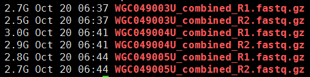 

首先用fastqc处理，会出一些图表，通常是不会有问题的，毕竟公司不想砸自己的牌子。

然后粗略统计下**平均测序深度**及**目标区域覆盖度**，这个是重点，不过一般没问题的，因为现在芯片捕获技术非常成熟了，而且实验水平大幅提升，没有以前那么多的问题了。

这个外显子项目的测序文件中mpileup文件是1371416525行，意味着总的测序长度是1.3G，以前我接触的一般是600M左右的。因为外显子目标区域并不大，就34729283bp，也就是约35M，即使加上侧翼长度。
```
54692160：外显子加上前后50bp
73066288：外显子加上前后100bp
90362533：外显子加上前后150bp
```
然后我要根据外显子记录文件对mpileup文件进行计数，统计外显子的coverage还有测序深度，这个脚本其实蛮有难度的。

我前面提到过外显子组的序列仅占全基因组序列的1%左右，而我在NCBI里面拿到 consensus coding sequence (CCDS)记录`CCDS.20150512.txt`文件，是基于hg38版本的，需要首先转换成hg19才可以来计算这次测序项目的覆盖度和平均测序深度。

参考：http://www.bio-info-trainee.com/?p=990 （ liftover基因组版本之间的coordinate转换）

```
 awk '{print "chr"$3,$4,$5,$1,0,$2,$4,$5,"255,0,0"}' CCDS.20150512.exon.txt >CCDS.20150512.exon.hg38.bed
~/bio-soft/liftover/liftOver CCDS.20150512.exon.hg38.bed ~/bio-soft/liftover/hg38ToHg19.over.chain CCDS.20150512.exon.hg19.bed unmap
```

下面这个程序就是读取转换好的外显子记录的数据，对一家三口一起统计，然后再读取每个样本的20G左右的mpileup文件进行统计，所以很耗费时间。

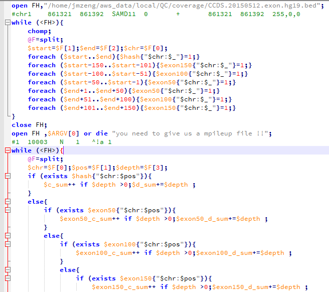

外显子目标区域平均测序深度接近100X，所以很明显是非常好的捕获效率啦！而全基因组背景深度才3.3，这符合实验原理，即与探针杂交碱基多的片段比少的片段更易被捕获。对非特异杂交的基因组覆盖度非特异的背景 DNA 也进行了测序。

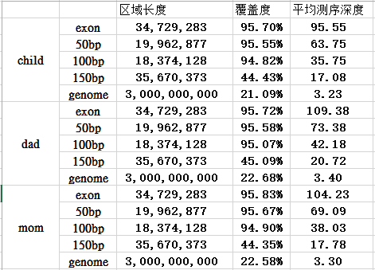

接下来对测序深度进行简单统计，脚本如下，但是这个图没多大意思因为我们的外显子的35M区域平均都接近100X的测序量。

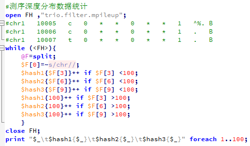

---

##### 第二步：找变异位点 {-}

准备文件：下载必备的软件和参考基因组数据

**软件**

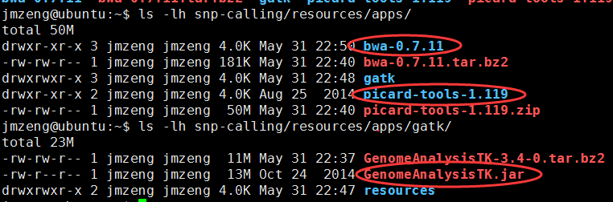

ps：还有samtools，freebayes和varscan软件，我以前下载过，这次就没有再弄了，但是下面会用到

**参考基因组**


**参考突变数据**

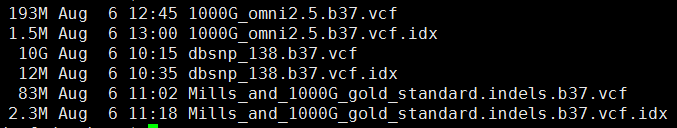

1. 下载数据


2. bwa比对

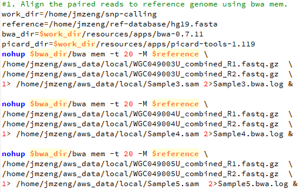

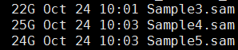

3. sam转为bam，并sort好

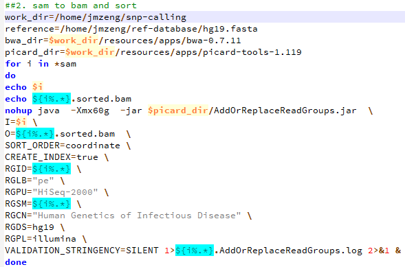

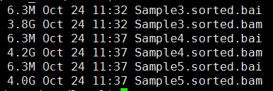

4. 标记PCR重复，并去除

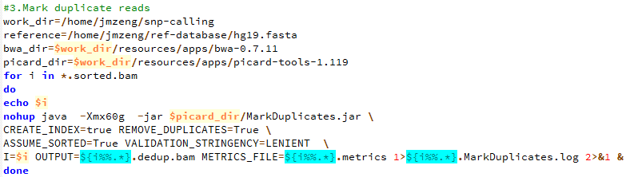

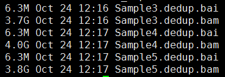

5. 产生需要重排的坐标记录

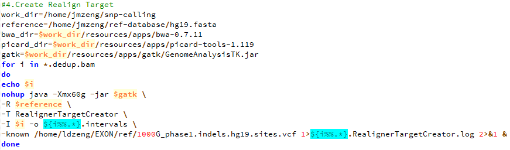

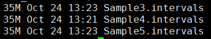

6. 根据重排记录文件把比对结果重新比对

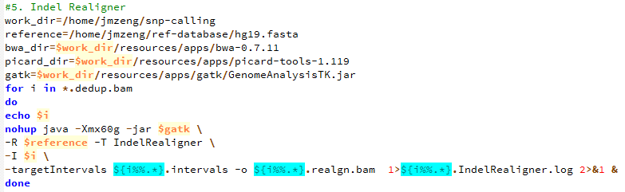

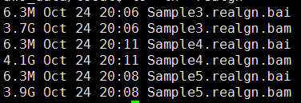

7. 把最终的bam文件转为mpileup文件

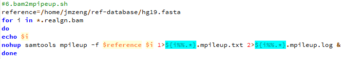

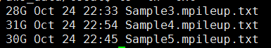

8. 用bcftools 来call snp

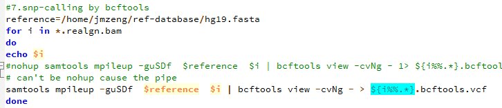

9 用freebayes来call snp

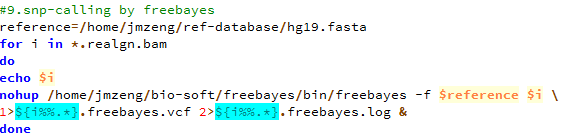

10. 用gatk来call snp

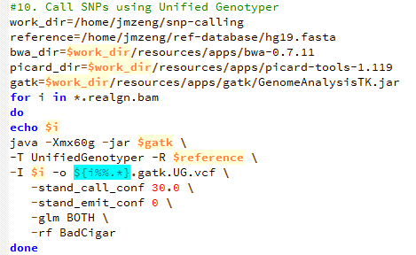

11. 用varscan来call snp

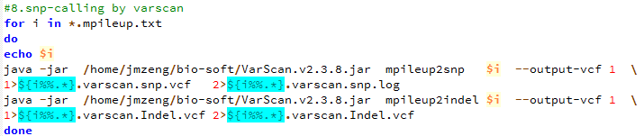

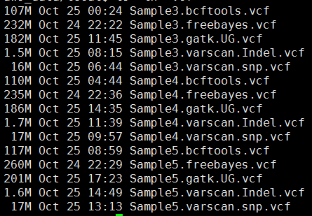


##### 第三步：过滤变异位点 {-}

其中freebayes,bcftools,gatk都是把所有的snp细节都call出来了，可以看到下面这些软件的结果有的高达一百多万个snp，而一般文献都说外显子组测序可鉴定约8万个变异。


这样得到突变太多了，所以需要过滤。这里过滤的统一标准都是**qual大于20，测序深度大于10**。过滤之后的snp数量如下

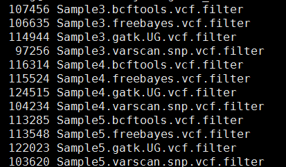

```
perl -alne '{next if $F[5]<20;/DP=(\d+)/;next if $1<10;next if /INDEL/;/(DP4=.*?);/;print "$F[0]\t$F[1]\t$F[3]\t$F[4]:$1"}' Sample3.bcftools.vcf >Sample3.bcftools.vcf.filter

perl -alne '{next if $F[5]<20;/DP=(\d+)/;next if $1<10;next if /INDEL/;/(DP4=.*?);/;print "$F[0]\t$F[1]\t$F[3]\t$F[4]:$1"}' Sample4.bcftools.vcf >Sample4.bcftools.vcf.filter

perl -alne '{next if $F[5]<20;/DP=(\d+)/;next if $1<10;next if /INDEL/;/(DP4=.*?);/;print "$F[0]\t$F[1]\t$F[3]\t$F[4]:$1"}' Sample5.bcftools.vcf >Sample5.bcftools.vcf.filter

perl -alne '{next if $F[5]<20;/DP=(\d+)/;next if $1<10;next unless /TYPE=snp/;@tmp=split/:/,$F[9];print "$F[0]\t$F[1]\t$F[3]\t$F[4]:$tmp[0]:$tmp[1]"}'  Sample3.freebayes.vcf > Sample3.freebayes.vcf.filter

perl -alne '{next if $F[5]<20;/DP=(\d+)/;next if $1<10;next unless /TYPE=snp/;@tmp=split/:/,$F[9];print "$F[0]\t$F[1]\t$F[3]\t$F[4]:$tmp[0]:$tmp[1]"}'  Sample4.freebayes.vcf > Sample4.freebayes.vcf.filter

perl -alne '{next if $F[5]<20;/DP=(\d+)/;next if $1<10;next unless /TYPE=snp/;@tmp=split/:/,$F[9];print "$F[0]\t$F[1]\t$F[3]\t$F[4]:$tmp[0]:$tmp[1]"}'  Sample5.freebayes.vcf > Sample5.freebayes.vcf.filter

perl -alne '{next if $F[5]<20;/DP=(\d+)/;next if $1<10;next if length($F[3]) >1;next if length($F[4]) >1;@tmp=split/:/,$F[9];print "$F[0]\t$F[1]\t$F[3]\t$F[4]:$tmp[0]:$tmp[1]:$tmp[2]"}'  Sample3.gatk.UG.vcf  >Sample3.gatk.UG.vcf.filter

perl -alne '{next if $F[5]<20;/DP=(\d+)/;next if $1<10;next if length($F[3]) >1;next if length($F[4]) >1;@tmp=split/:/,$F[9];print "$F[0]\t$F[1]\t$F[3]\t$F[4]:$tmp[0]:$tmp[1]:$tmp[2]"}'  Sample4.gatk.UG.vcf  >Sample4.gatk.UG.vcf.filter

perl -alne '{next if $F[5]<20;/DP=(\d+)/;next if $1<10;next if length($F[3]) >1;next if length($F[4]) >1;@tmp=split/:/,$F[9];print "$F[0]\t$F[1]\t$F[3]\t$F[4]:$tmp[0]:$tmp[1]:$tmp[2]"}'  Sample5.gatk.UG.vcf  >Sample5.gatk.UG.vcf.filter

perl -alne '{@tmp=split/:/,$F[9];next if $tmp[3]<10;print "$F[0]\t$F[1]\t$F[3]\t$F[4]:$tmp[0]:$tmp[3]"}' Sample3.varscan.snp.vcf >Sample3.varscan.snp.vcf.filter

perl -alne '{@tmp=split/:/,$F[9];next if $tmp[3]<10;print "$F[0]\t$F[1]\t$F[3]\t$F[4]:$tmp[0]:$tmp[3]"}' Sample4.varscan.snp.vcf >Sample4.varscan.snp.vcf.filter

perl -alne '{@tmp=split/:/,$F[9];next if $tmp[3]<10;print "$F[0]\t$F[1]\t$F[3]\t$F[4]:$tmp[0]:$tmp[3]"}' Sample5.varscan.snp.vcf >Sample5.varscan.snp.vcf.filter

```
这样不同工具产生的snp记录数就比较整齐了，我们先比较四种不同工具的call snp的情况，然后再比较三个人的区别。

然后写了一个程序把所有的snp合并起来比较

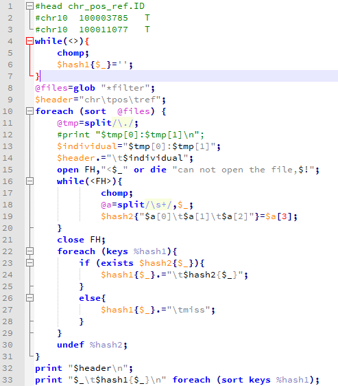

得到了一个很有趣的表格，我放在excel里面看了看 ，主要是要看生物学意义，但是我的生物学知识好多都忘了，得重新学习了 

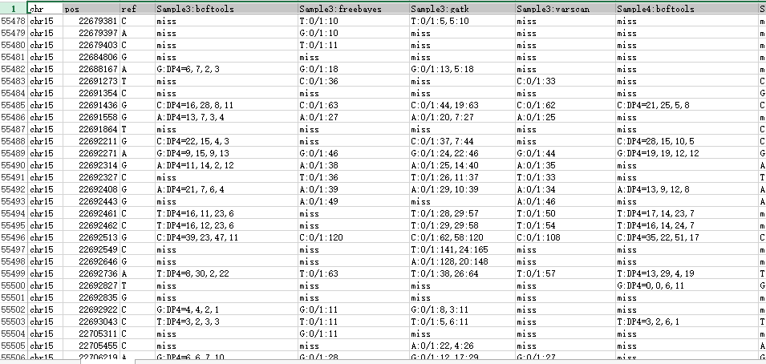


##### 第四步：不同个体的比较 {-}

3-4-5分别就是孩子、父亲、母亲

我对每个个体取他们的**四种软件的公共snp**来进行分析，并且只分析基因型，看看是否符合孟德尔遗传定律。

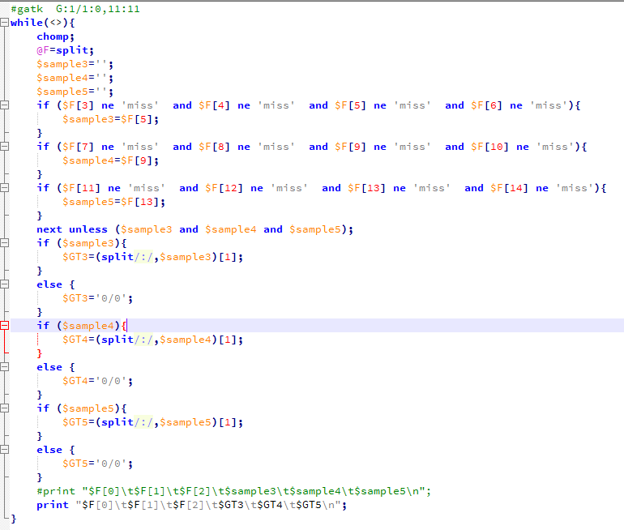

结果如下：

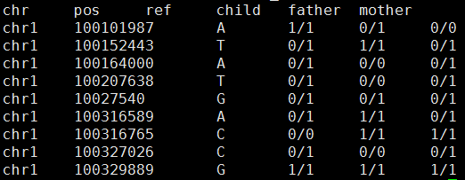

粗略看起来好像很少不符合孟德尔遗传定律，然后我写了程序计算。


总共127138个可以计算的位点，共有18063个位点不符合孟德尔遗传定律。

我检查了一下不符合的原因，发现我把

`chr1 100617887 C T:DP4=0,0,36,3 T:1/1:40 T:1/1:0,40:40 miss T:DP4=0,0,49,9 T:1/1:59 T:1/1:0,58:59 miss T:DP4=0,0,43,8 T:1/1:53 T:1/1:0,53:53 T:1/1:50`

计算成了`chr1 100617887 C 0/0 0/0 1/1` 所以认为不符合，因为我认为只有四个软件都认为是snp的我才当作是snp的基因型，否则都是0/0。那么我就改写了程序，全部用gatk结果来计算。这次可以计算的snp有个176036，不符合的有20309，而且我看了不符合的snp的染色体分布，Y染色体有点异常。

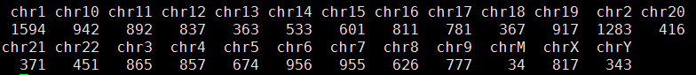

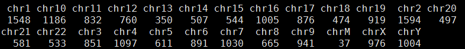

但是很失败，没什么发现。

##### 第五步：不同软件比较 {-}

主要是画韦恩图看看，参考：http://www.bio-info-trainee.com/?p=893

对合并而且过滤的高质量snp信息来看看四种不同的snp calling软件的差异

我们用R语言来画韦恩图

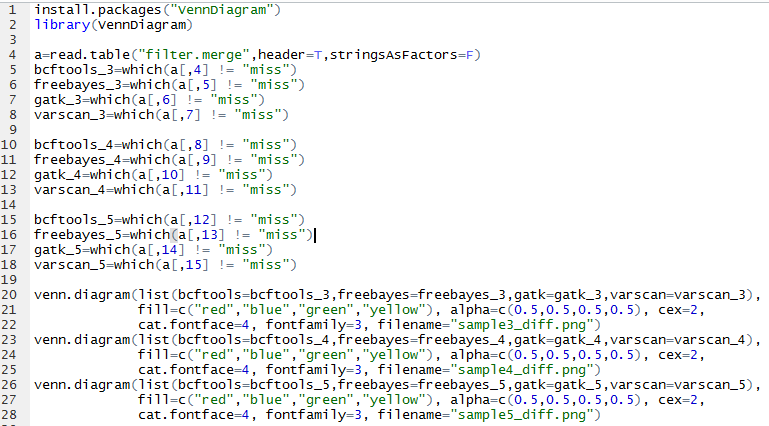

可以看出不同软件的差异还是蛮大的，所以我只选四个软件的公共snp来进行分析

首先是sample3


然后是sample4

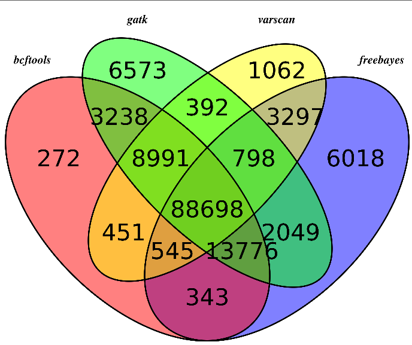

然后是sample5

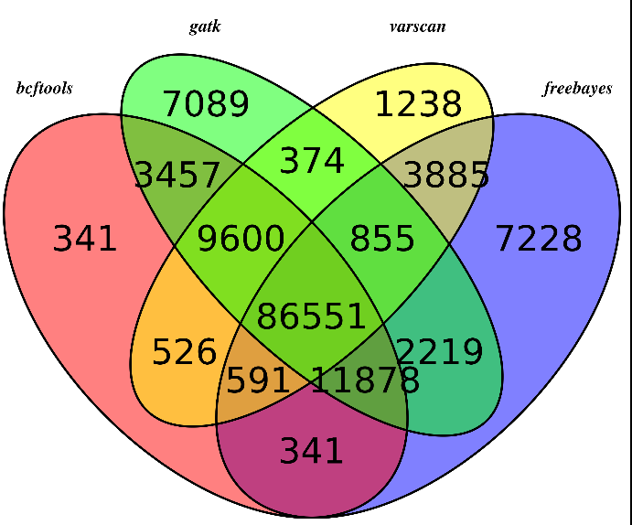

可以看出，不同的软件差异还是蛮大的，所以我重新比较了一下，这次只比较，它们不同的软件在exon位点上面的snp的差异，毕竟，我们这次是外显子测序，重点应该是外显子snp

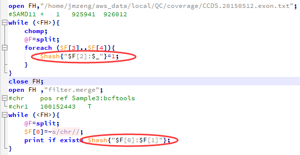

然后我们用同样的程序，画韦恩图，这次能明显看出来了，大部分的snp位点都至少有两到三个软件支持

**所以，只有测序深度达到一定级别，用什么软件来做snp-calling其实影响并不大。**

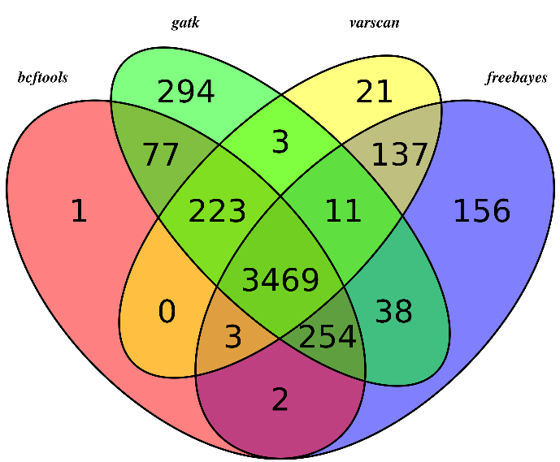

##### 第六步：用annovar注释 {-}

使用annovar软件参考自：http://www.bio-info-trainee.com/?p=641

```
/home/jmzeng/bio-soft/annovar/convert2annovar.pl -format vcf4  Sample3.varscan.snp.vcf > Sample3.annovar

/home/jmzeng/bio-soft/annovar/convert2annovar.pl -format vcf4  Sample4.varscan.snp.vcf > Sample4.annovar

/home/jmzeng/bio-soft/annovar/convert2annovar.pl -format vcf4  Sample5.varscan.snp.vcf > Sample5.annovar
```
然后用下面这个脚本批量注释

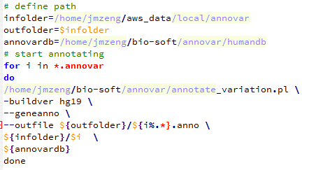

Reading gene annotation from /home/jmzeng/bio-soft/annovar/humandb/hg19_refGene.txt ... Done with 50914 transcripts (including 11516 without coding sequence annotation) for 26271 unique genes

最后查看结果可知，真正在外显子上面的突变并不多

```
23515 Sample3.anno.exonic_variant_function
23913 Sample4.anno.exonic_variant_function
24009 Sample5.anno.exonic_variant_function
```
annovar软件就是把我们得到的十万多个snp分类了，看看这些snp分别是基因的哪些位置，是否引起蛋白突变，位置信息如下：

```
downstream
exonic
exonic;splicing
intergenic
intronic
ncRNA_exonic
ncRNA_intronic
ncRNA_splicing
ncRNA_UTR3
ncRNA_UTR5
splicing
upstream
upstream;downstream
UTR3
UTR5
UTR5;UTR3
```

##### 第七步：de novo变异情况 {-}

de novo变异寻找也属于snp-calling的一部分，但是有点不同的就是该软件考虑了一家三口的测序文件，找de novo突变。

功能介绍：http://varscan.sourceforge.net/trio-calling-de-novo-mutations.html

而且还专门有一篇文章讲ASD和autism与de novo变异的关系，但个人感觉文章不清不楚，没什么意思

**Trio Calling for de novo Mutations**

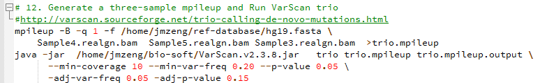

```
Min coverage:   10
Min reads2:     4
Min var freq:   0.2
Min avg qual:   15
P-value thresh: 0.05
Adj. min reads2:        2
Adj. var freq:  0.05
Adj. p-value:   0.15
```
**Reading input from trio.filter.mpileup**

```
1371416525 bases in pileup file （137M的序列）
83123183 met the coverage requirement of 10 （其中有83M的测序深度大于10X）
145104 variant positions (132268 SNP, 12836 indel) （共发现15.5万的变异位点）
4403 were failed by the strand-filter
139153 variant positions reported (126762 SNP, 12391 indel)
502 de novo mutations reported (376 SNP, 126 indel) （真正属于 de novo mutations只有502个）
1734 initially DeNovo were re-called Germline
12 initially DeNovo were re-called MIE
3 initially DeNovo were re-called MultAlleles
522 initially MIE were re-called Germline
1 initially MIE were re-called MultAlleles
3851 initially Untransmitted were re-called Germline
```
然后我看了看输出的文件**trio.mpileup.output.snp.vcf**

软件是这样解释的
> The output of the trio subcommand is a single VCF in which all variants are classified as germline (transmitted or untransmitted), de novo, or MIE.

- FILTER - mendelError if MIE, otherwise PASS

- **STATUS - 1=untransmitted, 2=transmitted, 3=denovo, 4=MIE**

- DENOVO - if present, indicates a high-confidence de novo mutation call

里面的信息量还是不清楚。

我首先对拿到的trio.de_novo.mutaion.snp.vcf文件进行简化，只看基因型！

```
head status.txt   （顺序是dad,mom,child）
STATUS=2 0/0 0/1 0/1
STATUS=2 1/1 1/1 1/1
STATUS=2 0/1 0/0 0/1
STATUS=2 1/1 1/1 1/1
STATUS=1 0/1 0/0 0/0
STATUS=1 0/1 0/0 0/0
STATUS=2 1/1 1/1 1/1
STATUS=2 1/1 1/1 1/1
STATUS=2 1/1 1/1 1/1
STATUS=2 0/1 0/1 0/1
#那么总结如下：
26564 STATUS=1 无所以无 （0/0 0/1 0/0或者 0/1 0/0 0/0等等）
97764 STATUS=2 有所以有 （1/1 1/1 1/1 或者0/1 0/1 1/1等等）
385 STATUS=3 无中生有 （0/0 0/0 0/1 或者0/0 0/0 1/1）
1485 STATUS=4 有中生无 （1/1 0/1 0/0 等等）
```
我用annovar注释了一下

```
/home/jmzeng/bio-soft/annovar/convert2annovar.pl -format vcf4  trio.mpileup.output.snp.vcf > trio.snp.annovar
/home/jmzeng/bio-soft/annovar/annotate_variation.pl -buildver hg19  --geneanno --outfile  trio.snp.anno trio.snp.annovar /home/jmzeng/bio-soft/annovar/humandb
```
结果是：
```
A total of 132268 locus in VCF file passed QC threshold, representing 132809 SNPs (86633 transitions and 46176 transversions) and 3 indels/substitutions
```
可以看到最后被**注释到外显子上面的突变有两万多个**。
```
23794  284345 3123333 trio.snp.anno.exonic_variant_function
```
这个应该是非常有意义的，但是我还没学会后面的分析。只能先做到这里了……

### 转录组

转录组测序的研究对象为特定细胞在某一功能状态下所能转录出来的**所有 RNA 的总和**，包括 mRNA 和非编码 RNA 。通过转录组测序，能够全面获得物种特定组织或器官的转录本信息，从而进行转录本结构研究、变异研究、**基因表达水平研究**以及全新转录本发现等研究。

其中，基因表达水平的探究是转录组领域**最热门**的方向，利用转录组数据来识别转录本和表达定量，是转录组数据的核心作用。由于这个作用，他可以不依赖其他组学信息，单独成为一个产品项目RNA-seq测序。所以很多时候**转录组测序**会与**RNA-seq**混为一谈。

现在RNA-seq数据**使用广泛**，但是没有一套流程可以解决所有的问题。比较值得关注的RNA-seq分析中的重要的步骤包括：实验设计，质控，read比对，表达定量，可视化，差异表达，识别可变剪切，功能注释，融合基因检测，eQTL定位等。


#### RNA-seq表达量分析指引

##### (1)：[计算机资源的准备](http://www.biotrainee.com/thread-1742-1-1.html) {-}

最好是有mac或者linux系统，8G+的内存，500G的存储即可。
如果你是Windows，那么安装必须安装 git,notepad++,everything，还有虚拟机，在虚拟机里面安装linux，最好是ubuntu。
需要安装的软件包括 sratoolkit,fastqc,hisats,samtools,htseq-count,R,Rstudio 
软件安装的代码，在生信技能树公众号后台回复**老司机**即可拿到。
进阶作业，每个软件都收集一个中文教程链接，并自己阅读，发在论坛里面。 

##### (2)：[读文章拿到测序数据](http://www.biotrainee.com/thread-1743-1-1.html) {-}

本系列课程学习的文章是：AKAP95 regulates splicing through scaffolding RNAs and RNA processing factors. Nat Commun 2016 Nov 8;7:13347. PMID: 27824034 很容易在文章里面找到数据地址GSE81916 这样就可以下载sra文件
作业，看文章里的methods部分，把它用到的软件和参数摘抄下来！

然后理解GEO/SRA数据库的数据存放形式，把规律和笔记发在论坛上面！ 

##### (3)：了解fastq测序数据 {-}

需要用安装好的sratoolkit把sra文件转换为fastq格式的测序文件，并且用fastqc等软件测试测序文件的质量！

作业，理解测序reads，GC含量，质量值，接头，index，fastqc的全部报告，搜索中文教程，并发在论坛上面。 

##### (4)：了解参考基因组及基因注释 {-}

在UCSC下载hg19参考基因组，我博客有详细说明，从gencode数据库下载基因注释文件，并且用IGV去查看你感兴趣的基因的结构，比如TP53,KRAS,EGFR等等。


作业，截图几个基因的IGV可视化结构！还可以下载ENSEMBL，NCBI的gtf，也导入IGV看看，截图基因结构。了解IGV常识。


##### (5)： 序列比对 {-}

比对软件很多，首先大家去收集一下，因为我们是带大家入门，请统一用hisat2，并且搞懂它的用法。

直接去hisat2的主页下载index文件即可，然后把fastq格式的reads比对上去得到sam文件。

接着用samtools把它转为bam文件，并且排序(注意N和P两种排序区别)索引好，载入IGV，再截图几个基因看看！

顺便对bam文件进行简单QC，参考直播我的基因组系列。 

##### (6)： reads计数 {-}

实现这个功能的软件也很多，还是烦请大家先自己搜索几个教程，入门请统一用htseq-count，对每个样本都会输出一个表达量文件。

需要用脚本合并所有的样本为表达矩阵。参考：生信编程直播第四题：多个同样的行列式文件合并起来

对这个表达矩阵可以自己简单在excel或者R里面摸索，求平均值，方差。
看看一些生物学意义特殊的基因表现如何，比如GAPDH,β-ACTIN等等。
这是一个分水岭，后面的分析主要靠R了，前面的分析都最好是在linux系统下面完成，主要是安装软件，下载数据，运行。

有几个笔记不错的整合作业：

* [转录组入门（1-6）从测序数据到生成count矩阵](http://www.biotrainee.com/thread-1931-1-1.html)
* [JD加栋 的个人博客](http://www.zd200572.com/2017/07/15/2017-RNAseq-executing/)
* [PANDA姐的转录组入门（0-6）合辑](http://www.biotrainee.com/thread-1966-1-1.html)


##### (7)： 差异基因分析 {-}

这个步骤推荐在R里面做，载入表达矩阵，然后设置好分组信息，统一用DEseq2进行差异分析，当然也可以走走edgeR或者limma的voom流程。

基本任务是得到差异分析结果，进阶任务是比较多个差异分析结果的异同点。

##### (8)： 差异基因结果注释 {-}

我们统一选择p<0.05而且abs(logFC)大于一个与众的基因为显著差异表达基因集，对这个基因集用R包做KEGG/GO超几何分布检验分析。

然后把表达矩阵和分组信息分别作出cls和gct文件，导入到GSEA软件分析。
基本任务是完成这个分析。


最后，把同样的代码实践与其它几篇转录组文章，并且把代码和分析结果发在论坛上面；

* http://biotrainee.com/jmzeng/RNA-seq/RNA-seq-example-GSE81916-two-group.sh
* http://biotrainee.com/jmzeng/RNA-seq/DEG.zip 

我以前在博客写过的

* http://www.bio-info-trainee.com/2218.html

> 比如可以来一些实战：

* 生信技能树»生信技能树›互动作业›项目实战›[mRNA-seq数据分析实战](http://www.biotrainee.com/thread-115-1-1.html)
* [MeDIP-seq,ChIP-seq,RNA-seq结合起来分析](http://www.biotrainee.com/thread-883-1-1.html)

#### RNA-seq检测变异分析实战

前面我们说到RNA-seq最重要的就是对所测样品进行基因表达量的测定，但也有部分课题需要检测RNA-seq试剂里面的变异位点。
这里也进行简单的介绍，如下：

##### RNA-seq 序列比对  {-}

对 RNA-seq 产出的数据进行变异检测分析，与常规重测序的主要区别就在序列比对这一步，因为 RNA-seq 的数据是来自转录本的，比对到参考基因组需要跨越转录剪切位点，所以 RNA-seq 进行变异检测的重点就在于**跨剪切位点的精确序列比对**

文献 [systematic evaluation of spliced alignment programs for RNA-seq data](http://www.nature.com/nmeth/journal/v10/n12/full/nmeth.2722.html) 中对 RNA-seq 数据常用的 11 款比对软件进行了详细测试，包括 STAR 2-pass，而 GATK 对 RNA-seq 数据变异检测的最佳实践流程中选用了 STAR 2-pass 这一方法进行比对，STAR 发表的文章至今已被引用 1900 余次，这款软件的比对速度很快，也是 [ENCODE](https://www.encodeproject.org/) 项目的御用比对软件。

STAR 2-pass 模式需要进行两次序列比对，建立两次参考基因组索引。它的思路是第一次建参考基因组索引之后进行初步的序列比对，根据初步比对结果得到该样本所有的剪切位点信息，包括参考基因组注释 GTF 中已知的剪切位点和比对时新发现的剪切位点，然后利用第一次比对得到的剪切位点信息重新对参考基因组建立索引，然后进行第二次的序列比对，这样可以得到更精确的比对结果。

这里使用了一个测试数据演示流程，第一次对参考基因组建索引：
```shell
# star 1-pass index
STAR --runThreadN 8 --runMode genomeGenerate \
        --genomeDir ./star_index/ \
        --genomeFastaFiles ./genome/chrX.fa \
        --sjdbGTFfile ./genes/chrX.gtf
```

然后进行第一次序列比对：
```shell
#star 1-pass align
STAR --runThreadN 8 --genomeDir ./star_index/ \
        --readFilesIn ./samples/ERR188044_chrX_1.fastq.gz ./samples/ERR188044_chrX_2.fastq.gz \
        --readFilesCommand zcat \
        --outFileNamePrefix ./star_1pass/ERR188044
```

之后根据第一次比对得到的所有剪切位点，重新对参考基因组建立索引：
```shell
# star 2-pass index
STAR --runThreadN 8 --runMode genomeGenerate \
        --genomeDir ./star_index_2pass/ \
        --genomeFastaFiles ./genome/chrX.fa \
        --sjdbFileChrStartEnd ./star_1pass/ERR188044SJ.out.tab
```

再进行 STAR 二次序列比对：
```shell
# star 2-pass align
STAR --runThreadN 8 --genomeDir ./star_index_2pass/ \
        --readFilesIn ./samples/ERR188044_chrX_1.fastq.gz ./samples/ERR188044_chrX_2.fastq.gz \
        --readFilesCommand zcat \
        --outFileNamePrefix ./star_2pass/ERR188044
```

由于后面要用 GATK 进行 call 变异，还需要对比对结果 SAM 文件进行一些处理，这些都可以用 picard 来做，包括 SAM 头文件添加 \@RG 标签，SAM 文件排序并转 BAM 格式，然后标记 duplicate：
```shell
# picard Add read groups, sort, mark duplicates, and create index
java -jar picard.jar AddOrReplaceReadGroups \
        I=./star_2pass/ERR188044Aligned.out.sam \
        O=./star_2pass/ERR188044_rg_added_sorted.bam \
        SO=coordinate \
        RGID=ERR188044 \
        RGLB=rna \
        RGPL=illumina \
        RGPU=hiseq \
        RGSM=ERR188044 

java -jar picard.jar MarkDuplicates \
        I=./star_2pass/ERR188044_rg_added_sorted.bam \
        O=./star_2pass/ERR188044_dedup.bam  \
        CREATE_INDEX=true \
        VALIDATION_STRINGENCY=SILENT \
        M=./star_2pass/ERR188044_dedup.metrics
```
到此序列比对就完成了。

---

##### 使用 GATK 进行变异检测  {-}

感觉 GATK 里面的工具都很慢（相对于其他的软件特别慢！），都是单线程在跑，有的虽然可以设置为多线程但是感觉没啥速度上的提升，所以要有点耐心……

由于 STAR 软件使用的 MAPQ 标准与 GATK 不同，而且比对时会有 reads 的片段落到内含子区间，需要进行一步 MAPQ 同步和 reads 剪切，使用 GATK 专为 RNA-seq 应用开发的工具 `SplitNCigarReads` 进行操作，它会将落在内含子区间的 reads 片段直接切除，并对 MAPQ 进行调整。DNA 测序的重测序应用中也有序列比对软件的 MAPQ 与 GATK 无法直接对接的情况，需要进行调整。

```shell
# samtools faidx chrX.fa
# samtools dict chrX.fa
java -jar GenomeAnalysisTK.jar -T SplitNCigarReads \
        -R ./genome/chrX.fa \
        -I ./star_2pass/ERR188044_dedup.bam \
        -o ./star_2pass/ERR188044_dedup_split.bam \
        -rf ReassignOneMappingQuality \
        -RMQF 255 \
        -RMQT 60 \
        -U ALLOW_N_CIGAR_READS
```

之后就是可选的 Indel Realignment，对已知的 indel 区域附近的 reads 重新比对，可以稍微提高 indel 检测的真阳性率，如果时间紧张也可以不做，这一步影响很轻微

```shell
# 可选步骤 IndelRealign
java -jar GenomeAnalysisTK.jar -T RealignerTargetCreator \
        -R ./genome/chrX.fa \
        -I ./star_2pass/ERR188044_dedup_split.bam \
        -o ./star_2pass/ERR188044_realign_interval.list \
        -known Mills_and_1000G_gold_standard.indels.hg19.sites.vcf 

java -jar GenomeAnalysisTK.jar -T IndelRealigner \
        -R ./genome/chrX.fa \
        -I ./star_2pass/ERR188044_dedup_split.bam \
        -known Mills_and_1000G_gold_standard.indels.hg19.sites.vcf \
        -o ./star_2pass/ERR188044_realign.bam \
        -targetIntervals ./star_2pass/ERR188044_realign_interval.list

        
```

然后还是可选的 BQSR，这一步操作主要是针对测序质量不太好的数据，进行碱基质量再校准，如果对自己的测序数据质量足够自信可以省略，2500 之后 Hiseq 仪器的数据质量都挺不错的，可以根据 FastQC 结果来决定。这一步省了又能节省时间

```shell
# 可选步骤 BQSR
java -jar GenomeAnalysisTK.jar \
        -T BaseRecalibrator \
        -R ./genome/chrX.fa \
        -I ./star_2pass/ERR188044_realign.bam \
        -knownSites 1000G_phase1.snps.high_confidence.hg19.sites.vcf \
        -knownSites Mills_and_1000G_gold_standard.indels.hg19.sites.vcf \
        -o ./star_2pass/ERR188044_recal_data.table

java -jar GenomeAnalysisTK.jar  \
        -T PrintReads \
        -R ./genome/chrX.fa \
        -I ./star_2pass/ERR188044_realign.bam \
        -BQSR ./star_2pass/ERR188044_recal_data.table \
        -o ./star_2pass/ERR188044_BQSR.bam

```

比如下面的数据就可以放心的省略这两步了：


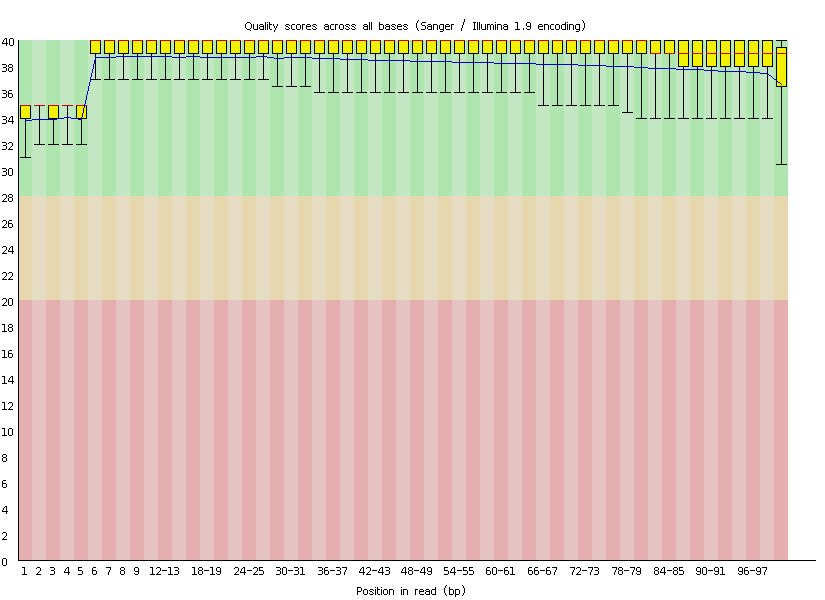

现在终于可以进行变异检测了，GATK 官网说 HC 表现比 UC 好，所以这里用 HC 进行变异检测：
```shell
java -jar GenomeAnalysisTK.jar -T HaplotypeCaller \
        -R ./genome/chrX.fa \
        -I ./star_2pass/ERR188044_dedup_split.bam \
        -dontUseSoftClippedBases \
        -stand_call_conf 20.0 \
        -o ./star_2pass/ERR188044.vcf

```
call 完变异之后再进行过滤：
```shell
java -jar GenomeAnalysisTK.jar \
        -T VariantFiltration \
        -R ./genome/chrX.fa \
        -V ./star_2pass/ERR188044.vcf \
        -window 35 \
        -cluster 3 \
        -filterName FS -filter "FS > 30.0" \
        -filterName QD -filter "QD < 2.0" \
        -o ./star_2pass/ERR188044_filtered.vcf
```
然后就拿到变异检测结果了，可以用 ANNOVAR 或 SnpEff 或 VEP 进行注释，根据自己的需要进行筛选了。


  [1]: http://static.zybuluo.com/wangpeng905/tiitfgpjnuvyvfdnvvnud319/R1_QC.png
  [2]: http://static.zybuluo.com/wangpeng905/iqx3yy6wf72dmodirjnjvs6j/R2_QC.png
  
#### 全转录组

> 全转录组即包含mRNA，small RNA，lncRNA，circRNA的测序。

搞研究的小伙伴目前大多默认转录组指的是mRNA。而我们知道转录组中也包含着非编码RNA（ncRNA），包括具有调控功能的ncRNAs和管家RNAs（如tRNA，rRNA等）。对转录组中的非编码RNA，目前大家的研究多集中在具有调控功能的small RNA（以miRNA为代表），长链非编码RNA（lncRNA）和环状RNA（circRNA）上，而这几类ncRNA的调控对象都和mRNA有关。因此，全转录组即包含了ncRNAs和mRNA。
大家目前主要关心调控ncRNAs与mRNA的相互作用关系。全转录组的提出，是为了与大家默认的转录组（mRNA）有所区分，并不是一个新概念。但是在实验和数据分析上，两者还是有一些不同的。

##### 全转录组文库构建 {-}

全转录组测序是通过构建2个文库，1个小RNA文库（包含miRNA）和一个去除核糖体的链特异性文库（包含mRNA，lncRNA，和circRNA），然后分别上机测序，最后主要获得4类RNA——miRNA，lncRNA，mRNA，circRNA的序列信息。

由于miRNA序列较短（18~26 nt），而其他三类RNA序列较长（通常在1 kb以上），因此它们构建文库的方式会不一样，长序列需要先片段化再建库。这也造成了两者的测序读长是不一样的，小RNA文库的测序读长是SE50，长序列文库的测序读长是PE150，因而需要分别上机测序。
我们熟悉的转录组测序只需要构建一个文库，针对mRNA进行序列鉴定和分析。

##### 全转录组测序的数据分析  {-}

不同于只能获取mRNA信息的转录组测序，在全转录组测序完成后，我们可以获取4类主要RNA（miRNA，mRNA，lncRNA，circRNA）的序列信息。接着我们对这4类RNA进行标准分析和整合分析。
标准分析是针对每类RNA主要讨论，序列鉴定，序列特征分析，差异表达分析，和功能富集分析；
整合分析是全转录组测序的重点内容，基于标准分析的结果，整合分析重点讨论非编码RNA与编码RNA间的调控关系，主要包括两者间互作关系miRNA vs mRNA，miRNA vs lncRNA，miRNA vs circRNA，再进一步讨论三者间互作关系mRNA vs miRNA vs lncRNA，mRNA vs miRNA vs circRNA。而三者间的互作关系正是目前讨论得如火如荼的ceRNA（competing endogenous RNA）调控网络。

 
#### 可变剪切

##### 什么是可变剪接，研究可变剪接的意义？  {-}

某些基因的一个mRNA前体可以通过选择不同的剪接位点产生不同的可变剪接（Alternative Splicing, AS）形式，这种可变剪接通过以下两种方式参与基因表达调控：

* 1）导致一个基因形成多个剪接异构体（isoform），从而编码不同的蛋白质
* 2）通过无义介导的mRNA降解（NMD）和miRNA调节来调整mRNA的稳定性及翻译。

可变剪接是转录本和蛋白质多样性的主要来源，已有研究表明可变剪接与某些数量性状基因、性别决定通路（如果蝇）、遗传疾病（如脆性X综合征）等密切相关。对可变剪接进行精准的鉴定分析，能够更深入地研究基因表达模型和调控机制。

##### 如何对标准的mRNA-seq数据进行可变剪切分析？   {-}

这个数据分析点比较小众，理论上不属于本书的讲解范畴，我们就简单描述部分。可以用ASprofile 软件对 Cufflinks 预测的转录本的可变剪切事件进行分类统计，常见可变剪切事件如下所示:

- AE: Alternative exon ends (5' , 3' , or both) ----- 可变 5' 或3' 端剪切
- XAE: Approximate AE (5' , 3' , or both) ----- 近似可变 5' 或3' 端剪切
- IR: Intron retention ----- 单内含子保留
- XIR: Approximate IR ----- 近似单内含子保留
- MIR: Multi-IR ----- 多内含子保留
- XMIR: Approximate MIR ----- 近似多内含子保留
- TSS: Alternative 5' first exon ----- 第一个外显子可变剪切
- TTS: Alternative 3' last exon ----- 最后一个外显子可变剪切
- SKIP: Skipped exon ----- 单外显子跨跃
- XSKIP: Approximate SKIP ----- 近似单外显子跨跃
- MSKIP: Multi-exon SKIP ----- 多外显子跨跃
- XMSKIP: Approximate MSKIP ----- 近似多外显子跨跃

可以将**Length >= 200bp** 且 **exon number >=2** 作为可靠的新基因的转录本筛选条件，新基因的转录本需要做Nr, KEGG的数据库注释。

至于基因结构优化，对于人、小鼠、拟南芥等模式生物来说，基因注释相对完整，但对于研究没那么透彻的其他物种，我们可以用reads来优化基因结构，从而完善它们的基因注释信息。

Reads比对参考基因组后，我们用**Cufflink**软件对reads进行转录本重构，将重构结果与参考转录本序列进行比较，重构出来的转录本可能会延长基因注释的5’或3’端，由此实现优化基因结构的目的。

##### 可变剪切事件的可视化 {-}

Python软件SpliceGrapher可以将可变剪切模型绘制成图片

SpliceGrapher可以根据测序序列预测可变剪切模型，也可以用已知的基因注释文件生成可变剪切模型。它需要两种输入文件，注释gtf/gff3文件和测序reads与参考基因组比对的sam文件。SpliceGrapher可以预测出多种多样的可变剪切事件，已知的基因模型中存在Alt 3’（可变3’端）、Skipped Exon（跳过外显子）、Intron Retention（内含子保留）、Alt 5’（可变5’端）、既是Alt 3’又是Skipped Exon、既是Alt 5’又是Intron Retention等多种可变剪切事件。不同的事件用不同的颜色标注出来。

发表这个工具的文章是Xiaoxian Liu, et al. Detecting Alternatively Spliced Transcript Isoforms from Single-Molecule Long-Read Sequences without a Reference Genome. Mol Ecol Resour. (2017)

#### 融合基因分析

基因融合现象发生在很多致命疾病中，如果是癌症等疾病的融合基因分析可以使用defuse软件， 利用reads的基因跨越以及一对reads的相对距离进行基因融合查找，当然，也可以使用BGI的SOAP系列，生信菜鸟团博客里面有详细描述软件的安装以及示例数据的测试使用。

结题报告能给用户的就是软件找到的可能的融合基因表格,表格里面可能有下面的内容：


#### 自学miRNA-seq八讲

##### 第一讲：文献选择与解读  {-}

前阵子逛BioStar论坛的时候看到了一个关于miRNA分析的问题，提问者从NCBI的SRA中下载文献提供的原始数据，然后处理的时候出现了问题。我看到他列出的数据来自iron torrent测序仪，而且我以前也没有做过miRNA-seq的数据分析， 就自学了一下。因为我有RNA-seq的基础，所以理解学习起来比较简单。

在这里记录自己的学习过程，希望对需要的朋友有帮助。

这里选择的文章是2014年发表的，作者用ET-1刺激human iPSCs (hiPSC-CMs) 细胞前后，观察miRNA和mRNA表达量的变化，我并没有细看文章的生物学意义，仅仅从数据分析的角度解读一下这篇文章，mRNA表达量用的是Affymetrix Human Genome U133 Plus 2.0 Array，分析起来特别容易。得到表达矩阵，然后用limma这个包找差异表达基因即可。

但是miRNA分析起来就有点麻烦了，作者用的是iron torrent测序仪。不过从SRA数据中心下载的是已经去掉接头的fastq格式测序数据，所以这里其实并不需要考虑测序仪的特异性。

###### 关于该文章的几个资料 {-}

- paper : http://journals.plos.org/plosone/article?id=10.1371/journal.pone.0108051
- Aggarwal P, Turner A, Matter A, Kattman SJ et al. RNA expression profiling of human iPSC-derived cardiomyocytes in a cardiac hypertrophy model. PLoS One 2014;9(9):e108051. PMID: 25255322
- The accession numbers are 1. SuperSeries (mRNA+miRNA) - GSE60293
- mRNA expression array - GSE60291  (Affymetrix Human Genome U133 Plus 2.0 Array)
- miRNA-Seq - GSE60292  (Ion Torrent)
- GEO   : http://www.ncbi.nlm.nih.gov/geo/query/acc.cgi?acc=GSE60292
- FTP   : ftp://ftp-trace.ncbi.nlm.nih.gov/sra/sra-instant/reads/ByStudy/sra/SRP/SRP045/SRP045420

接下来我们要知道文章做了哪些分析，然后才能自己模仿看是否可以得到同样的分析结果。

###### 文章数据处理流程 {-}

- Ion Torrent's Torrent Suite version 3.6 was used for basecalling
- Raw sequencing reads were aligned using the SHRiMP2 aligner and were aligned against the human reference genome (hg19) for novel miRNA prediction and then against a custom reference sequence file containing miRBase v.20 known human miRNA hairpins, tRNA, rRNA, adapter sequences and predicted novel miRNA sequences.(Genome_build: hg19, miRBase v.20 human miRNA hairpins)
- The miRDeep2 package (default parameters) was used to predict novel (as yet undescribed) miRNAs
- Alignments with less than 17 bp matches and a custom 3′ end phred q-score threshold of 17 were filtered out.
- miRNA quanitification was done using HTSeq v0.5.3p3 using the default union parameter.
  Differential miRNA expression was analyzed using the DESeq (v.1.12.1) R/Bioconductor package
- In this study, differentially expressed genes that had a false discovery rate cutoff at 10% (FDR< = 0.1), a log2 fold change greater than 1.5 and less than −1.5 were considered significant.
- Target gene prediction was performed using the TargetScan (version 6.2) database
- We also used miRTarBase (version 4.3), to identify targets that have been experimentally validated
- miR-Deep2 and miReap predict exact precursor sequence according from mature sequence 


 文章提到了fastq数据**质量控制**标准，**数据比对**工具，比对的**参考基因组**（两条比对线路），**获得miRNA表达量**，**miRNA预测**，**miRNA靶基因预测**。

这也是我们学习miRNA-seq的数据分析的标准套路， 而且作者给出了所有的分析结果，我们完全可以通过自己的学习来重现他的分析过程。


- Supplementary_files_format_and_content: tab-delimited text files containing raw read counts for known mature human miRNAs.（表达矩阵）

- We detected 836 known human mature miRNAs in the control-CMs and 769 in the ET1-CMs

- Based on our miRNA-Seq data, we predicted 506 sequences to be potentially novel, as yet undescribed miRNAs.

- In order to validate the expression profiles of the miRNAs detected, we performed RT-qPCR on a subset of five known human mature and five of our predicted novel miRNAs.

- we obtained a total of 1,922 predicted miRNA-mRNA pairs represented by 309 genes and 174 known mature human miRNAs. 

当然仅仅是套路分析还不够，所以他进行了 miRNA和mRNA 进行网络分析并做了少量湿实验来验证，最后还扯了一些生物学意义。

---

##### 第二讲：搜集学习资料 {-}

因为我是完全从零开始入门miRNA-seq分析，所以收集的资料比较齐全。

首先看了部分中文资料，**了解miRNA测序是怎么回事，该分析什么，然后主要围绕着第一讲文献里的分析步骤来搜索资料。**

###### miRNA定义 {-}

我首先找到了miRNA定义：[http://nar.oxfordjournals.org/content/34/suppl_1/D135.full ](http://nar.oxfordjournals.org/content/34/suppl_1/D135.full)

>  MicroRNAs (miRNAs) are **small RNA molecules**, which are **∼22 nt sequences**  that have an important role in the translational regulation and degradation of mRNA by the base's pairing to the 3′-untranslated regions (3′-UTR) of the mRNAs. The miRNAs are derived from the **precursor transcripts of ∼70–120 nt sequences**, which fold to **form as stem–loop structures**, which are thought to be highly conserved in the evolution of genomes. Previous analyses have suggested that **∼1% of all human genes are miRNA genes,** which regulate the production of protein for 10% or more of all human coding genes。

###### 选择参考序列 {-}

然后我比较纠结的问题是参考序列如何选择，因为miRNA序列很少，把它map到3G大小的人类基因组有点浪费计算资源，正好我的服务器又坏了，不想太麻烦，想用自己的个人电脑搞定这个学习过程。

我看到很多帖子提到的都是用bowtie比对到**参考miRNA数据库**(miRNA count: 28645 entries)  [http://www.mirbase.org/](http://www.mirbase.org/) ，从这个数据库，我明白了前体miRNA和成熟的miRNA的区别，前体miRNA长度一般是**70–120 **碱基，一般是茎环结果，也就是发夹结构，所以叫做hairpin。成熟之后，一般**22 个碱基，**在miRNA数据库很容易下载到这些数据，目前人类这个物种已知的成熟miRNA共有2588条序列，而前体miRNA共有1881条序列，我下载（下载时间2016年6月 ）的代码如下所示：

```
wget ftp://mirbase.org/pub/mirbase/CURRENT/hairpin.fa.gz   ##　28645　reads
wget ftp://mirbase.org/pub/mirbase/CURRENT/mature.fa.zip   ##   35828 reads 
wget ftp://mirbase.org/pub/mirbase/CURRENT/hairpin.fa.zip
wget ftp://mirbase.org/pub/mirbase/CURRENT/genomes/hsa.gff3 ##
wget ftp://mirbase.org/pub/mirbase/CURRENT/miFam.dat.zip
grep sapiens mature.fa |wc  　# 2588 
grep sapiens hairpin.fa |wc       # 1881 
## Homo sapiens
perl -alne '{if(/^>/){if(/Homo/){$tmp=1}else{$tmp=0}};next if $tmp!=1;s/U/T/g if !/>/;print }' hairpin.fa >hairpin.human.fa
perl -alne '{if(/^>/){if(/Homo/){$tmp=1}else{$tmp=0}};next if $tmp!=1;s/U/T/g if !/>/;print }' mature.fa >mature.human.fa
# 这里值得一提的是miRBase数据库下载的序列，居然都是用U表示的，也就是说就是miRNA序列，而不是转录成该miRNA的基因序列，而我们测序的都是基因序列。
```

通过这个代码制作的**hairpin.human.fa** 和 **mature.human.fa** 就是本次数据分析的参考基因组。

在搜集资料的过程中，我看到了一篇文献讲挖掘1000genomes的数据找到位于miRNA的snp位点

[https://genomemedicine.biomedcentral.com/articles/10.1186/gm363](https://genomemedicine.biomedcentral.com/articles/10.1186/gm363) 

看起来比较新奇，不过跟本次学习过程没有关系，我就是记录一下，有空回来学习学习。


**博客讲解如何分析miRNA数据**

- [http://genomespot.blogspot.com/2013/08/quick-alignment-of-microrna-seq-data-to.html](http://genomespot.blogspot.com/2013/08/quick-alignment-of-microrna-seq-data-to.html)

**公司数据分析流程：**

- [http://bioinfo5.ugr.es/miRanalyzer/miRanalyzer_tutorial.html](http://bioinfo5.ugr.es/miRanalyzer/miRanalyzer_tutorial.html)

- [http://www.partek.com/sites/default/files/Assets/UserGuideMicroRNAPipeline.pdf](http://www.partek.com/sites/default/files/Assets/UserGuideMicroRNAPipeline.pdf)

- [http://partek.com/Tutorials/microarray/microRNA/miRNA_tutorial.pdf](http://partek.com/Tutorials/microarray/microRNA/miRNA_tutorial.pdf)

- [http://www.arraystar.com/reviews/microrna-sequencing-data-analysis-guideline/](http://www.arraystar.com/reviews/microrna-sequencing-data-analysis-guideline/)

- [http://bioinfo5.ugr.es/sRNAbench/sRNAbench_tutorial.pdf](http://bioinfo5.ugr.es/sRNAbench/sRNAbench_tutorial.pdf)

- [http://seqcluster.readthedocs.io/mirna_annotation.html](http://seqcluster.readthedocs.io/mirna_annotation.html)

**耶鲁大学**

- [http://www.yale.edu/giraldezlab/miRNA.html](http://www.yale.edu/giraldezlab/miRNA.html)

**南方基因**

-  [http://www.southgene.com/newsshow.php?cid=55&id=73](http://www.southgene.com/newsshow.php?cid=55&id=73)

**miRNA研究整套方案** 

- [http://wenku.baidu.com/view/5f38577a31b765ce05081429.html?re=view](http://wenku.baidu.com/view/5f38577a31b765ce05081429.html?re=view)

**Biostar 讨论帖子**

- [https://www.biostars.org/p/3344/](https://www.biostars.org/p/3344/)

- [https://www.biostars.org/p/98486/](https://www.biostars.org/p/98486/)

**miRNA-seq数据处理实战指南**

- [http://bib.oxfordjournals.org/content/early/2015/04/17/bib.bbv019.full](http://bib.oxfordjournals.org/content/early/2015/04/17/bib.bbv019.full)

**直接用一个包搞定**

[- http://bioconductor.org/packages/release/bioc/html/easyRNASeq.html](http://bioconductor.org/packages/release/bioc/html/easyRNASeq.html)

**github流程**：miRNA Analysis Pipeline v0.2.7

- [https://github.com/bcgsc/mirna/tree/master/v0.2.7](https://github.com/bcgsc/mirna/tree/master/v0.2.7)

- [https://tools.thermofisher.com/content/sfs/manuals/CO25176_0512.pdf](https://tools.thermofisher.com/content/sfs/manuals/CO25176_0512.pdf)

**miRNA annotation**

- [http://seqcluster.readthedocs.io/mirna_annotation.html](http://seqcluster.readthedocs.io/mirna_annotation.html)

**网页版分析工具**

- [https://wiki.uio.no/projects/clsi/images/2/2f/HTS_2014_miRNA_analysis_Lifeportal_14_final.pdf](https://wiki.uio.no/projects/clsi/images/2/2f/HTS_2014_miRNA_analysis_Lifeportal_14_final.pdf)
- [http://www.training.prace-ri.eu/uploads/tx_pracetmo/NGSdataAnalysisWithChipster.pdf](http://www.training.prace-ri.eu/uploads/tx_pracetmo/NGSdataAnalysisWithChipster.pdf)

**可视化IGV User Guide**

- [http://www.broadinstitute.org/igv/book/export/html/6](http://www.broadinstitute.org/igv/book/export/html/6)

比较特殊的是新的miRNA预测，miRNA靶基因预测，这块软件太多并没有成型的流程和标准。

---

##### 第三讲：下载公共数据 {-}

前面已经讲到了该文章的数据已经上传到NCBI的SRA数据中心，所以直接根据索引号下载，然后用**SRAtoolkit**转出我们想要的fastq测序数据即可。

下载的数据一般要进行质量控制，可视化展现一下质量如何，然后根据大题测序质量进行简单过滤。所以需要提前安装一些软件来完成这些任务，包括：**sratoolkit /fastx_toolkit /fastqc/bowtie2/hg19/miRBase/SHRiMP**

下面是我用新服务器下载安装软件的一些代码记录，因为fastx_toolkit /fastqc我已经安装过，就不列代码了

```
## pre-step: download sratoolkit /fastx_toolkit_0.0.13/fastqc/bowtie2/hg19/miRBase/SHRiMP
## http://www.ncbi.nlm.nih.gov/Traces/sra/sra.cgi?view=software
## http://www.ncbi.nlm.nih.gov/books/NBK158900/
## 我这里特意挑选的二进制版本程序下载的，这样直接解压就可以用，但是需要挑选适合自己的操作系统的程序。
cd ~/biosoft
mkdir sratoolkit &&  cd sratoolkit
wget http://ftp-trace.ncbi.nlm.nih.gov/sra/sdk/2.6.3/sratoolkit.2.6.3-centos_linux64.tar.gz
##
##  Length: 63453761 (61M) [application/x-gzip]
##  Saving to: "sratoolkit.2.6.3-centos_linux64.tar.gz"
tar zxvf sratoolkit.2.6.3-centos_linux64.tar.gz
cd ~/biosoft
mkdir bowtie &&  cd bowtie
wget https://sourceforge.net/projects/bowtie-bio/files/bowtie2/2.2.9/bowtie2-2.2.9-linux-x86_64.zip/download
#Length: 27073243 (26M) [application/octet-stream]
#Saving to: "download"
mv download  bowtie2-2.2.9-linux-x86_64.zip
unzip bowtie2-2.2.9-linux-x86_64.zip
## http://compbio.cs.toronto.edu/shrimp/
mkdir SHRiMP &&  cd SHRiMP
wget http://compbio.cs.toronto.edu/shrimp/releases/SHRiMP_2_2_3.lx26.x86_64.tar.gz
tar zxvf SHRiMP_2_2_3.lx26.x86_64.tar.gz 
cd SHRiMP_2_2_3
export SHRIMP_FOLDER=$PWD  ## 这个软件使用的时候比较奇葩，需要设置到环境变量，不能简单的调用全路径
```

**SHRiMP**这个软件比较小众，我也是第一次听说过。

本来我计划是能用bowtie搞定，但是第一次比对出了一个bug，就是下载的miRNA序列里面的U没有转换成T，所以导致比对率非常之低。于是我不得不根据文章里面记录的软件SHRiMP 来做比对，最后发现比对率完全没有改善，搞得我都在怀疑是不是作者乱来了。

下面是下载数据，质量控制的代码，希望大家可以照着运行一下。

```
## step1 : download raw data
mkdir miRNA_test && cd miRNA_test
echo {14..19} |sed 's/ /\n/g' |while read id; \
do  wget "ftp://ftp-trace.ncbi.nlm.nih.gov/sra/sra-instant/reads/ByStudy/sra/SRP/SRP045/SRP045420/SRR15427$id/SRR15427$id.sra"  ;\
done
## step2 :  change sra data to fastq files.
## 主要是用shell脚本来批量下载
ls *sra |while read id; do ~/biosoft/sratoolkit/sratoolkit.2.6.3-centos_linux64/bin/fastq-dump $id;done
rm *sra
##  33M --> 247M
#Read 1866654 spots for SRR1542714.sra
#Written 1866654 spots for SRR1542714.sra
## step3 : download the results from paper
## http://www.bio-info-trainee.com/1571.html
## ftp://ftp.ncbi.nlm.nih.gov/geo/series/GSE1nnn/GSE1009/suppl/GSE1009_RAW.tar
mkdir paper_results && cd paper_results
wget ftp://ftp.ncbi.nlm.nih.gov/geo/series/GSE60nnn/GSE60292/suppl/GSE60292_RAW.tar
## tar xvf GSE60292_RAW.tar
ls *gz |while read id ; do (echo $id;zcat $id | cut -f 2 |perl -alne '{$t+=$_;}END{print $t}');done
ls *gz |xargs gunzip
## step4 : quality assessment
ls *fastq | while read id ; do ~/biosoft/fastqc/FastQC/fastqc $id;done
## Sequence length 8-109
## %GC 52
## Adapter Content passed
## write a script : :: cat >filter.sh
ls *fastq |while read id
do
echo $id
~/biosoft/fastx_toolkit_0.0.13/bin/fastq_quality_filter -v -q 20 -p 80 -Q33  -i $id -o tmp ;
~/biosoft/fastx_toolkit_0.0.13/bin/fastx_trimmer -v -f 1 -l 27 -i tmp  -Q33 -z -o ${id%%.*}_clean.fq.gz ;
done
rm tmp
## discarded 12%~~49%%
ls *_clean.fq.gz | while read id ; do ~/biosoft/fastqc/FastQC/fastqc $id;done
mkdir QC_results
mv *zip *html QC_results
```

这个代码是我自己根据文章的理解写出的，因为我本身不擅长miRNA数据分析，所以在进行QC的时候参数选择可能并不是那么友好.

```
~/biosoft/fastx_toolkit_0.0.13/bin/fastq_quality_filter -v -q 20 -p 80 -Q33  -i $id -o tmp ;
~/biosoft/fastx_toolkit_0.0.13/bin/fastx_trimmer -v -f 1 -l 27 -i tmp  -Q33 -z -o ${id%%.*}_clean.fq.gz ;
```

最后得到的**clean.fq.gz**系列文件，就是我需要进行比对的序列。

---

##### 第四讲：测序数据比对 {-}

序列比对是大多数类型数据分析的核心，如果要利用好测序数据，比对细节非常重要，我这里只是研读一篇文章也就没有对比对细节过多考虑，只是列出自己的代码和自己的几点思考，力求重现文章作者的分析结果。

对miRNA-seq数据有两条比对策略：

1. 下载miRBase数据库里面的已知miRNA序列来进行比对

2. 直接比对到参考基因组(比如人类的是hg19/hg38)

前面的比对非常简单，而且很容易就可以数出已经的所以miRNA序列的表达量；后面的比对有点耗时，而且算表达量的时候也不是很方便，但是它的优点是可以来预测新的miRNA，所以大多数文章都会把这两条路给走一下。

本文选择的是SHRiMP这个小众软件，起初我并没有在意，就用的bowtie2而已，参考基因组就用了miRBase数据库下载的人类的参考序列。

```
## step5 : alignment to miRBase v21 (hairpin.human.fa/mature.human.fa )
#### step5.1 using bowtie2 to do alignment
mkdir  bowtie2_index &&  cd bowtie2_index
~/biosoft/bowtie/bowtie2-2.2.9/bowtie2-build ../hairpin.human.fa hairpin_human
~/biosoft/bowtie/bowtie2-2.2.9/bowtie2-build ../mature.human.fa  mature_human
ls *_clean.fq.gz | while read id ; do  ~/biosoft/bowtie/bowtie2-2.2.9/bowtie2 -x miRBase/bowtie2_index/hairpin_human -U $id   -S ${id%%.*}.hairpin.sam ; done
## overall alignment rate:  10.20% / 5.71%/ 10.18%/ 4.36% / 10.02% / 4.95%  (before convert U to T )
## overall alignment rate:  51.77% / 70.38%/51.45% /61.14%/ 52.20% / 65.85% (after convert U to T )
ls *_clean.fq.gz | while read id ; do  ~/biosoft/bowtie/bowtie2-2.2.9/bowtie2 -x miRBase/bowtie2_index/mature_human  -U $id   -S ${id%%.*}.mature.sam ; done
## overall alignment rate:  6.67% / 3.78% / 6.70% / 2.80%/ 6.55% / 3.23%    (before convert U to T )
## overall alignment rate:  34.94% / 46.16%/ 35.00%/ 38.50% / 35.46% /42.41%(after convert U to T )
#### step5.2 using SHRiMP to do alignment
##    http://compbio.cs.toronto.edu/shrimp/README
##    3.5 Mapping cDNA reads against a miRNA database
cd ~/biosoft/SHRiMP/SHRiMP_2_2_3
export SHRIMP_FOLDER=$PWD
cd -
##　　We project the database with:
$SHRIMP_FOLDER/utils/project-db.py --seed 00111111001111111100,00111111110011111100,00111111111100111100,00111111111111001100,00111111111111110000 \
 --h-flag --shrimp-mode ls miRBase/hairpin.human.fa
##
$SHRIMP_FOLDER/bin/gmapper-ls -L  hairpin.human-ls SRR1542716.fastq  --qv-offset 33   \
-o 1 -H -E -a -1 -q -30 -g -30 --qv-offset 33 --strata -N 8  >map.out 2>map.log
```

大家可以看到我们把测序reads比对到前体miRNA和成熟的miRNA结果是有略微区别的，**因为一个前体miRNA可以形成多个成熟的miRNA，而并不是所有的成熟的miRNA形式都被记录在数据库，所以一般推荐比对到前体miRNA数据库，这样还可以预测新的成熟miRNA，也是非常有意义的。**

另外非常重要的一点是，把U变成T前后比对率差异非常大，这其实是一个非常蠢的错误，我就不多说了。但是做到这一步，其实可以跟文章来做验证，文章有提到比对率，比对的序列。

我也是在博客里面看到这个信息的：

> Thank you so  much!. Yes I contacted the lab-guy and he just said that trimmed the first 4 bp and last 4bp. ( as you found)
> So  I firstly trimmed the adapter sequences(TGGAATTCTCGGGTGCCAAGGAACTCCAGTCAC)
> And then, trimmed the first 4bp and last 4bp from reads, which leads to the 22bp peak of read-length distribution(instead of 24bp)
> Anyhow, I tried to map with bowtie2 again.
```
> bowtie2 --local -N 1 -L 16
> -x ../miRNA_reference/hairpin_UtoT.fa
> -U first4bptrimmed_A1-SmallRNA_S1_L001_R1_001_Illuminaadpatertrim.fastq
> -S f4_trimmed.sam
```

> I also changed hairpin.fa file (U to T) 
> Oh.. thank you David,
> Finallly, I got

```
>  2565353 reads; of these:
>  2565353 (100.00%) were unpaired; of these:
>  479292 (18.68%) aligned 0 times
>  11959 (0.47%) aligned exactly 1 time
>  2074102 (80.85%) aligned >1 times
>  81.32% overall alignment rate
```

---

##### 第五讲：获取miRNA表达量 {-}

得到比对后的sam/bam文件只能算是level2的数据，一般我们给他人share的结果也是直接给表达矩阵的， miRNA分析跟mRNA分析类似，但是它的表达矩阵更好获取一点。

如果是mRNA，我们一般会跟基因组来比较，而基因组就是24条参考染色体，想知道具体比对到了哪个基因，需要根据基因组注释文件来写程序提取表达量信息，现在比较流行的是htseq这个软件，我前面也写过教程如何安装和使用，这里就不啰嗦了。但是对于miRNA，因为我比对的就是那1881条前体miRNA序列，所以直接分析比对的sam/bam文件就可以知道每条参考miRNA序列的表达量了。 

```
## step6: counts the reads which mapping to each miRNA reference.
## we need to exclude unmapped as well as multiple-mapped  reads
## XS:i:<n> Alignment score for second-best alignment. Can be negative. Can be greater than 0 in --local mode
## NM:i:1   ## NM i Edit distance to the reference, including ambiguous bases but excluding clipping
#The following command exclude unmapped (-F 4) as well as multiple-mapped (grep -v “XS:”) reads
#samtools view -F 4 input.bam | grep -v "XS:" | wc -l
## 180466//1520320
##cat >count.hairpin.sh
ls *hairpin.sam  | while read id
do
samtools view  -SF 4 $id |perl -alne '{$h{$F[2]}++}END{print "$_\t$h{$_}" foreach sort keys %h }'  > ${id%%_*}.hairpin.counts
done
## bash count.hairpin.sh
##cat >count.mature.sh
ls *mature.sam  | while read id
do
samtools view  -SF 4 $id |perl -alne '{$h{$F[2]}++}END{print "$_\t$h{$_}" foreach sort keys %h }'  > ${id%%_*}.mature.counts
done
## bash count.mature.sh
```

上面的代码，是我自己写的脚本来算表达量，非常简单，因为我没有考虑细节，直接想得到各个样本测序数据的表达量而已。如果是比对到了参考基因组，就要根据miRNA的gff注释文件用htseq等软件来计算表达量。

得到了表达量，就可以跟文献来做比较

```
### step7: compare the results with paper's
GSM1470353: control-CM, experiment1; Homo sapiens; miRNA-Seq   SRR1542714
GSM1470354: ET1-CM, experiment1; Homo sapiens; miRNA-Seq  SRR1542715
GSM1470355: control-CM, experiment2; Homo sapiens; miRNA-SeqSRR1542716
GSM1470356: ET1-CM, experiment2; Homo sapiens; miRNA-Seq SRR1542717
GSM1470357: control-CM, experiment3; Homo sapiens; miRNA-Seq SRR1542718
GSM1470358: ET1-CM, experiment3; Homo sapiens; miRNA-Seq SRR1542719
### 下面我用R语言来检验一下，我得到的分析结果跟文章发表的结果的区别。
a=read.table("bowtie_bam/SRR1542714.mature.counts")
b=read.table("paper_results/GSM1470353_iPS_010313_Unstim_known_miRNA_counts.txt")
plot(log(tmp[,2]),log(tmp[,3]))
cor(tmp[,2],tmp[,3])
##[1] 0.8413439
```

相关性还不错，总算没有分析错。

这个代码是我自己根据文章的理解写出的，因为我本身不擅长miRNA数据分析，所以在进行alignment的时候参数选择可能并不是那么友好。

---

##### 第六讲：miRNA表达量差异分析 {-}

这一讲是miRNA-seq数据分析的分水岭，前面的5讲说的是读文献下载数据比对，然后计算表达量，属于常规的流程分析，一般在公司测序之后都可以拿到分析结果，或者文献也会给出下载结果。

但是单纯的分析一个样本意义不大，一般来说，我们做研究都是针对于不同状态下的miRNA表达量差异分析，然后做注释，功能分析，网络分析，这才是重点和难点。

我这里就直接拿文献处理好的miRNA表达量来展示如何做下游分析，首先就是差异分析。

根据文献，我们可以知道样本的分类情况是

> GSM1470353: control-CM, experiment1; Homo sapiens; miRNA-Seq   SRR1542714
>
> GSM1470354: ET1-CM, experiment1; Homo sapiens; miRNA-Seq  SRR1542715
>
> GSM1470355: control-CM, experiment2; Homo sapiens; miRNA-SeqSRR1542716
>
> GSM1470356: ET1-CM, experiment2; Homo sapiens; miRNA-Seq SRR1542717
>
> GSM1470357: control-CM, experiment3; Homo sapiens; miRNA-Seq SRR1542718
>
> GSM1470358: ET1-CM, experiment3; Homo sapiens; miRNA-Seq SRR1542719
>
> 可以看到是6个样本的测序数据，分成两组，就是ET1刺激了CM细胞系前后对比而已！

同时，我们也拿到了这6个样本的表达矩阵，计量单位是counts的reads数，所以我们一般会选用DESeq2，edgeR这样的常用包来做差异分析，当然，做差异分析的工具还有十几个，我这里只是拿一根最顺手的举例子，就是**DESeq2**。

下面的代码有点长，因为我在bioconductor系列教程里面多次提到了DESeq2使用方法，这里就只贴出代码，反正我要说的重点是，我们通过差异分析得到了差异miRNA列表

```
### step8: differential expression analysis by R package for miRNA expression patterns:
## 文章里面提到的结果是：
MicroRNA sequencing revealed over 250 known and 34 predicted novel miRNAs to be differentially expressed between ET-1 stimulated and unstimulated control hiPSC-CMs.
## (FDR < 0.1 and 1.5 fold change)
rm(list=ls())
setwd('J:\\miRNA_test\\paper_results')  ##把从GEO里面下载的文献结果放在这里
sampleIDs=c()
groupList=c()
allFiles=list.files(pattern = '.txt')
i=allFiles[1]
sampleID=strsplit(i,"_")[[1]][1]
treat=strsplit(i,"_")[[1]][4]
dat=read.table(i,stringsAsFactors = F)
colnames(dat)=c('miRNA',sampleID)
groupList=c(groupList,treat)
for (i in allFiles[-1]){
sampleID=strsplit(i,"_")[[1]][1]
treat=strsplit(i,"_")[[1]][4]
a=read.table(i,stringsAsFactors = F)
colnames(a)=c('miRNA',sampleID)
dat=merge(dat,a,by='miRNA')
groupList=c(groupList,treat)
}
### 上面的代码只是为了把6个独立的表达文件给合并成一个表达矩阵
## we need to filter the low expression level miRNA
exprSet=dat[,-1]
rownames(exprSet)=dat[,1]
suppressMessages(library(DESeq2))
exprSet=ceiling(exprSet)
(colData <- data.frame(row.names=colnames(exprSet), groupList=groupList))
## DESeq2就是这么简单的用
dds <- DESeqDataSetFromMatrix(countData = exprSet,
colData = colData,
design = ~ groupList)
dds <- DESeq(dds)
png("qc_dispersions.png", 1000, 1000, pointsize=20)
plotDispEsts(dds, main="Dispersion plot")
dev.off()
res <- results(dds)
## 画一些图，相当于做QC吧
png("RAWvsNORM.png")
rld <- rlogTransformation(dds)
exprSet_new=assay(rld)
par(cex = 0.7)
n.sample=ncol(exprSet)
if(n.sample>40) par(cex = 0.5)
cols <- rainbow(n.sample*1.2)
par(mfrow=c(2,2))
boxplot(exprSet,  col = cols,main="expression value",las=2)
boxplot(exprSet_new, col = cols,main="expression value",las=2)
hist(exprSet[,1])
hist(exprSet_new[,1])
dev.off()library(RColorBrewer)
(mycols <- brewer.pal(8, "Dark2")[1:length(unique(groupList))])
# Sample distance heatmap
sampleDists <- as.matrix(dist(t(exprSet_new)))
#install.packages("gplots",repos = "http://cran.us.r-project.org")
library(gplots)
png("qc-heatmap-samples.png", w=1000, h=1000, pointsize=20)
heatmap.2(as.matrix(sampleDists), key=F, trace="none",
col=colorpanel(100, "black", "white"),
ColSideColors=mycols[groupList], RowSideColors=mycols[groupList],
margin=c(10, 10), main="Sample Distance Matrix")
dev.off()

png("MA.png")
DESeq2::plotMA(res, main="DESeq2", ylim=c(-2,2))
dev.off()
## 重点就是这里啦，得到了差异分析的结果
resOrdered <- res[order(res$padj),]
resOrdered=as.data.frame(resOrdered)
write.csv(resOrdered,"deseq2.results.csv",quote = F)

##下面也是一些图，主要是看看样本之间的差异情况
library(limma)
plotMDS(log(counts(dds, normalized=TRUE) + 1))
plotMDS(log(counts(dds, normalized=TRUE) + 1) - log(t( t(assays(dds)[["mu"]]) / sizeFactors(dds) ) + 1))
plotMDS( assays(dds)[["counts"]] )  ## raw count
plotMDS( assays(dds)[["mu"]] ) ##- fitted values.
```

最后我们得到的差异分析结果：**deseq2.results.csv**，就可以跟进FDR和fold change来挑选符合要求的差异miRNA。

---

##### 第七讲：miRNA样本配对mRNA表达量获取 {-}

这一讲其实算不上自学miRNA-seq分析，本质是affymetrix的mRNA表达芯片数据分析，而且还是最常用的那种GPL570   HG-U133_Plus_2，但因为是跟miRNA样本配对检测而且后面会利用到这两个数据分析结果来做共表达网络分析等等，所以就贴出对该芯片数据的分析结果。

文章里面也提到了 Messenger RNA expression analysis identified 731 probe sets with significant differential expression，作者挑选的差异分析结果的显著基因列表如下 http://journals.plos.org/plosone/article/asset?unique&id=info:doi/10.1371/journal.pone.0108051.s002
mRNA expression array - GSE60291  (Affymetrix Human Genome U133 Plus 2.0 Array)

hgu133plus2 芯片数据很常见，可以从GEO里面下载该study的原始测序数据，然后用**affy,limma**包来分析，也可以直接用**GEOquery**包来下载作者分析好的表达矩阵，然后直接做差异分析。我这里选择的是后者，而且我跟作者分析方法有一点区别是，我先把探针都注释好了基因，然后只挑最大表达量的基因。而作者是直接对探针为单位的的表达矩阵进行差异分析，对分析结果里面的探针进行基因注释。我这里无法给出哪种方法好的绝对评价。代码如下

```
m(list=ls())
library(GEOquery)
library(limma)
GSE60291 <- getGEO('GSE60291', destdir=".",getGPL = F)

#下面是表达矩阵
exprSet=exprs(GSE60291[[1]])
library("annotate")
GSE60291[[1]]
## 下面是分组信息
pdata=pData(GSE60291[[1]])
treatment=factor(unlist(lapply(pdata$title,function(x) strsplit(as.character(x),"-")[[1]][1])))
#treatment=relevel(treatment,'control')
## 下面做基因注释
platformDB='hgu133plus2.db'
library(platformDB, character.only=TRUE)
probeset <- featureNames(GSE60291[[1]])
#EGID <- as.numeric(lookUp(probeset, platformDB, "ENTREZID"))
SYMBOL <-  lookUp(probeset, platformDB, "SYMBOL")
## 下面对每个基因挑选最大表达量探针
a=cbind(SYMBOL,exprSet)
## remove the duplicated probeset
rmDupID <-function(a=matrix(c(1,1:5,2,2:6,2,3:7),ncol=6)){
exprSet=a[,-1]
rowMeans=apply(exprSet,1,function(x) mean(as.numeric(x),na.rm=T))
a=a[order(rowMeans,decreasing=T),]
exprSet=a[!duplicated(a[,1]),]
#
exprSet=exprSet[!is.na(exprSet[,1]),]
rownames(exprSet)=exprSet[,1]
exprSet=exprSet[,-1]
return(exprSet)
}
exprSet=rmDupID(a)
rn=rownames(exprSet)
exprSet=apply(exprSet,2,as.numeric)
rownames(exprSet)=rn
exprSet[1:4,1:4]
#exprSet=log(exprSet) ## based on e
boxplot(exprSet,las=2)
## 下面用limma包来进行芯片数据差异分析
design=model.matrix(~ treatment)
fit=lmFit(exprSet,design)
fit=eBayes(fit)
#vennDiagram(decideTests(fit))
DEG=topTable(fit,coef=2,n=Inf,adjust='BH')
dim(DEG[abs(DEG[,1])>1.2 & DEG[,5]<0.05,])  ## 806 genes
write.csv(DEG,"ET1-normal.DEG.csv")
```

得到的**ET1-normal.DEG.csv** 文件就是我们的差异分析结果，可以跟文章提供的差异结果做比较，几乎一模一样。

如果根据logFC:1.2 和pValue:0.05来挑选，可以拿到806个基因。

---

##### 第八讲：miRNA-mRNA表达相关下游分析 {-}

通过前面的分析，我们已经量化了ET1刺激前后的细胞的miRNA和mRNA表达水平，也通过成熟的统计学分析分别得到了差异miRNA和mRNA，这时候我们就需要换一个参考文献了，因为前面提到的那篇文章分析的不够细致，我这里选择了浙江大学的一篇TCGA数据挖掘分析文章：

[Identifying miRNA/mRNA negative regulation pairs in colorectal cancer](http://www.nature.com/articles/srep12995%20)

里面首先查找miRNA-mRNA基因对，因为miRNA主要还是负向调控mRNA表达，所以根据我们得到的两个表达矩阵做相关性分析，很容易得到符合统计学意义的miRNA-mRNA基因对，具体分析内容如下

- 把得到的差异miRNA的表达量画一个热图，看看它是否能显著的分类
- 用miRWalk2.0等数据库或者根据来获取这些差异miRNA的validated target genes
- 然后看看这些**pairs of miRNA- target genes的表达量相关系数**，选取显著正相关或者负相关的pairs
- 这些被选取的pairs of miRNA- target genes拿去做**富集分析**
- 最后这些pairs of miRNA- target genes做**PPI网络分析**

首先我们看第一个热图的实现

```
resOrdered=na.omit(resOrdered)
DEmiRNA=resOrdered[abs(resOrdered$log2FoldChange)>log2(1.5) & resOrdered$padj <0.01 ,]
write.csv(resOrdered,"deseq2.results.csv",quote = F)
DEmiRNAexprSet=exprSet[rownames(DEmiRNA),]
write.csv(DEmiRNAexprSet,'DEmiRNAexprSet.csv')

DEmiRNAexprSet=read.csv('DEmiRNAexprSet.csv',stringsAsFactors = F)
exprSet=as.matrix(DEmiRNAexprSet[,2:7])
rownames(exprSet)=rownames(DEmiRNAexprSet)
heatmap(exprSet)
gplots::heatmap.2(exprSet)
library(pheatmap)
## http://biit.cs.ut.ee/clustvis/
```

因为我前面保存的表达量就基于counts的，所以画热图还需要进行normalization，我这里懒得弄了，就用了一个网页版工具可以自动生成热图：http://biit.cs.ut.ee/clustvis/

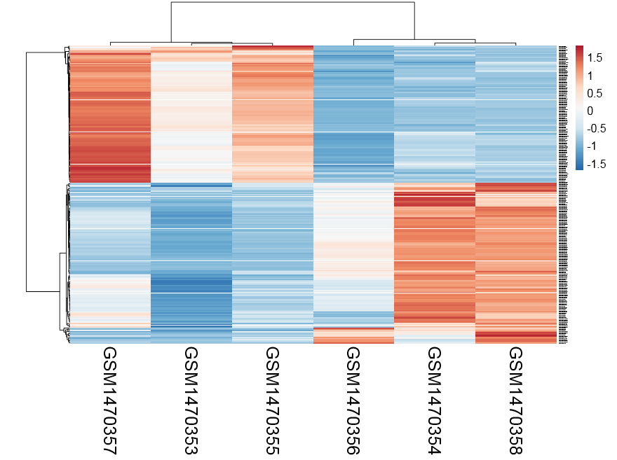


感觉还不错，可以很清楚的看到ET1刺激前后细胞中miRNA表达量变化

然后就是检验我们感兴趣的有显著差异的miRNA的target genes，这时候有两种方法：一个是先由数据库得到已经被检验的miRNA的target genes；另一种是根据miRNA和mRNA表达量的相关性来预测。

用数据库来查找MiRNA的作用基因，非常多的工具，比较常用的有**TargetScan/miRTarBase** 

- http://nar.oxfordjournals.org/content/early/2015/11/19/nar.gkv1258.full
- http://mirtarbase.mbc.nctu.edu.tw/
- http://mirtarbase.mbc.nctu.edu.tw/cache/download/6.1/hsa_MTI.xlsx
- http://www.targetscan.org/vert_71/ (version 7.1 (June 2016))

我还看到过一个整合工具： **miRecords ** (DIANA-microT, MicroInspector, miRanda, MirTarget2, miTarget, NBmiRTar, PicTar, PITA, RNA22, RNAhybrid and TargetScan/TargertScanS)里面提到了查找miRNA的作用基因这一过程，高假阳性，至少被5种工具支持，才算是真的。

还有很多类似的工具，**miRWalk2，psRNATarget**网页版工具。

最后值得一提的是中山大学的：[ starBase  ](http://starbase.sysu.edu.cn/panCancer.php)

>  Pan-Cancer Analysis Platform is designed for deciphering Pan-Cancer Networks of lncRNAs, miRNAs, ceRNAs and RNA-binding proteins (RBPs) by mining clinical and expression profiles of 14 cancer types (>6000 samples) from The Cancer Genome Atlas (TCGA) Data Portal (all data available without limitations).

虽然我没有仔细的用，但是看介绍好牛的样子。

还有一个R包：**miRLAB**，它是先通过算所有配对的**miRNA- genes的表达量相关系数**，选取显著正相关或者负相关的pairs，然后反过来通过已知数据库来验证。

后面我就不讲了，主要看你得到miRNA的时候其它生物学数据是否充分，如果是癌症病人，有生存相关数据，可以做生存分析，如果你同时测了甲基化数据，可以做甲基化相关分析。

如果只是单纯的miRNA测序数据，可以回过头去研究一下de novo的miRNA预测的步骤，也是研究重点。


### 表观组

几十年来，DNA一直被认为是决定生命遗传信息的核心物质，但是近些年新的研究表明，生命遗传信息从来就不是基因所能完全决定的，比如科学家们发现，可以在不影响DNA序列的情况下改变基因组的修饰，这种改变不仅可以影响个体的发育，而且还可以遗传下去。这种在基因组的水平上研究表观遗传修饰的领域被称为“表观基因组学(epigenomics）”。表观基因组学使人们对基因组的认识又增加了一个新视点：对基因组而言，不仅仅是序列包含遗传信息，而且其修饰也可以记载遗传信息。

#### 自学ChIP-seq分析九讲

##### 第一讲：文献选择与解读 {-}


**文献；CARM1 Methylates Chromatin Remodeling Factor BAF155 to Enhance Tumor Progression and Metastasis** 

我很早以前想自学CHIP-seq的时候关注过这篇文章，那时候懂得还不多，甚至都没有仔细看这篇文章就随便下载了数据进行分析，也只是跑一些软件而已。这次仔细阅读这篇文章才发现里面门道很多，尤其是ChIP-seq的实验基础和表观遗传学的生物学基础知识。

作者首先实验证明了用small haripin RNA来knockout CARM1 只能达到90%的敲除效果，有趣的是，对CARM1的功能影响非常小，说明只需要极少量的CARM1就可以发挥很好的作用，因此作者通过zinc finger nuclease这种基因组编辑技术设计了100%敲除CARM1的实验材料，

这样就能比较CARM1有无时各种蛋白被催化状态了，其中SWI/SNF(BAF) chromatin remodeling complex  染色质重构复合物的一个亚基 BAF155，非常明显的只有在CARM1这个基因完好无损的细胞系里面才能被正常的甲基化。作者证明了BAF155是CARM1这个基因非常好的一个底物， 而且通过巧妙的实验设计，证明了BAF155这个蛋白的第1064位氨基酸(R) 是 CARM1的作用位点。

因为早就有各种文献说明了SWI/SNF(BAF) chromatin remodeling complex  染色质重构复合物在癌症的重要作用， 所以作者也很自然想探究BAF155在癌症的功能详情，这里作者选择的是**ChIP-seq**技术。BAF155是一种转录因子(transcription factor)（能与基因5端上游特定序列专一性结合，从而保证目的基因以特定的强度在特定的时间与空间表达的蛋白质分子）。ChIP-seq技术最适合来探究BAF155这样转录因子的功能，所以作者构造了一种细胞系（MCF7），它的BAF155蛋白的第1064位氨基酸(R) 突变而无法被CARM1这个基因催化而甲基化，然后比较突变的细胞系和野生型细胞系的BAF155的ChIP-seq结果，这样就可以研究BAF155这个转录因子，是否必须要被CARM1这个基因催化而甲基化后才能行使生物学功能。

作者用me-BAF155特异性抗体+western bloting 证明了正常的野生型MCF7细胞系里面有~74%的BAF155被甲基化。

有一个细胞系SKOV3，可以正常表达除了BAF155之外的其余14种SWI/SNF(BAF) chromatin remodeling complex  染色质重构复合物，而不管是把突变的细胞系和野生型细胞系的BAF155混在里面都可以促进染色质重构复合物的组装，所以甲基化与否并不影响这个染色质重构复合物的组装，重点应该研究的是甲基化会影响BAF155在基因组其它地方结合。

结果显示，突变的细胞系和野生型细胞系种BAF155在基因组结合位置(peaks)还是有较大的overlap的，重点是看它们的peaks在各种基因组区域(基因上下游，5,3端UTR，启动子，内含子，外显子，基因间区域，microRNA区域)分布情况的差别，还有它们距离转录起始位点的距离的分布区别，还有它们注释到的基因区别，已经基因富集到什么通路等等。

虽然作者在人的细胞系(MCF7)上面做ChIP-seq，但是在老鼠细胞系(MDA-MB-231)做了mRNA芯片数据分析，BAF155这个蛋白的第1064位氨基酸(R) 突变细胞系和野生型细胞系，用的是Affymetrix HG U133 Plus 2.0这个常用平台。

which was hybridized to Affymetrix HG U133 Plus 2.0 microarrays containing 54,675 probesets for >47,000 transcripts and variants, including 38,500 human genes.

To identify genes differentially expressed between MDA-MB-231-BAF155WT and MDA-MB-231-BAF155R1064K

表达矩阵下载地址：[http://www.ncbi.nlm.nih.gov/pmc/articles/PMC4004525/bin/NIHMS556863-supplement-03.xlsx](http://www.ncbi.nlm.nih.gov/pmc/articles/PMC4004525/bin/NIHMS556863-supplement-03.xlsx)

我简单摘抄作者ChIP-seq数据的生物信息学分析结果

- All samples were mapped from fastq files using BOWTIE [-m 1 -- best] to mm9 [UCSCmouse genome build 9]

- Sequences were mapped to the human genome (hg19) using BOWTIE (--best –m 1) to yield unique alignments

- Peaks were called by using HOMER [[http://biowhat.ucsd.edu/homer/](http://biowhat.ucsd.edu/homer/)] and QuEST [[http://mendel.stanford.edu/sidowlab/downloads/quest/](http://mendel.stanford.edu/sidowlab/downloads/quest/)].

**用到的软件有**

- **QuEST 2.4 **(Valouev et al., 2008) was run using the recommend settings for transcription factor (TF) like binding with the following exceptions:

  kde_bandwith=30, region_size=600, ChIP threshold=35, enrichment fold=3, rescue fold=3.

- **HOMER **(Heinz et al., 2010) analysis was run using the default settings for peak finding.

  False Discovery Rate (FDR) cut off was **0.001 (0.1%) for all peaks. **

  The tag density for each factor was **normalized to 1x107 tags** and displayed using the UCSC genome browser.

- **Motif analysis** (de novo and known), was performed using the** HOMER software and Genomatix. **

- **Peak overlaps **were processed with HOMER and Galaxy (Giardine et al., 2005).

- **Peak comparisons **between replicates were processed with EdgeR statistical package in R

以上就是我们接下来需要学习的流程化分析步骤，下面我给一个主要流程的截图，但主要是实验是如何设计

这里有一个文章发表了关于CHIP-seq的流程的：[http://biow.sb-roscoff.fr/ecole_bioinfo/protected/jacques.van-helden/ThomasChollier_NatProtoc_2012_peak-motifs.pdf](http://biow.sb-roscoff.fr/ecole_bioinfo/protected/jacques.van-helden/ThomasChollier_NatProtoc_2012_peak-motifs.pdf)

 

**同时我还推荐大家看几篇相关文献**

- Genome-wide maps of chromatin state in pluripotent and lineage-committed cells. [http://www.nature.com/nature/journal/v448/n7153/pdf/nature06008.pdf](http://www.nature.com/nature/journal/v448/n7153/pdf/nature06008.pdf)
- Mapping and analysis of chromatin state dynamics in nine human cell types(GSE26386): [http://www.nature.com/nature/journal/v473/n7345/full/nature09906.html](http://www.nature.com/nature/journal/v473/n7345/full/nature09906.html)
- Promiscuous RNA binding by Polycomb Repressive Complex 2 [http://www.ncbi.nlm.nih.gov/pmc/articles/PMC3823624/pdf/nihms517229.pdf](http://www.ncbi.nlm.nih.gov/pmc/articles/PMC3823624/pdf/nihms517229.pdf)

---

##### 第二讲：资料收集 {-}


CHIP-seq的确是非常完善的NGS流程，各种资料层出不穷。

大家首先可以看下面几个完整流程的PPT来对CHIP-seq流程有个大致的印象，我对前面提到的文献数据处理的几个要点，就跟下面这个图片类似。


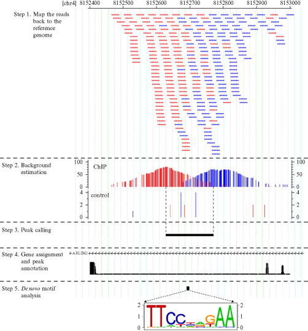


- QuEST is a statistical software for analysis of ChIP-Seq data with data and analysis results visualization through UCSC Genome Browser.  [http://www-hsc.usc.edu/](http://www-hsc.usc.edu/)~valouev/QuEST/QuEST.html

- peak calling 阈值的选择： [http://www.nature.com/nprot/journal/v7/n1/fig_tab/nprot.2011.420_F2.html](http://www.nature.com/nprot/journal/v7/n1/fig_tab/nprot.2011.420_F2.html)

- MeDIP-seq and histone modification ChIP-seq analysis  [http://crazyhottommy.blogspot.com/2014/01/medip-seq-and-histone-modification-chip.html](http://crazyhottommy.blogspot.com/2014/01/medip-seq-and-histone-modification-chip.html)

- 2011-review-CHIP-seq-high-quaility-data: [http://www.nature.com/ni/journal/v12/n10/full/ni.2117.html?message-global=remove](http://www.nature.com/ni/journal/v12/n10/full/ni.2117.html?message-global=remove)

- 不同处理条件的CHIP-seq的差异peaks分析： [http://www.slideshare.net/thefacultyl/diffreps-automated-chipseq-differential-analysis-package](http://www.slideshare.net/thefacultyl/diffreps-automated-chipseq-differential-analysis-package)

- 一个实际的CHIP-seq数据分析例子： [http://www.biologie.ens.fr/](http://www.biologie.ens.fr/)~mthomas/other/chip-seq-training/

- [http://biow.sb-roscoff.fr/ecole_bioinfo/training_material/chip-seq/documents/presentation_chipseq.pdf](http://biow.sb-roscoff.fr/ecole_bioinfo/training_material/chip-seq/documents/presentation_chipseq.pdf)

- [http://ecole-bioinfo-aviesan.sb-roscoff.fr/sites/ecole-bioinfo-aviesan.sb-roscoff.fr/files/files/chipseq_CarlHerrmann_Roscoff2015.pdf](http://ecole-bioinfo-aviesan.sb-roscoff.fr/sites/ecole-bioinfo-aviesan.sb-roscoff.fr/files/files/chipseq_CarlHerrmann_Roscoff2015.pdf)

- [http://ecole-bioinfo-aviesan.sb-roscoff.fr/sites/ecole-bioinfo-aviesan.sb-roscoff.fr/files/files/defrance-ChIP-seq_annotation.pdf](http://ecole-bioinfo-aviesan.sb-roscoff.fr/sites/ecole-bioinfo-aviesan.sb-roscoff.fr/files/files/defrance-ChIP-seq_annotation.pdf)

然后下面的各种资料，是针对CHIP-seq流程的各个环境的，还有一些是针对于表观遗传学知识

- ppt : [http://159.149.160.51/epigen_milano/epigen_barozzi.pdf](http://159.149.160.51/epigen_milano/epigen_barozzi.pdf)

- best practise: [http://bioinformatics-core-shared-training.github.io/cruk-bioinf-sschool/](http://bioinformatics-core-shared-training.github.io/cruk-bioinf-sschool/)

- pipeline : [https://github.com/shenlab-sinai/chip-seq_preprocess](https://github.com/shenlab-sinai/chip-seq_preprocess)

- [https://sites.google.com/site/anshul...e/projects/idr](https://sites.google.com/site/anshul...e/projects/idr)  ## samtools view -b -F 1548 -q 30 chipSampleRep1.bam

- pipeline : [http://daudin.icmb.utexas.edu/wiki/index.php/ChIPseq_prep_and_map](http://daudin.icmb.utexas.edu/wiki/index.php/ChIPseq_prep_and_map)

- pipeline : [https://github.com/BradyLab/ChipSeq/blob/master/chipseq.sh](https://github.com/BradyLab/ChipSeq/blob/master/chipseq.sh)

- [https://github.com/crukci-bioinformatics/chipseq-pipeline](https://github.com/crukci-bioinformatics/chipseq-pipeline)

- [https://github.com/ENCODE-DCC/chip-seq-pipeline](https://github.com/ENCODE-DCC/chip-seq-pipeline)

- Hands-on introduction to ChIP-seq analysis - VIB Training   [http://www.biologie.ens.fr/](http://www.biologie.ens.fr/)~mthomas/other/chip-seq-training/

- video(A Step-by-Step Guide to ChIP-Seq Data Analysis Webinar) : [http://www.abcam.com/webinars/a-step-by-step-guide-to-chip-seq-data-analysis-webinar](http://www.abcam.com/webinars/a-step-by-step-guide-to-chip-seq-data-analysis-webinar)

- Using ChIP-Seq to identify and/or quantify bound regions (peaks)  [http://barcwiki.wi.mit.edu/wiki/SOPs/chip_seq_peaks](http://barcwiki.wi.mit.edu/wiki/SOPs/chip_seq_peaks)

- [http://jura.wi.mit.edu/bio/education/hot_topics/ChIPseq/ChIPSeq_HotTopics.pdf](http://jura.wi.mit.edu/bio/education/hot_topics/ChIPseq/ChIPSeq_HotTopics.pdf)

- [http://pedagogix-tagc.univ-mrs.fr/courses/ASG1/practicals/chip-seq/mapping_tutorial.html](http://pedagogix-tagc.univ-mrs.fr/courses/ASG1/practicals/chip-seq/mapping_tutorial.html)

- 公开课： [https://www.coursera.org/learn/galaxy-project/lecture/FUzcg/chip-sequence-analysis-with-macs](https://www.coursera.org/learn/galaxy-project/lecture/FUzcg/chip-sequence-analysis-with-macs)

- EBI的教程：[https://www.ebi.ac.uk/training/online/course/ebi-next-generation-sequencing-practical-course/chip-seq-analysis/chip-seq-practical](https://www.ebi.ac.uk/training/online/course/ebi-next-generation-sequencing-practical-course/chip-seq-analysis/chip-seq-practical)


- 台湾教程：[http://lsl.sinica.edu.tw/Services/Class/files/20151118475_2.pdf](http://lsl.sinica.edu.tw/Services/Class/files/20151118475_2.pdf) 徐唯哲 Paul Wei-Che HSU

- peak finder软件大全：
[http://wodaklab.org/nextgen/data/peakfinders.html](http://wodaklab.org/nextgen/data/peakfinders.html)
 
- [https://bioshare.bioinformatics.ucdavis.edu/bioshare/download/47aq5pp5mzza5vb/PDFs/Tuesday_MB_ChIP-Seq_Intro.pdf](https://bioshare.bioinformatics.ucdavis.edu/bioshare/download/47aq5pp5mzza5vb/PDFs/Tuesday_MB_ChIP-Seq_Intro.pdf)

- paper： Large-Scale Quality Analysis of Published ChIP-seq Data [http://www.g3journal.org/content/4/2/209.full](http://www.g3journal.org/content/4/2/209.full)

- paper： Chip-seq data analysis: from quality check to motif discovery and more [http://ccg.vital-it.ch/var/sib_april15/cases/landt12/strand_correlation.html](http://ccg.vital-it.ch/var/sib_april15/cases/landt12/strand_correlation.html)

- Workshop hands on session(RNA-Seq / ChIP-Seq  ) :  [https://hpc.oit.uci.edu/biolinux/handson.docx](https://hpc.oit.uci.edu/biolinux/handson.docx)

- [http://www.gqinnovationcenter.com/documents/bioinformatics/ChIPseq.pptx](http://www.gqinnovationcenter.com/documents/bioinformatics/ChIPseq.pptx)

- paper supplement : [http://genome.cshlp.org/content/suppl/2015/10/02/gr.192005.115.DC1/Supplemental_Information.docx](http://genome.cshlp.org/content/suppl/2015/10/02/gr.192005.115.DC1/Supplemental_Information.docx)

- [http://www.illumina.com/documents/products/datasheets/datasheet_chip_sequence.pdf](http://www.illumina.com/documents/products/datasheets/datasheet_chip_sequence.pdf)

- [http://www.ncbi.nlm.nih.gov/pubmed/22130887](http://www.ncbi.nlm.nih.gov/pubmed/22130887) "Analyzing ChIP-seq data: preprocessing, normalization, differential identification, and binding pattern characterization."

- [http://www.ncbi.nlm.nih.gov/pubmed/22499706](http://www.ncbi.nlm.nih.gov/pubmed/22499706) "Normalization, bias correction, and peak calling for ChIP-seq." (stat heavy)

- [http://www.ncbi.nlm.nih.gov/pubmed/24244136](http://www.ncbi.nlm.nih.gov/pubmed/24244136) "Practical guidelines for the comprehensive analysis of ChIP-seq data."

- [http://www.ncbi.nlm.nih.gov/pubmed/25223782](http://www.ncbi.nlm.nih.gov/pubmed/25223782) "Identifying and mitigating bias in next-generation sequencing methods for chromatin biology."

- [http://www.ncbi.nlm.nih.gov/pubmed/24598259](http://www.ncbi.nlm.nih.gov/pubmed/24598259) "Impact of sequencing depth in ChIP-seq experiments."

- figures: [https://github.com/shenlab-sinai/ngsplot](https://github.com/shenlab-sinai/ngsplot)

可视化工具

- [https://github.com/daler/metaseq](https://github.com/daler/metaseq)

- [http://liulab.dfci.harvard.edu/CEAS/usermanual.html](http://liulab.dfci.harvard.edu/CEAS/usermanual.html)

bioconductor系列工具和教程 :

- [http://faculty.ucr.edu/](http://faculty.ucr.edu/)~tgirke/HTML_Presentations/Manuals/Workshop_Dec_6_10_2012/Rchipseq/Rchipseq.pdf

- [http://bioinformatics-core-shared-training.github.io/cruk-bioinf-sschool/Day4/chipqc_sweave.pdf](http://bioinformatics-core-shared-training.github.io/cruk-bioinf-sschool/Day4/chipqc_sweave.pdf)

- [http://bioconductor.org/packages/release/bioc/html/chipseq.html](http://bioconductor.org/packages/release/bioc/html/chipseq.html)

- [http://bioconductor.org/help/workflows/chipseqDB/](http://bioconductor.org/help/workflows/chipseqDB/)

- [http://bioconductor.org/help/workflows/generegulation/](http://bioconductor.org/help/workflows/generegulation/)

- [http://bioconductor.org/help/course-materials/2009/EMBLJune09/Practicals/chipseq/BasicChipSeq.pdf](http://bioconductor.org/help/course-materials/2009/EMBLJune09/Practicals/chipseq/BasicChipSeq.pdf)

公司教程

- [http://www.partek.com/Tutorials/microarray/Tiling/ChipSeqTutorial.pdf](http://www.partek.com/Tutorials/microarray/Tiling/ChipSeqTutorial.pdf)

---

##### 第三讲：公共数据下载 {-}

这一步跟自学其它高通量测序数据处理一样，就是仔细研读paper，在里面找到作者把原始测序数据放在了哪个公共数据库里面，一般是NCBI的GEO，SRA，本文也不例外，然后解析样本数，找到下载链接规律。

```
## step1 : download raw data
> cd ~
> mkdir CHIPseq_test && cd CHIPseq_test
> mkdir rawData && cd rawData
> ## batch download the raw data by shell script :
> for ((i=593;i<601;i++)) ;do wget [ftp://ftp-trace.ncbi.nlm.nih.gov/sra/sra-instant/reads/ByStudy/sra/SRP/SRP033/SRP033492/SRR1042](ftp://ftp-trace.ncbi.nlm.nih.gov/sra/sra-instant/reads/ByStudy/sra/SRP/SRP033/SRP033492/SRR1042)$i/SRR1042$i.sra;done
```

很容易就下载了8个测序文件，每个样本的数据大小，测序量如下

```
> 621M Jun 27 14:03 SRR1042593.sra (16.9M reads)
> 2.2G Jun 27 15:58 SRR1042594.sra (60.6M reads)
> 541M Jun 27 16:26 SRR1042595.sra (14.6M reads)
> 2.4G Jun 27 18:24 SRR1042596.sra (65.9M reads)
> 814M Jun 27 18:59 SRR1042597.sra (22.2M reads)
> 2.1G Jun 27 20:30 SRR1042598.sra (58.1M reads)
> 883M Jun 27 21:08 SRR1042599.sra (24.0M reads)
> 2.8G Jun 28 11:53 SRR1042600.sra (76.4M reads)
```

虽然下载的SRA格式数据也是一个很流行的标准，但它只是数据压缩的标准，几乎没有软件能直接跟SRA的格式的测序数据来进行分析，我们需要转成fastq格式，代码如下：

```
> ## step2 :  change sra data to fastq files.
> ## cell line: MCF7 //  Illumina HiSeq 2000 //  50bp // Single ends // phred+33
> ## [http://www.ncbi.nlm.nih.gov/geo/query/acc.cgi?acc=GSE52964](http://www.ncbi.nlm.nih.gov/geo/query/acc.cgi?acc=GSE52964)
> ## [ftp://ftp-trace.ncbi.nlm.nih.gov/sra/sra-instant/reads/ByStudy/sra/SRP/SRP033/SRP033492](ftp://ftp-trace.ncbi.nlm.nih.gov/sra/sra-instant/reads/ByStudy/sra/SRP/SRP033/SRP033492)
> ls *sra |while read id; do ~/biosoft/sratoolkit/sratoolkit.2.6.3-centos_linux64/bin/fastq-dump $id;done
> rm *sra
```
解压的详情如下，可以看到SRA格式有6~9倍的压缩了，比zip格式压缩的2~3倍高多了

```
##  621M --> 3.9G
##  2.2G --> 14G
##  541M --> 3.3G
##  2.4G --> 15G
```
---

##### 第四讲：必要软件安装及结果下载 {-}

博文的顺序有点乱，因为怕读到前面的公共测序数据下载这篇文章的朋友搞不清楚，我如何调用各种软件的，所以我这里强势插入一篇博客来描述这件事，当然也只是略过，我所有的软件理论上都是安装在我的home目录下的biosoft文件夹，所以你看到我一般安装程序都是:

```
cd ~/biosoft
mkdir macs2 && cd macs2 ##指定的软件安装在指定文件夹里面
```


这只是我个人的安装习惯，因为我不是root，所以不能在linux系统下做太多事，我这里贴出我所有的软件安装代码：

```
## pre-step: download sratoolkit /fastx_toolkit_0.0.13/fastqc/bowtie2/bwa/MACS2/HOMER/QuEST/mm9/hg19/bedtools
## http://www.ncbi.nlm.nih.gov/Traces/sra/sra.cgi?view=software
## http://www.ncbi.nlm.nih.gov/books/NBK158900/

## Download and install sratoolkit
cd ~/biosoft
mkdir sratoolkit && cd sratoolkit
wget http://ftp-trace.ncbi.nlm.nih.gov/sra/sdk/2.6.3/sratoolkit.2.6.3-centos_linux64.tar.gz
##
## Length: 63453761 (61M) [application/x-gzip]
## Saving to: "sratoolkit.2.6.3-centos_linux64.tar.gz"
tar zxvf sratoolkit.2.6.3-centos_linux64.tar.gz

## Download and install bedtools
cd ~/biosoft
mkdir bedtools && cd bedtools
wget https://github.com/arq5x/bedtools2/releases/download/v2.25.0/bedtools-2.25.0.tar.gz
## Length: 19581105 (19M) [application/octet-stream]
tar -zxvf bedtools-2.25.0.tar.gz
cd bedtools2
make

## Download and install PeakRanger
cd ~/biosoft
mkdir PeakRanger && cd PeakRanger
wget https://sourceforge.net/projects/ranger/files/PeakRanger-1.18-Linux-x86_64.zip/
## Length: 1517587 (1.4M) [application/octet-stream]
unzip PeakRanger-1.18-Linux-x86_64.zip
~/biosoft/PeakRanger/bin/peakranger -h

## Download and install bowtie
cd ~/biosoft
mkdir bowtie && cd bowtie
wget https://sourceforge.net/projects/bowtie-bio/files/bowtie2/2.2.9/bowtie2-2.2.9-linux-x86_64.zip/download
#Length: 27073243 (26M) [application/octet-stream]
#Saving to: "download" ## I made a mistake here for downloading the bowtie2
mv download bowtie2-2.2.9-linux-x86_64.zip
unzip bowtie2-2.2.9-linux-x86_64.zip

mkdir -p ~/biosoft/bowtie/hg19_index
cd ~/biosoft/bowtie/hg19_index

# download hg19 chromosome fasta files
wget http://hgdownload.cse.ucsc.edu/goldenPath/hg19/bigZips/chromFa.tar.gz
# unzip and concatenate chromosome and contig fasta files
tar zvfx chromFa.tar.gz
cat *.fa > hg19.fa
rm chr*.fa
## ~/biosoft/bowtie/bowtie2-2.2.9/bowtie2-build ~/biosoft/bowtie/hg19_index/hg19.fa ~/biosoft/bowtie/hg19_index/hg19
## Download and install BWA
cd ~/biosoft
mkdir bwa && cd bwa

http://sourceforge.net/projects/bio-bwa/files/

tar xvfj bwa-0.7.12.tar.bz2 # x extracts, v is verbose (details of what it is doing), f skips prompting for each individual file, and j tells it to unzip .bz2 files
cd bwa-0.7.12
make
export PATH=$PATH:/path/to/bwa-0.7.12 # Add bwa to your PATH by editing ~/.bashrc file (or .bash_profile or .profile file)
# /path/to/ is an placeholder. Replace with real path to BWA on your machine
source ~/.bashrc
# bwa index [-a bwtsw|is] index_prefix reference.fasta
bwa index -p hg19bwaidx -a bwtsw ~/biosoft/bowtie/hg19_index/hg19.fa
# -p index name (change this to whatever you want)
# -a index algorithm (bwtsw for long genomes and is for short genomes)
## Download and install macs2
## // https://pypi.python.org/pypi/MACS2/
cd ~/biosoft
mkdir macs2 && cd macs2
wget ~~~~~~~~~~~~~~~~~~~~~~MACS2-2.1.1.20160309.tar.gz
tar zxvf MACS2-2.1.1.20160309.tar.gz
cd MACS2-2.1.1.20160309
python setup.py install --user

#################### The log for installing MACS2:
Creating ~/.local/lib/python2.7/site-packages/site.py
Processing MACS2-2.1.1.20160309-py2.7-linux-x86_64.egg
Copying MACS2-2.1.1.20160309-py2.7-linux-x86_64.egg to ~/.local/lib/python2.7/site-packages
Adding MACS2 2.1.1.20160309 to easy-install.pth file
Installing macs2 script to ~/.local/bin
Finished processing dependencies for MACS2==2.1.1.20160309
############################################################
~/.local/bin/macs2 --help

Example for regular peak calling:
macs2 callpeak -t ChIP.bam -c Control.bam -f BAM -g hs -n test -B -q 0.01
Example for broad peak calling:
macs2 callpeak -t ChIP.bam -c Control.bam --broad -g hs --broad-cutoff 0.1

## Download and install homer (Hypergeometric Optimization of Motif EnRichment)
## // http://homer.salk.edu/homer/
## // http://blog.qiubio.com:8080/archives/3024
## pre-install: Ghostscript，seqlogo,blat
cd ~/biosoft
mkdir homer && cd homer
wget http://homer.salk.edu/homer/configureHomer.pl
perl configureHomer.pl -install
perl configureHomer.pl -install hg19
```
一般来说，对我这样水平的人来说，软件安装就跟家常便饭一样，没有什么问题了，但如果你是初学者呢，肯定没那么轻松，所以请加强学习，我无法在这里讲解太具体的知识了。

所有软件安装完毕后就可以下载文章对这些ChIP-seq的处理结果了，这个很重要，检验我们是否重复了人家的数据分析过程。

```
## step3 : download the results from paper
## http://www.bio-info-trainee.com/1571.html
mkdir paper_results && cd paper_results
wget ftp://ftp.ncbi.nlm.nih.gov/geo/series/GSE52nnn/GSE52964/suppl/GSE52964_RAW.tar
tar xvf GSE52964_RAW.tar

ls *gz |xargs gunzip

## step4 : run FastQC to check the sequencing quality.

##这里可以看到我们下载的原始数据已经被作者处理好了，去了接头，去了低质量序列

ls *.fastq | while read id ; do ~/biosoft/fastqc/FastQC/fastqc $id;done
## Sequence length 51
## %GC 39
## Adapter Content passed

The quality of the reads is pretty good, we don't need to do any filter or trim

mkdir QC_results
mv *zip *html QC_results/
```

---

##### 第五讲：测序数据比对 {-}

比对本质是是很简单的了，各种mapping工具层出不穷，我们一般常用的就是BWA和bowtie了，我这里就挑选bowtie2吧，反正别人已经做好了各种工具效果差异的比较，我们直接用就好了，代码如下：

```
## step5 : alignment to hg19/ using bowtie2 to do alignment
## ~/biosoft/bowtie/bowtie2-2.2.9/bowtie2-build ~/biosoft/bowtie/hg19_index /hg19.fa ~/biosoft/bowtie/hg19_index/hg19
## cat >run_bowtie2.sh
ls *.fastq | while read id ;
do
echo $id
#~/biosoft/bowtie/bowtie2-2.2.9/bowtie2 -p 8 -x ~/biosoft/bowtie/hg19_index/hg19 -U $id -S ${id%%.*}.sam 2>${id%%.*}.align.log;
#samtools view -bhS -q 30 ${id%%.*}.sam > ${id%%.*}.bam ## -F 1548 https://broadinstitute.github.io/picard/explain-flags.html
# -F 0x4 remove the reads that didn't match
samtools sort ${id%%.*}.bam ${id%%.*}.sort ## prefix for the output
# samtools view -bhS a.sam | samtools sort -o - ./ > a.bam
samtools index ${id%%.*}.sorted.bam
done
```
这个索引~/biosoft/bowtie/hg19_index/hg19需要自己提取建立好，见前文

初步比对的sam文件到底该如何过滤，我查了很多文章都没有给出个子丑寅卯，各执一词，我也没办法给大家一个标准，反正我测试了好几种，看起来call peaks的差异不大，就是得不到文章给出的那些结果！！

一般来说，初步比对的sam文件只能选取unique mapping的结果，所以我用了#samtools view -bhS -q 30，但是结果并没什么改变，有人说是peak caller这些工具本身就会做这件事，所以取决于你下游分析所选择的工具。

给大家看比对的日志吧：

```
SRR1042593.fastq
16902907 reads; of these:
16902907 (100.00%) were unpaired; of these:
667998 (3.95%) aligned 0 times
12467095 (73.76%) aligned exactly 1 time
3767814 (22.29%) aligned >1 times
96.05% overall alignment rate
......
SRR1042598.fastq
58068816 reads; of these:
58068816 (100.00%) were unpaired; of these:
8433671 (14.52%) aligned 0 times
37527468 (64.63%) aligned exactly 1 time
12107677 (20.85%) aligned >1 times
85.48% overall alignment rate
[samopen] SAM header is present: 93 sequences.
SRR1042599.fastq
24019489 reads; of these:
24019489 (100.00%) were unpaired; of these:
1411095 (5.87%) aligned 0 times
17528479 (72.98%) aligned exactly 1 time
5079915 (21.15%) aligned >1 times
94.13% overall alignment rate
[samopen] SAM header is present: 93 sequences.
SRR1042600.fastq
76361026 reads; of these:
76361026 (100.00%) were unpaired; of these:
8442054 (11.06%) aligned 0 times
50918615 (66.68%) aligned exactly 1 time
17000357 (22.26%) aligned >1 times
88.94% overall alignment rate
[samopen] SAM header is present: 93 sequences.
```

可以看到比对非常成功。

我这里就不用表格的形式来展现了，毕竟我又不是给客户写报告，大家就将就着看吧。


---


##### 第六讲 寻找peaks {-}


ChIP-seq测序的本质还是目标片段捕获测序，但跟WES不同的是，你选择的IP不同，细胞或者机体状态不同，捕获到的序列差异很大。而我们研究的重点就是捕获到的差异。我们对ChIP-seq测序数据寻找peaks的本质就是得到所有测序数据比对在全基因组之后在基因组上测序深度里面寻找比较突出的部分。比如对WES数据来说，各个外显子，或者外显子的5端到3端，理论上测序深度应该是一致的，都是50X~200X，画一个测序深度曲线，应该是近似于一条直线。但对我们的ChIP-seq测序数据来说，在所捕获的区域上面，理论上测序深度是绝对不一样的，应该是近似于一个山峰。而那些覆盖度高的地方，山顶，就是我们的IP所结合的热点，也就是我们想要找的peaks，在IGV里面看到大致是下面这样：


可以看到测序的reads是分布不均匀的，我们通常说的ChIP-seq测序的IP，可以是各个组蛋白上各修饰位点对应的抗体，或者是各种转录因子的抗体等等。

如何定义热点呢？通俗地讲，热点是这样一些位置，这些位置多次被测得的read所覆盖（我们测的是一个细胞群体，read出现次数多，说明该位置被TF结合的几率大）。那么，read数达到多少才叫多？这就要用到统计检验来分析。假设TF在基因组上的分布是没有任何规律的，那么，测序得到的read在基因组上的分布也必然是随机的，某个碱基上覆盖的read的数目应该服从二项分布。

具体统计学原理可以看这篇博客文章：[http://www.plob.org/2014/05/08/7227.html](http://www.plob.org/2014/05/08/7227.html)

为了达到作者文献里面的结果，我换了**8**个软件：**MACS2/HOMER/SICERpy/PePr/SWEMBL/SISSRs/BayesPeak/PeakRanger**

这里就不一一介绍peaks caller软件的安装以及使用了，因为MACS2是最常用的，所以简单贴一下我关于MACS2的学习代码：

```
## step6 : peak calling
### step6.1: with MACS2
## 我先看了看说明书：

macs2 callpeak -t TF_1.bam -c Input.bam -n mypeaks
We used the following options:
-t: This is the only required parameter for MACS, refers to the name of the file with the ChIP-seq data
-c: The control or mock data file
-n: The name string of the experiment
MAC2 creates 4 files (mypeaks peaks.narrowPeak, mypeaks summits.bed, mypeaks peaks.xls and mypeaks model.r)

# MACS首先的工作是要确定一个模型，这个模型最关键的参数就是峰宽d。这个d就是bw(band width)，而它的一半就是shiftsize。
### 然后根据文章确定了下载的测序数据的分类

GSM1278641 Xu_MUT_rep1_BAF155_MUT        SRR1042593
GSM1278642 Xu_MUT_rep1_Input        SRR1042594
GSM1278643 Xu_MUT_rep2_BAF155_MUT        SRR1042595
GSM1278644 Xu_MUT_rep2_Input        SRR1042596
GSM1278645 Xu_WT_rep1_BAF155        SRR1042597
GSM1278646 Xu_WT_rep1_Input        SRR1042598
GSM1278647 Xu_WT_rep2_BAF155        SRR1042599
GSM1278648 Xu_WT_rep2_Input         SRR1042600

## 这里有个很奇怪的问题，input的测序数据居然比IP的测序数据多？？？

848M Jun 28 14:31 SRR1042593.bam
2.7G Jun 28 14:52 SRR1042594.bam
716M Jun 28 14:58 SRR1042595.bam
2.9G Jun 28 15:20 SRR1042596.bam
1.1G Jun 28 15:28 SRR1042597.bam
2.6G Jun 28 15:48 SRR1042598.bam
1.2G Jun 28 15:58 SRR1042599.bam
3.5G Jun 28 16:26 SRR1042600.bam

## 我没有想明白为什么

## http://www2.uef.fi/documents/1698400/2466431/Macs2/f4d12870-34f9-43ef-bf0d-f5d087267602
## http://www.ncbi.nlm.nih.gov/pmc/articles/PMC3120977/我首先用的是下面这些代码
nohup time ~/.local/bin/macs2 callpeak -c SRR1042594.bam -t SRR1042593.bam -f BAM -B -g hs -n Xu_MUT_rep1 2>Xu_MUT_rep1.masc2.log &
nohup time ~/.local/bin/macs2 callpeak -c SRR1042596.bam -t SRR1042595.bam -f BAM -B -g hs -n Xu_MUT_rep2 2>Xu_MUT_rep2.masc2.log &
nohup time ~/.local/bin/macs2 callpeak -c SRR1042598.bam -t SRR1042597.bam -f BAM -B -g hs -n Xu_WT_rep1 2>Xu_WT_rep1.masc2.log &
nohup time ~/.local/bin/macs2 callpeak -c SRR1042600.bam -t SRR1042599.bam -f BAM -B -g hs -n Xu_WT_rep2 2>Xu_WT_rep2.masc2.log &

得到的peaks少的可怜，我第一次检查，以为是因为自己没有sort 比对的bam文件导致

## forget to sort the bam files:
## 首先把bam文件sort好，构建了inde，然后继续运行！

nohup time ~/.local/bin/macs2 callpeak -c SRR1042594.sorted.bam -t SRR1042593.sorted.bam -f BAM -B -g hs -n Xu_MUT_rep1 2>Xu_MUT_rep1.masc2.log &
nohup time ~/.local/bin/macs2 callpeak -c SRR1042596.sorted.bam -t SRR1042595.sorted.bam -f BAM -B -g hs -n Xu_MUT_rep2 2>Xu_MUT_rep2.masc2.log &
nohup time ~/.local/bin/macs2 callpeak -c SRR1042598.sorted.bam -t SRR1042597.sorted.bam -f BAM -B -g hs -n Xu_WT_rep1 2>Xu_WT_rep1.masc2.log &
nohup time ~/.local/bin/macs2 callpeak -c SRR1042600.sorted.bam -t SRR1042599.sorted.bam -f BAM -B -g hs -n Xu_WT_rep2 2>Xu_WT_rep2.masc2.log &

##此时得到peaks跟上面为sort的bam文件得到的peaks一模一样，看来不是这个原因
##然后我怀疑是不是作者上传数据的时候把input和IP标记反了，所以我认为的调整过来

## Then change the control and treatment
nohup time ~/.local/bin/macs2 callpeak -t SRR1042594.sorted.bam -c SRR1042593.sorted.bam -f BAM -B -g hs -n Xu_MUT_rep1 2>Xu_MUT_rep1.masc2.log &
nohup time ~/.local/bin/macs2 callpeak -t SRR1042596.sorted.bam -c SRR1042595.sorted.bam -f BAM -B -g hs -n Xu_MUT_rep2 2>Xu_MUT_rep2.masc2.log &
nohup time ~/.local/bin/macs2 callpeak -t SRR1042598.sorted.bam -c SRR1042597.sorted.bam -f BAM -B -g hs -n Xu_WT_rep1 2>Xu_WT_rep1.masc2.log &
nohup time ~/.local/bin/macs2 callpeak -t SRR1042600.sorted.bam -c SRR1042599.sorted.bam -f BAM -B -g hs -n Xu_WT_rep2 2>Xu_WT_rep2.masc2.log &

##结果，压根就没有peaks了！！！！看了作者并没有搞错
##接下来我怀疑是自己用samtools view -bhS -q 30   处理了sam文件，这个标准太严格了！！
## 
## then just use the sam files.

nohup time ~/.local/bin/macs2 callpeak -c SRR1042594.sam -t SRR1042593.sam -f SAM -B -g hs -n Xu_MUT_rep1 2>Xu_MUT_rep1.masc2.log &
nohup time ~/.local/bin/macs2 callpeak -c SRR1042596.sam -t SRR1042595.sam -f SAM -B -g hs -n Xu_MUT_rep2 2>Xu_MUT_rep2.masc2.log &
nohup time ~/.local/bin/macs2 callpeak -c SRR1042598.sam -t SRR1042597.sam -f SAM -B -g hs -n Xu_WT_rep1 2>Xu_WT_rep1.masc2.log &
nohup time ~/.local/bin/macs2 callpeak -c SRR1042600.sam -t SRR1042599.sam -f SAM -B -g hs -n Xu_WT_rep2 2>Xu_WT_rep2.masc2.log &

## 也没有多几个peaks，最后我只能想到是我的p值太严格了
## then chang the criteria for p values :

https://github.com/taoliu/MACS/

nohup time ~/.local/bin/macs2 callpeak -c SRR1042594.sam -t SRR1042593.sam -f SAM -p 0.01 -g hs -n Xu_MUT_rep1 2>Xu_MUT_rep1.masc2.log &
nohup time ~/.local/bin/macs2 callpeak -c SRR1042596.sam -t SRR1042595.sam -f SAM -p 0.01 -g hs -n Xu_MUT_rep2 2>Xu_MUT_rep2.masc2.log &
nohup time ~/.local/bin/macs2 callpeak -c SRR1042598.sam -t SRR1042597.sam -f SAM -p 0.01 -g hs -n Xu_WT_rep1 2>Xu_WT_rep1.masc2.log &
nohup time ~/.local/bin/macs2 callpeak -c SRR1042600.sam -t SRR1042599.sam -f SAM -p 0.01 -g hs -n Xu_WT_rep2 2>Xu_WT_rep2.masc2.log &

##我大大减小了P值的标准，结果是输出一大堆的peaks

18919 Xu_MUT_rep1_peaks.xls
36277 Xu_MUT_rep2_peaks.xls
32494 Xu_WT_rep1_peaks.xls
56080 Xu_WT_rep2_peaks.xls

问题是这些peaks根本就都是假阳性！！！
我手动的check了几个之前严格过滤条件下的peaks，的确可以看到测序深度是两个山峰形状的曲线

## check some peaks 手动的 ## chr1 121484235 121485608
## masc results :
samtools depth -r chr10:42385331-42385599 SRR1042593.sorted.bam
samtools depth -r chr10:42385331-42385599 SRR1042594.sorted.bam
samtools depth -r chr20:45810382-45810662 SRR1042593.sorted.bam
samtools depth -r chr20:45810382-45810662 SRR1042594.sorted.bam

##我也check了paper里面得到的peak，但是在我的比对文件里面，肉眼看起来根本不像，所以我很纠结

paper results:
chr20 45796362 46384917
chr1 121482722 121485861
samtools depth -r chr1:121482722-121485861 SRR1042593.sorted.bam
samtools depth -r chr1:121482722-121485861 SRR1042594.sorted.bam
samtools depth -r chr20:45796362-46384917 SRR1042593.sorted.bam
samtools depth -r chr20:45796362-46384917 SRR1042594.sorted.bam 
```
很不幸，最后还是没能达到作者的结果，我没搞清楚是为什么，我还用了**BayesPeak/PeakRanger这两个软件，结果也不理想。**

- peak finder软件大全： [http://wodaklab.org/nextgen/data/peakfinders.html](http://wodaklab.org/nextgen/data/peakfinders.html)
- Peak Calling for ChIP-Seq :　[http://epigenie.com/guide-peak-calling-for-chip-seq/](http://epigenie.com/guide-peak-calling-for-chip-seq/)


---

##### 第七讲 peaks注释 {-}

经过前面的ChIP-seq测序数据处理的常规分析，我们已经成功的把测序仪下机数据变成了BED格式的peaks记录文件，我选取的这篇文章里面做了4次ChIP-seq实验，分别是两个重复的野生型MCF7细胞系的 BAF155 immun =oprecipitates和两个重复的突变型MCF7细胞系的 BAF155 immunoprecipitates，这样通过比较野生型和突变型MCF7细胞系的 BAF155 immunoprecipitates的不同结果就知道该细胞系的BAF155 突变，对它在全基因组的结合功能的影响。

```
#我这里直接从GEO里面下载了peaks结果，它们详情如下：wc -l *bed
6768 GSM1278641_Xu_MUT_rep1_BAF155_MUT.peaks.bed
3660 GSM1278643_Xu_MUT_rep2_BAF155_MUT.peaks.bed
11022 GSM1278645_Xu_WT_rep1_BAF155.peaks.bed
5260 GSM1278647_Xu_WT_rep2_BAF155.peaks.bed
49458 GSM601398_Ini1HeLa-peaks.bed
24477 GSM601398_Ini1HeLa-peaks-stringent.bed
12725 GSM601399_Brg1HeLa-peaks.bed
12316 GSM601399_Brg1HeLa-peaks-stringent.bed
46412 GSM601400_BAF155HeLa-peaks.bed
37920 GSM601400_BAF155HeLa-peaks-stringent.bed
30136 GSM601401_BAF170HeLa-peaks.bed
25432 GSM601401_BAF170HeLa-peaks-stringent.bed
```

每个BED的peaks记录，本质是就3列是需要我们注意的，就是染色体，以及在该染色体上面的起始和终止坐标，如下

```
#PeakID chr start end strand Normalized Tag Count region size findPeaks Score Clonal Fold Change
chr20 52221388 52856380 chr20-8088 41141 +
chr20 45796362 46384917 chr20-5152 31612 +
chr17 59287502 59741943 chr17-2332 29994 +
chr17 59755459 59989069 chr17-667 19943 +
chr20 52993293 53369574 chr20-7059 12642 +
chr1 121482722 121485861 chr1-995 9070 +
chr20 55675229 55855175 chr20-6524 7592 +
chr3 64531319 64762040 chr3-4022 7213 +
chr20 49286444 49384563 chr20-4482 6165 +
```

我们所谓的peaks注释，就是想看看该peaks在基因组的哪一个区段，看看它们在**各种基因组区域**(基因上下游，5,3端UTR，启动子，内含子，外显子，基因间区域，microRNA区域)**分布情况**，但是一般的peaks都有近万个，所以需要批量注释，如果脚本学的好，自己下载参考基因组的GFF注释文件，完全可以自己写一个，我这里会介绍一个R的bioconductor包ChIPpeakAnno来做CHIP-seq的peaks注释，下面的包自带的示例

```
library(ChIPpeakAnno)
bed <- system.file("extdata", "MACS_output.bed", package="ChIPpeakAnno")
gr1 <- toGRanges(bed, format="BED", header=FALSE)
## one can also try import from rtracklayer
library(rtracklayer)
gr1.import <- import(bed, format="BED")
identical(start(gr1), start(gr1.import))
gr1[1:2]
gr1.import[1:2] #note the name slot is different from gr1
gff <- system.file("extdata", "GFF_peaks.gff", package="ChIPpeakAnno")
gr2 <- toGRanges(gff, format="GFF", header=FALSE, skip=3)
ol <- findOverlapsOfPeaks(gr1, gr2)
makeVennDiagram(ol)

##还可以用binOverFeature来根据特定的GRanges对象(通常是TSS)来画分布图
## Distribution of aggregated peak scores or peak numbers around transcript start sites.
```

可以看到这个包使用起来非常简单，只需要把我们做好的peaks文件(GSM1278641_Xu_MUT_rep1_BAF155_MUT.peaks.bed等等)用`toGRanges`或者`import`读进去，成一个GRanges对象即可，上面的代码是比较两个peaks文件的overlap。然后还可以根据R很多包都自带的数据来注释基因组特征

```
data(TSS.human.GRCh37) ## 主要是借助于这个GRanges对象来做注释，也可以用getAnnotation来获取其它GRanges对象来做注释
## featureType ： TSS, miRNA, Exon, 5'UTR, 3'UTR, transcript or Exon plus UTR
peaks=MUT_rep1_peaks
macs.anno <- annotatePeakInBatch(peaks, AnnotationData=TSS.human.GRCh37,
output="overlapping", maxgap=5000L)

## 得到的macs.anno对象就是已经注释好了的，每个peaks是否在基因上，或者距离基因多远，都是写的清清楚楚

if(require(TxDb.Hsapiens.UCSC.hg19.knownGene)){
aCR<-assignChromosomeRegion(peaks, nucleotideLevel=FALSE,
precedence=c("Promoters", "immediateDownstream",
"fiveUTRs", "threeUTRs",
"Exons", "Introns"),
TxDb=TxDb.Hsapiens.UCSC.hg19.knownGene)
barplot(aCR$percentage)
}
```

得到的条形图如下，虽然很丑，但这就是peaks注释的精髓，搞清楚每个peaks在基因组的位置特征：

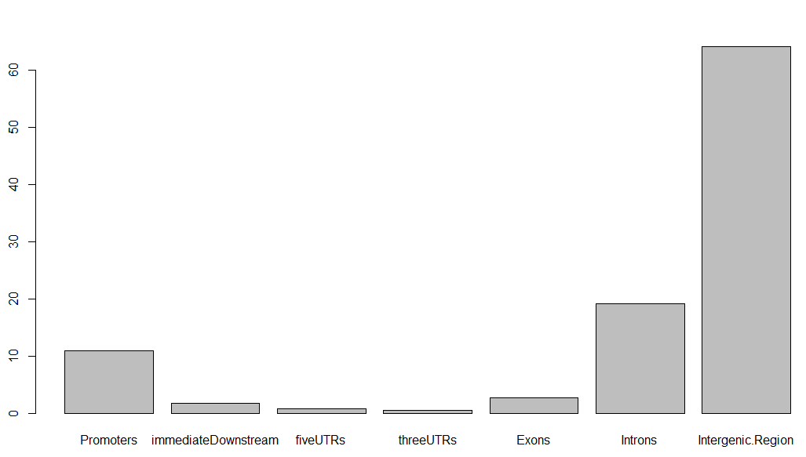

 

同理，对每个peaks文件，都可以做类似的分析！

但是对多个peaks文件，比如本文中的，想比较野生型和突变型MCF7细胞系的 BAF155 immunoprecipitates的结果的不同，就需要做peaks之间的差异分析，已经后续的差异基因注释啦

当然，值得一提的是peaks注释我更喜欢网页版工具，反正peaks文件非常小，直接上传到别人做好的web tools，就可立即出一大堆可视化图表分析结果啦，大家可以去试试看：

[http://chipseek.cgu.edu.tw/](http://chipseek.cgu.edu.tw/)

[http://bejerano.stanford.edu/great/public/html/](http://bejerano.stanford.edu/great/public/html/)

[http://liulab.dfci.harvard.edu/CEAS/](http://liulab.dfci.harvard.edu/CEAS/)

虽然我花费了大部分篇幅来描述ChIPpeakAnno这个包的用法，**但是真正的重点是你得明白peaks记录了什么，要注释什么，以及把这3个网页工具的可视化图表分析结果全部看懂，这网页版工具才是重点！**


---

##### 第八讲：寻找motif {-}

motif是比较有特征的短序列，会多次出现的，一般认为它的生物学意义重大，做完CHIP-seq分析之后，一般都会寻找motif 。

查找有两种，一种是de novo的，要求的输入文件的fasta序列，一般是根据peak的区域的坐标提取好序列；另一种是依赖于数据库的搜寻匹配，很多课题组会将现有的ChIP-seq数据进行整合，提供更全面，更准确的motif数据库。

**motif的定义如下：**

> motif: recurring pattern. eg, sequence motif, structure motif or network motif
>
> DNA sequence motif: short, recurring patterns in DNA that are presumed to have a biological function.

> 从上边的定义可以看出，其实motif这个**单词**就是形容一种反复出现的模式，而**序列motif**往往是DNA上的反复出现的模式，并被假设拥有生物学功能。而且，经常是一些具有序列特异性的蛋白的结合位点（如，转录因子）或者是涉及到重要生物过程的（如，RNA 起始，RNA 终止， RNA 剪切等等）。

摘抄自：[http://blog.163.com/zju_whw/blog/static/225753129201532104815301/](http://blog.163.com/zju_whw/blog/static/225753129201532104815301/)

motif最先是通过实验的方法发现的，换句话说，不是说有了ChIP-seq才有了motif分析，起始很早人们就开始研究motif了！例如，**'TATAAT’ box**在1975年就被pribnow发现了，它与上游的**‘TTGACA’motif**是RNA聚合酶结合位点的特异性序列。而且，当时的人们就知道，不是所有的结合位点都一定完美地与motif匹配，大部分都只匹配了12个碱基中的7-9个。结合位点与motif的匹配程度往往也与蛋白质与DNA的结合强弱有关。

目前被人们识别出来的motif也越来越多，如TRANSFAC和JASPAR数据库都有着大量转录因子的motif。而随着ChIP-seq数据的大量产出，motif的研究会进一步深入，有一些课题组会将现有的ChIP-seq数据进行整合，提供更全面，更准确的motif数据库。

从算法上来讲，这是很复杂的，我就不多说了，我这里主要讲best practice：

一篇文献列出了2014年以前的近乎所有知名的A survey of motif finding Web tools for detecting binding site motifs in ChIP-Seq data 链接见：[https://biologydirect.biomedcentral.com/articles/10.1186/1745-6150-9-4](https://biologydirect.biomedcentral.com/articles/10.1186/1745-6150-9-4)

 **最常用的是 MEME工具套件 ：**

 [http://meme-suite.org/](http://meme-suite.org/)  输入文件是fasta序列，需要对peaks进行转换，根据bed的基因坐标从基因组里面提取对应的序列咯： [http://bedtools.readthedocs.io/en/latest/content/tools/getfasta.html](http://bedtools.readthedocs.io/en/latest/content/tools/getfasta.html)

它里面集成了4个寻找motif 的工具，每个工具都是一篇文章，里面有详细描述具体原理，但是整个网页给人的感觉是too busy，让初学者无从下手。

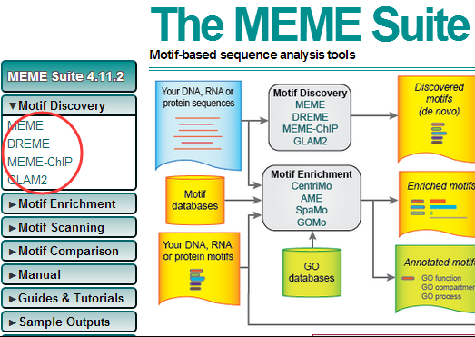


把自己的fasta序列上传上去即可，还是选取我们本次系列教程的数据

```
$ ls -lh  *fasta
-rw-r--r-- 1 Jimmy 197121  18M Jul  7 19:40 GSM1278641_Xu_MUT_rep1_BAF155_MUT_sequence.fasta
-rw-r--r-- 1 Jimmy 197121 9.9M Jul  7 19:38 GSM1278643_Xu_MUT_rep2_BAF155_MUT_sequence.fasta
-rw-r--r-- 1 Jimmy 197121  26M Jul  7 19:41 GSM1278645_Xu_WT_rep1_BAF155_sequence.fasta
-rw-r--r-- 1 Jimmy 197121  14M Jul  7 19:41 GSM1278647_Xu_WT_rep2_BAF155_sequence.fasta
```

然后就可以看到所有结果啦，大家可以试试看。

最后值得一提的是现在流行的R的bioconductor系列包，也可以寻找motif：

一般的R包都可以直接从BED文件里面记录的基因坐标来找motif，有点需要输入fasta序列，就需要自己根据bed的基因坐标从基因组里面提取对应的序列咯：

rGADEM (motif discovery): [http://bioconductor.org/packages/devel/bioc/html/rGADEM.html](http://bioconductor.org/packages/devel/bioc/html/rGADEM.html)

MotIV (motif validation): [http://bioconductor.org/packages/devel/bioc/html/MotIV.html](http://bioconductor.org/packages/devel/bioc/html/MotIV.html)

[http://lgsun.grc.nia.nih.gov/CisFinder/](http://lgsun.grc.nia.nih.gov/CisFinder/)

[http://bioinfo.cs.technion.ac.il/drim/](http://bioinfo.cs.technion.ac.il/drim/)

[http://www.ncbi.nlm.nih.gov/pubmed/20736340](http://www.ncbi.nlm.nih.gov/pubmed/20736340)

还有一个PICS (ChIP-seq): 虽然不是bioconductor的包 [http://www.rglab.org/pics-probabilistic-inference-for-chip-seq/](http://www.rglab.org/pics-probabilistic-inference-for-chip-seq/) 貌似国内被墙了，无法打开。


---

##### 第九讲：ChIP-seq可视化大全 {-}

讲到这里，我们的自学ChIP-seq分析系列教程就告一段落了，当然，我会随时查漏补缺，根据读者的反馈来更新着系列教程。

其实可视化这已经是一个比较复杂的方向了，不仅仅是针对于ChIP-seq数据。可视化本身是发文章的先决条件，而让人一目了然图片也说明了数据分析人员对数据本身的理解。我这里就列出一些目录和一些工具和ppt。这个主要靠大家自学，而且我博客空间有限，就不上传一大堆图片了，大家随便找一些经典的paper里面都会有很多可视化分析。

首先强烈推荐两个网页版工具，针对找到的peaks可视化:

[http://chipseek.cgu.edu.tw/](http://chipseek.cgu.edu.tw/)

[http://bejerano.stanford.edu/great/public/html/](http://bejerano.stanford.edu/great/public/html/)

然后再推荐一个哈佛刘小乐实验室出品的软件，也是专门为了作图 [http://liulab.dfci.harvard.edu/CEAS/usermanual.html](http://liulab.dfci.harvard.edu/CEAS/usermanual.html)

还有一个java工具：也可以可视化CHIP-seq的peaks结果EXPANDER (EXpression Analyzer and DisplayER) is a java-based tool for analysis of gene expression data.[http://acgt.cs.tau.ac.il/expander/help/ver7.0Help/html/Input_Data_.htm](http://acgt.cs.tau.ac.il/expander/help/ver7.0Help/html/Input_Data_.htm)

如图所示

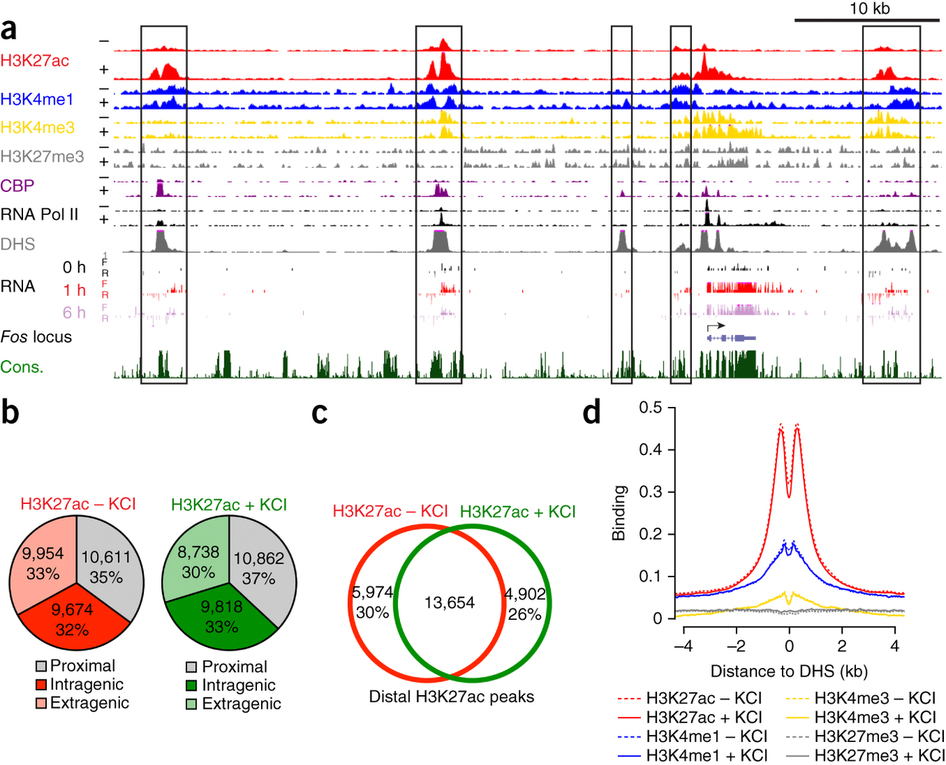

然后我所了解的图片大概有下面这些，都是有专门的软件，甚至自己写脚本也可以做的

- peaks长度分布柱状图
- 每个peak的测序情况可视化(IGV,sushi)
- 测序reads在全基因组各个染色体的分布(Chromosome ideograms)
- reads相对基因位置分布统计
- peaks相对基因位置分布统计
- reads在基因组位置分布统计（染色体分开作图）
- peaks在基因组位置分布统计（染色体分开作图）
- 统计peaks在各种基因组区域(基因上下游，5,3端UTR，启动子，内含子，外显子，基因间区域，- microRNA区域)分布情况，条形图和饼图均可
- peak与转录起始位点距离的分析（曲线图和热图）


**最后总结一下**

CHIP-seq pipeline :　[http://www.slideshare.net/COST-events/chipseq-data-analysis](http://www.slideshare.net/COST-events/chipseq-data-analysis)

大家一定要看这个ChIP-seq guidelines and practices of the ENCODE and modENCODE consortia.  [http://www.ncbi.nlm.nih.gov/pubmed/22955991](http://www.ncbi.nlm.nih.gov/pubmed/22955991)

#### ChIP-seq数据分析指引

##### 写在前面 {-}

参加了[RNA-seq基础入门 ](http://www.biotrainee.com/thread-1750-1-1.html )的朋友可以先看看 我以前分享过有参组学(全基因组，全外显子组学，转录组学，表观)的几个NGS测序数据分析的表现形式的异同点，主要是各个地方的测序深度，各个地方的覆盖情况的区别！

分析流程都是fastq-->bam-->vcf/expression/peaks，中间选择不同软件，不同参数而已。 视频在链接： http://pan.baidu.com/s/1jIQFGSA 密码：48uj

本次其实已经有不少人已经完成了，优秀作业如下：

* [jimmy的ChIP-seq实战分析](http://mp.weixin.qq.com/s/_A0rHldzEgVk7bgwt457qQ)
* [张生的ChIP-seq实战分析](https://mp.weixin.qq.com/s/mEwl7-f2WTNfmK-FkNkP0A)
* [赵小凡的ChIP-seq实战分析](http://mp.weixin.qq.com/s/LcAEzGEmjj37XYogeU3v6A)


##### step1:计算机资源的准备 {-}

这个跟转录组对计算资源的要求是大同小异的，最好是有mac或者linux系统，8G+的内存，500G的存储即可。

* 如果你是Windows，那么安装必须安装 git,notepad++,everything，还有虚拟机，在虚拟机里面安装linux，最好是ubuntu。
* 如果本身就是mac或者linux，那么很简单了，安装好wget吧

需要安装的各种ChIP-seq软件包括 sratoolkit,fastqc,bowtie2,samtools,htseq-count,bedtools,macs2,HOMER,R,Rstudio 

软件安装的代码，在生信技能树公众号后台回复老司机即可拿到。

如果呀详细了解计算机配置清单，软件安装等，请查看我们[公众号推文](http://mp.weixin.qq.com/s/e-m8edpa4G-uqZxY4affPA)

###### 作业1 {-}

安装好软件，下载软件的说明书，整理它们的官网链接。


##### step2:读文章拿到测序数据 {-}

本次讲解选取的文章是为了探索PRC1，PCR2这样的蛋白复合物，不是转录因子或者组蛋白的CHIP-seq，请注意区别。

文章题目

RYBP and Cbx7 define specific biological functions of polycomb complexes in mouse embryonic stem cells

https://www.ncbi.nlm.nih.gov/pubmed/23273917

从文章里面找到数据存放地址如下：

数据下载：

* https://www.ncbi.nlm.nih.gov/geo/query/acc.cgi?acc=GSE42466
* ftp://ftp-trace.ncbi.nlm.nih.gov/sra/sra-instant/reads/ByStudy/sra/SRP/SRP017/SRP017311

###### 作业2 {-}

看文章里的methods部分，把它用到的软件和参数摘抄下来，然后理解GEO/SRA数据库的数据存放形式，把规律和笔记发在论坛上面

##### step3:了解fastq测序数据 {-}

需要用安装好的sratoolkit把sra文件转换为fastq格式的测序文件，并且用fastqc软件及MultiQC汇总查看测试测序文件的质量！

###### 作业3 {-}

理解测序reads，GC含量，质量值，接头，index，fastqc的全部报告，搜索中文教程，并发在论坛上面。


##### step4:了解参考基因组及基因注释 {-}

在UCSC下载hg19参考基因组，我博客有详细说明，从gencode数据库下载基因注释文件，并且用IGV去查看你感兴趣的基因的结构，比如TP53,KRAS,EGFR等等。

###### 作业4 {-}

截图几个基因的IGV可视化结构！还可以下载ENSEMBL，NCBI的gtf，也导入IGV看看，截图基因结构。了解IGV常识。

##### step5:序列比对 {-}

比对软件很多，首先大家去收集一下，因为我们是带大家入门ChIP-seq基础，请统一用bowtie2，并且搞懂它的用法。 再思考一下为什么不同的组学数据有着不同的最佳比对软件。

直接去bowtie2的主页下载index文件即可，然后把fastq格式的reads比对上去得到sam文件。

接着用samtools把它转为bam文件，并且排序索引好，考虑一下是否需要去重PCR重复，载入IGV，再截图几个基因看看！

顺便对bam文件进行简单QC，参考直播我的基因组系列。

###### 作业5 {-}

把ChIP-seq比对得到的bam跟转录组的bam统一载入IGV，看看各种genomic features上面的reads分布的区别，想一想为什么是这样。


##### step6:寻找peaks {-}

peaks-calling的软件也不少，如果需要了解原理，请看我[前面的推文](http://mp.weixin.qq.com/s/tnbhwZ16QiAnWulCvBNFsQ)  这里统一用MACS2软件

###### 作业6 {-}

把通过macs2得到的bed格式peaks文件，也载入IGV，跟bam文件进行比较。

##### step7:peaks注释 {-}

得到的bed格式peaks文件只是记录每个peaks的染色体以及起始终止坐标，一般情况下需要看看该peaks在基因组的哪一个区段。
看看它们在各种基因组区域(基因上下游，5,3端UTR，启动子，内含子，外显子，基因间区域，microRNA区域)分布情况，但是一般的peaks都有近万个，所以需要批量注释！

能做CHIP-seq的peaks注释，有R的bioconductor包ChIPpeakAnno，以及chipseeker包，还有HOMER软件，大家都可以用一下。 注释完毕，顺便可视化一下。

###### 作业7 {-}

找到R包，并读文档，整理文档和链接，以及文档里面的例子，如何学习一个R包。 比较多种注释的结果的差异。

##### step8：信号的可视化 {-}

因为peaks在基因组的分布是有规律的，如果是集中在TSS附近，就可以画TSS附近的信号强度图，一些人为处理可以改变peaks的分布，同理信号强度也会改变，这个是大家的注意分析结果以及生物学一样。

可以选择NGSPLOT这个R包，或者deeptools这个python软件，个人比较喜欢deeptools

这里可以选择

###### 作业8 {-}

得到一些genomic features的信号强度可视化图。

##### 后记 {-}

因为本文选择的是PRC1，PCR2这样的蛋白复合物，不是转录因子或者组蛋白的CHIP-seq，所以一般不需要做motif等等。

而且我们文章并没有设计处理前后的IP实验，没有peaks的变化，也不需要找差异结合位点。

#### 450K甲基化芯片数据处理传送门

##### 写在前面 {-}

Illumina甲基化芯片目前仍是很多实验室做甲基化项目的首选，尤其是对于大样本研究而言，其性价比相当高。这种芯片的发展主要经历了27K、450K以及850K，目前积累的数据主要是450K芯片的，未来850K可能会成为主流。之前我写过一篇[450K芯片预处理的帖子](http://www.biotrainee.com/thread-237-1-1.html)，其中也介绍了这种芯片的基础知识以及流程图和代码，大家可以先看看。芯片的处理流程一般就是：**数据读入——数据过滤——数据校正——下游分析。**

##### step1:计算机资源的准备 {-}

与测序相比，芯片的处理可能对计算资源的要求是不算高，主要使用的工具就是R，R的使用比较耗内存，尤其是处理大批量数据的时候。

R本身是支持各种系统的，所以不管是mac、windows还是linux理论上都是可以的，只要下载对应版本即可。当然，如果你会linux最好在linux操作。其实数据分析很多都是相通的，所以之前群主推荐的配置和工具都是可以拿来用的。

需要安装的R packages包括 ChAMP，minfi和wateRmelon等.

###### 作业1 {-}

1. 安装好R软件及相应的包，下载R包的说明书，整理它们的官网链接。
2. 了解illumina 450K甲基化芯片的探针设计，下载manifest文件。

##### step2:读文章拿到测序数据 {-}

本次讲解用到的数据来自文章[The relationship between DNA methylation, genetic and expression inter-individual variation in untransformed human fibroblast](https://www.ncbi.nlm.nih.gov/pubmed/24555846)

从文章里面找到数据存放地址如下：https://www.ncbi.nlm.nih.gov/geo/query/acc.cgi?acc=GSE52025

###### 作业2 {-}

看文章里的methods部分，把它的分析步骤摘抄下来，然后理解GEO数据库的数据存放形式，把规律和笔记发在论坛上面，类似于[RNA-seq数据处理入门](http://www.biotrainee.com/thread-1750-1-1.html)和[CHIP-seq数据处理入门](http://www.biotrainee.com/thread-2013-1-1.html)

##### step3:了解芯片数据 {-}

需要阅读相关的资料，比如illumina的官网介绍及相关的文献，对甲基化及该芯片的技术核心有一定了解，对于存在的问题也要知道，这对于后面分析时理解校正的意义非常重要！

###### 作业3 {-}

理解芯片的probe，Bead，p值，I型探针和II型探针等。

##### step4:了解probe注释 {-}

在GEO或者illumina下载450K注释文件，理解每一列的意义及探针的分类。或者下载官网的manifest文件并且理解。

###### 作业4 {-}

下载注释文件，理解甲基化探针的分类及注释。

##### step5:数据读入 {-}

处理甲基化芯片的R包其实很多，我之前用的是minfi，现在用ChAMP应该更加方便，它整合了很多分析处理数据的方法，例如过滤和校正等，所以大家可以以ChAMP为主。

###### 作业5 {-}

查看甲基化芯片文件的命名规则，整理文件读入所需的表格，使用ChAMP包读入文件。

##### step6:数据过滤及数据校正 {-}

数据过滤主要是根据p值和bead数，probe还需要注意过滤snp和multiple-hit，样本过滤可以考虑PCA或MDS，很多时候R包会直接帮我们做了，但是需要对过滤的标准做到心中有数。

数据校正主要是I型探针和II型探针校正，批次校正和混杂因素校正等。

###### 作业6 {-}

根据p值和bead数过滤探针和样本，过滤SNP和multiple-hit的探针，使用BMIQ校正探针类型，使用combat校正批次效应，使用lm校正混杂因素。

##### step7:下游分析 {-}

下游分析一般根据需求来定，比如差异甲基化分析、甲基化与表达的整合分析等。

##### 作业7 {-}

学习T-test和线性回归的差异甲基化分析。

##### step8：探针注释、绘图等 {-}

甲基化探针可以根据官方给的注释文件进行基因和CGI的注释。

也可以使用webgestalt对感兴趣的探针做GO和Pathway的分析。

可以使用ggplot等对探针的分布进行绘图。

###### 作业8 {-}

理解甲基化探针的CGI及基因位置注释并且简单可视化。


### 微生物组

“微生物组”（microbiome）是指存在于特定环境（生态位，biotype）中所有微生物种类及其遗传信息和功能的集合，其不仅包括该环境中微生物间的相互作用，还包括有微生物与该环境中其它物种及环境的相互作用。

微生物组本身就包含了上面的基因组，转录组的数据分析，同时也涉及到蛋白和代谢的组学研究。

微生物作为地球上进化历史最长、生物量最大、生物多样性最丰富的生命形式，推动地球化学物质循环，影响人类健康乃至地球生态系统，蕴藏着极为丰富的物种资源和基因资源。在自然条件下，各类微生物与其所处的环境及环境中存在的宿主构成了复杂的生态系统，微生物以其社会行为，在维护人类健康及地球生态系统物质循环中发挥着不可替代的作用。

正因为认识到了微生物对人和地球的重要性，美国一批处在学科前沿的科学家就曾在《科学》周刊上，提出开展“联合微生物组研究计划（Unified Microbiome Initiative，简称 UMI）”的建议。

UMI是经由白宫科学与技术政策办公室、加利福尼亚Oxnard的Kavli基金会组织这些科学家经过一系列研讨后提出来。UMI将把美国国立卫生研究院、美国自然基金委、美国农业部、美国能源部、美国环境总署等政府部门和私立基金会以及企业界的力量动员和整合起来，开展对人体、植物、动物、土壤和海洋等几乎所有环境中微生物组的深入研究。这是美国在推出脑科学计划和精准医学计划以后，又一个举世瞩目的大科学计划。

#### 细菌序列的功能预测与注释 {-}

目前在NCBI等数据库中拥有大部分细菌的全基因组序列，这些全基因序列涵盖了这些细菌的功能以及代谢途径等信息。研究者在细菌16S扩增子测序中，通常会使用[PICRUST](http://huttenhower.sph.harvard.edu/galaxy/root?tool_id=PICRUSt_normalize)及[Tax4Fun](http://tax4fun.gobics.de/)进行细菌功能预测与注释。

#### 真菌序列的功能预测与注释 {-}

由于目前真菌的全基因信息相对较少，而且真菌基因组远比细菌复杂，所以对真菌群落的研究一直没有很好地办法直接把其分类信息注释到功能基因以及代谢途径的信息上去。在2016年Nguyen开发了一个使用在线的和本地的python语言写的脚本，[FUNGuild](http://www.stbates.org/guilds/app.php)来对真菌的扩增子测序拿到的OUT table 进行基本的功能注释。目前它还只能对真菌的物种信息注释到其是病原、共生、腐生这三大类，并进一步细分为12个小类：

- 动物病原菌（animalpathogens）
- 丛枝菌根真菌（arbuscularmycorrhizal fungi）
- 外生菌根真菌（ectomycorrhizal fungi）
- 杜鹃花类菌根真菌（ericoidmycorrhizal fungi）
- 叶内生真菌（foliar endophytes）
- 地衣寄生真菌（lichenicolousfungi）
- 地衣共生真菌（lichenizedfungi）
- 菌寄生真菌（mycoparasites）
- 植物病原菌（plantpathogens）
- 未定义根内生真菌（undefinedroot endophytes）
- 未定义腐生真菌（undefinedsaprotrophs）
- 木质腐生真菌（woodsaprotrophs）

还包括三类形态特殊的真菌：yeast、facultativeyeast和thallus。 

网页工具使用也非常简单，就是把格式为.txt或.csv的OUT table上传到网页即可。最后可以统计出不同guild的比例做柱状图、可以分析TOP丰度OTU的guild情况，也可以结合理化因子等对研究对象做出合理的解释与假设等等。 

这样功能分类就搞定了，再通过生物信息学脚本将物种分类与功能guild分类联系起来就大功告成啦并对其所有的注释信息给出文献的出处，但这也是真菌宏基因研究从单纯群落结构分析转向功能结构分析迈出的重要一步。


### 蛋白质组

蛋白质组学（Proteomics）是指在**大规模水平上研究蛋白质的特征**，包括蛋白质的表达水平，翻译后修饰，蛋白与蛋白相互作用等，由此获得蛋白质水平关于疾病发生、细胞代谢等过程的整体而全面的认识。从蛋白角度分析疾病发生与发展的分子机理，挖掘疾病标志物（biomarker），并为免疫治疗和药物开发提供强力支撑，迈进精准医疗。蛋白质组的研究不仅为生命活动规律提供物质基础，也为多种疾病机制的阐明及攻克提供理论。

蛋白质组学的研究是生命科学进入后基因组时代的特征，不仅是探索生命奥秘的必须工作，也能为人类健康事业带来巨大的利益。蛋白质不仅能为生命活动规律提供物质基础，而且蛋白质丰度的改变能够阐明多种疾病的机理。

#### 定量蛋白质组学

**定量蛋白质组学**是蛋白质组学中非常重要的研究方向。目前有很多定量方法例如SILAC, TMT, LFQ, PRM等多种方法，每种方法都有各自的优缺点，如何根据实验需求选择合适的定量方法是实验中的难点和热点。

##### 蛋白质芯片（Protein Array）{-}

> 蛋白质芯片检测技术，是将大量不同的蛋白质有序地排列、固定于固相载体表面，形成微阵列，利用蛋白质分子间特异性结合的原理，实现对生物蛋白质分子精准、快速、高通量的检测。

主要类型：

* 夹心法芯片(Sandwich-based Array)
* 标记法芯片(Label-based Array)
* 定量芯片(Quantitative Array)
* 半定量芯片(Semi-Quantitative Array)

##### 质谱（Mass Spectrometry）{-}

> 质谱法是利用电场和磁场，将运动的离子按它们的质荷比分离后，测出离子准确质量并确定离子的化合物组成，即是通过分析样品的离子质荷比而实现对样品的定性和定量的一种方法。

主要类型：

* 二维电泳+质谱(2D/Mass Spectrometry, MS) 
* 表面增强激光解吸电离飞行时间质谱(Surface-enhanced laser desorption/ionization-time of flight, SELDI)
* 同位素标记相对和绝对定量(Isobaric tags for relative and absolute quantitation, iTRAQ)


#### 修饰蛋白质组学

**翻译后修饰**是指对翻译后的蛋白质进行共价加工的过程，通过在一个或多个氨基酸残基加上修饰基团，可以改变蛋白质的理化性质。许多至关重要的生命进程不仅由蛋白质的相对丰度控制，更重要的是受到时空特异性和翻译后修饰的调控，揭示翻译后修饰的发生规律是解析蛋白质复杂多样的生物功能的一个重要前提。

常见的翻译后修饰包括**磷酸化**、**糖基化**、**乙酰化**、**泛素化**等等，具体如下表:

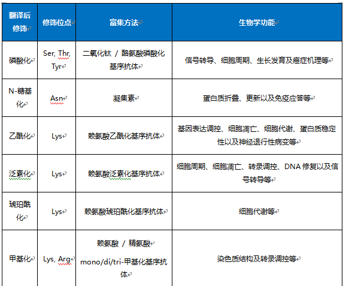


质谱是鉴定蛋白质翻译后修饰的重要方法，其原理是利用蛋白质发生修饰后的质量偏移来实现翻译后修饰位点的鉴定；同时，由于翻译后修饰的蛋白质在样本中含量低且动态范围广，检测前需要对发生修饰的蛋白质或肽段进行富集，然后再进行质谱鉴定。


#### 定量修饰蛋白质组学

**修饰蛋白质组学定量分析**主要是将修饰蛋白质或肽段富集方法与蛋白质组学相对定量的技术结合起来，在鉴定翻译后修饰位点的同时，对不同样本中翻译后修饰的程度进行相对定量，从而实现大规模的修饰蛋白质组学定性和定量分析；通常用于修饰定量分析的蛋白质组学方法包括非标记定量Label free，标记定量iTRAQ及SILAC。 根据技术原理可以分为两种

- 同重元素标记法和非标记法（lable free）。其中标记法依据使用的平台不一样可分为iTRAQ（ABI公司，分4标和8标）和TMT（Thermo公司，分2-10标）
- 非标记法根据数据采集的模式可以分为两种：lable free（DDA，Data Dependent Acquisition）和DIA（DIA，Data-Independent Acquisition）。

定量之后就可以走转录组数据的分析流程了，包括差异表达，GO/KEGG等功能数据库的注释，共表达热图，相关分析。 具体分析流程如下：


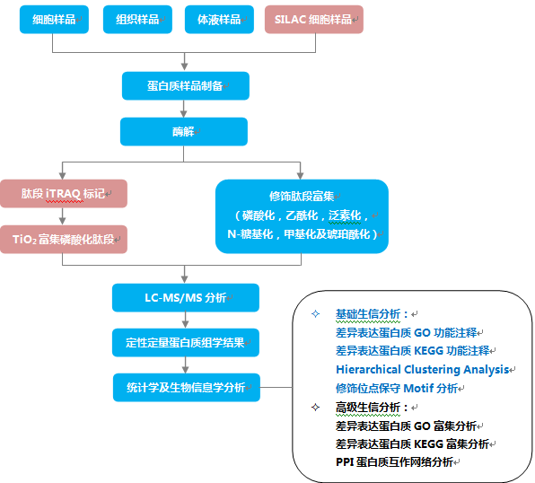

### 代谢组

**代谢组学**是继基因组学和蛋白质组学之后新发展起来的一门学科，它通过对**人体内小分子代谢物（50~1,500 Da）**进行精准定性定量，分析代谢物与人体生理病理变化的关系，研究疾病发生发展、寻找疾病生物标记物、预测疾病预后等。代谢组学在临床诊断上将有广阔的发展前景，主要应用方向有四个方面：

* 临床诊断（Biomarker）
* 病因与病理机制
* 临床用药指导中
* 临床前动物模型筛选上

机体在环境因素作用下，复杂信号通路中基因、酶、蛋白调节**最终结果的整体体现为代谢表型。**精准医疗相比传统医疗最大的优势体现在它是根据个体的差异有针对性地实施治疗策略，提高个体疾病治疗的成功率和有效率，可减少治疗后的副作用。代谢组学通过高分辨的**质谱、核磁等分析技术**，检测体液当中的代谢产物，通过模式识别模型筛选和疾病相关的代谢标志物。这些代谢标志物的变化体现了机体与饮食、生活方式、肠道菌群、地理位置及遗传背景等因素相互作用的结果。

最终体现在代谢表型的差异上。因此，代谢表型的不同反映了由遗传背景及环境因素所引起的个体差异。代谢组学技术的特点体现为代谢表型的特点。首先人体代谢表型由遗传背景和环境双重因素决定。

#### 代谢组学相关数据库

常用的代谢组学相关数据库有人类代谢组数据库[Human Metabolome Database， HMDB](http://www.hmdb.ca/)、[KEGG数据]库(http://www.genome.jp/kegg/pathway.html)、[Reactome数据库](http://www.reactome.org)等，一一介绍如下：

* 人类代谢组数据库（HMDB）是代谢组学热门数据库之一，包含人体内发现的小分子代谢物的详细信息，包含不少于79,650种代谢物条目。
* SMPDB数据库与HMDB关联，包含约700种人类代谢和疾病途径的途径图。KEGG数据库是代谢组热门数据库之一，包含代谢通路和互作网络信息。
* Reactome数据库主要收集了人体主要代谢通路信息以及重要反应。
* MassBank数据库主要收集许多高分辨率低代谢组分的谱图。

**BioCyc数据库**包含通路和基因组数据。METLIN数据库，是商业化的代谢组及串联质谱数据库，包含有约43000种代谢物和22000个MS/MS谱图。FiehnLib数据库是商业化的代谢组数据库，包含约1000个保守的代谢分子的EI光谱。

**NIST/EPA/NIH Mass Spectral Library数据库**也是商业化的代谢组数据库，包含超过190,000 个EI谱图。 BioCyc数据库收集了通路和基因组数据，可以免费使用。MetaCyc数据库广泛收集了许多来自不同生物体的代谢通路以及酶的信息，囊括了超过51000篇文献。MMCD数据库收集有超过10000种代谢物的信息以及它们的质谱和核磁共振谱数据，大多数是拟南芥的代谢物。

如何更好地整合各种组学数据目前仍是生物学界面临的一个重大挑战，并且有时还要面对不够完善的实验设计、不同实验平台的数据的整合。常用的方法是代谢通路水平的分析、生物网络分析、经验关联分析等。

#### 代谢组学相关网页工具

> 有一些软件或网站可以提供现成的整合多种组学数据的分析。

* 如可以进行代谢通路富集分析的有：IMPaLA网站，使用了来自11个数据库等3000多个代谢通路的信息，可以用于整合多种组学的分析；此外还有iPEAP软件，MetaboAnalyst网站等也可以提供代谢通路富集分析。


* 提供生物网络分析的包括：SAMNetWeb网站，可以提供转录组和蛋白组的通路腹肌分析和网络分析；pwOmics包，是R软件包，能够由随着时间变化的数转录组和蛋白组信息构建网络；相似的软件还有MetaMapR（R软件包，拥有用户界面）、MetScape（Cytoscape插件） 、Grinn（R软件包）等。


* 可以进行经验关联分析的有：WGCNA（R软件包），可以基于相关性和网络拓扑结构对多种组学数据进行整合分析；其他R软件包还有MixOmic、DiffCorr、qpgraph、huge。


#### 代谢组学数据特点

代谢组学数据具有以下特点：

- 高噪声：生物体内含有大量维持自身正常功能的内源性小分子，具有特定研究意义的生物标志物只是其中很少一部分，绝大部分代谢物和研究目的无关。
- 高维、小样本：代谢物的数目远大于样品个数，不适合使用传统的统计学方法进行分析，多变量分析容易出现过拟合和维数灾难问题。
- 高变异性：一是不同代谢物质的理化性质差异巨大，其浓度含量动态范围宽达7～9个数量级，二是生物个体间存在各种来源的变异，如年龄、性别都可能影响代谢产物的变化，三是仪器测量受各种因素影响，容易出现随机测量误差和系统误差，这使得识别有重要作用的生物标志物可能极其困难。
- 相互作用关系复杂：各种代谢物质可能不仅具有简单的相加效应，而且可能具有交互作用，从而增加了识别这些具有复杂关系的生物标志物的难度。
- 相关性和冗余性：各种代谢物并非独立存在，而是相互之间具有不同程度的相关性，同时由于碎片、加合物和同位素的存在使得数据结构存在很大的冗余性，这就需要采用合理的统计分析策略来揭示隐藏其中的复杂数据关系。
- 分布的不规则和稀疏性： 代谢组学数据分布不规则，而且数据具有稀疏性（即有很多值为零) ，因此，传统的一些线性和参数分析方法此时可能失效。

#### 代谢组数据分析

说起代谢组数据分析软件，可能大家第一个想到的就是SIMCA-P。[SIMCA-P](http://umetrics.com/products/simca)软件是由Umetrics公司在1987研究开发，目前是一款公认的多元变量统计分析软件，被绝大多数代谢组服务提供商所采用。

SIMCA-P虽然是一款强大的多元变量统计分析软件，但也有不足之处：

1. SIMCA-P是一款商业软件，需要收费（但有30天免费试用），windows版本的。对于想使用免费软件的老师来说，不那么友好；
2. 代谢组数据的分析除了多元变量统计分析，还有原始数据前处理（pre-processing）、数据处理（processing）、单变量统计分析等，很显然SIMCA-P在这些方面力不从心。

在《Metabolomics-Fundamentals and Applications》这本书的第四章节《Processing and Visualization of Metabolomics Data Using R》中，作者列出了一些代谢组数据处理、统计分析与可视化的开源免费软件工具！

数据分析的流程

1）数据预处理；2）PCA分析；3）PLS-DA分析；4）OPLS-DA分析；5）差异化合物筛选；6）差异化合物鉴定；7）多组分关联分析（同一个体同时取多组分）；8）代谢通路分析；9）多组学数据关联分析（具备多组学数据）

##### 数据的预处理{-}

代谢组学数据分析的目的是希望从中挖掘出生物相关信息，然而，代谢组学数据的变异来源很多，不仅包括生物变异，还包括环境影响和操作性误差等方面。

处理手段主要包括归一化（standardization) 、标准化（normalization) ，即中心化（centering) 和尺度化（scaling)，以及数据转换（transformation)。

##### 归一化是针对样品的操作 {-}

由于生物个体间较大的代谢物浓度差异或样品采集过程中的差异（如取不同时间的尿样) ，为了消除或减轻这种不均一性，一般使用代谢物的相对浓度，即每个代谢物除以样品的总浓度，以此来校正个体差异或其他因素对代谢物绝对浓度的影响。

##### 标准化是对不同样品代谢物的操作 {-}

即统计学意义上的变量标准化。标准化的目的是消除不同代谢物浓度数量级的差别，但同时也可能会过分夸大低浓度组分的重要性，即低浓度代谢物的变异系数可能更大。

数据转换是指对数据进行非线性变换，如log转换和power转换等。数据转换的目的是将一些偏态分布的数据转换成对称分布的数据，并消除异方差性的影响，以满足一些线性分析技术的要求。不同的预处理方法会对统计分析结果产生不同的影响（见表1) ，在实际应用中，我们应该根据具体的研究目的﹑数据类型以及要选用的统计分析方法综合考虑，选择适当的预处理方式。例如，Robert A. van den Berg等（2006) 通过实际代谢组学数据的分析发现，选用不同预处理方法在很大程度上影响着主成分分析（PCA) 的结果，自动尺度化（auto scaling)和全距尺度化（range scaling) 在对代谢组学数据进行探索性分析时表现更优，其PCA 分析后的结果在生物学上能够得到更合理的解释。

##### 单变量分析方法 {-}

单变量分析方法简便﹑直观和容易理解，在代谢组学研究中通常用来快速考察各个代谢物在不同类别之间的差异。

代谢组学数据在一般情况下难以满足参数检验的条件，使用较多的是非参数检验的方法，如Wilcoxon 秩和检验或Kruskal-Wallis 检验，t’检验也是一种比较好的统计检验方法。

由于代谢组学数据具有高维的特点，所以在进行单变量分析时，会面临多重假设检验的问题。如果我们不对每次假设检验的检验水准α进行校正，则总体犯一类错误的概率会明显增加。

一种解决方法是采用Bonferion校正，即用原检验水准除以假设检验的次数m作为每次假设检验新的检验水准（α/m) 。由于Bonferion校正的方法过于保守，会明显降低检验效能，所以在实际中更为流行的一种做法是使用阳性发现错误率（false discovery rate，FDR) 。

这种方法可用于估计多重假设检验的阳性结果中，可能包含多少假阳性结果。FDR 方法不仅能够将假阳性的比例控制在规定的范围内，而且较之传统的方法在检验效能上也得到显著的提高。

实际中也可以使用局部FDR（用fdr表示) ，其定义为某一次检验差异显著时，其结果为假阳性的概率。局部FDR 的使用，使得我们能够估计出任意变量为假阳性的概率，通常情况下有FDR≤fdr。

除了进行传统的单变量假设检验分析，代谢组学分析中通常也计算代谢物浓度在两组间的改变倍数值（fold change) ，如计算某个代谢物浓度在两组中的均值之比，判断该代谢物在两组之间的高低表达。计算ROC 曲线下面积（AUC) 也是一种经常使用的方法。

##### 多变量分析 {-}

代谢组学产生的是高维的数据，单变量分析不能揭示变量间复杂的相互作用关系，因此多变量统计分析在代谢组学数据分析中具有重要的作用。

总体来说，代谢组学数据多变量统计分析方法大致可以分为两类：

- 一类为非监督的学习方法，即在不给定样本标签的情况下对训练样本进行学习，如PCA、非线性映射（NLM) 等；
- 另一类为有监督的学习方法，即在给定样本标签的情况下对训练样本进行学习，如偏最小二乘判别分析（PLS-DA) 、基于正交信号校正的偏最小二乘判别分析（OPLS-DA) 、人工神经网络（ANN) 、支持向量机（SVM) 等。其中，PCA、PLS-DA和OPLS-DA是目前代谢组学领域中使用最为普遍的多变量统计分析方法。

##### PCA {-}

PCA是从原始变量之间的相互关系入手，根据变异最大化的原则将其线性变换到几个独立的综合指标上（即主成分) ，取2～3个主成分作图，直观地描述不同组别之间的代谢模式差别和聚类结果，并通过载荷图寻找对组间分类有贡献的原始变量作为生物标志物。通常情况下，由于代谢组学数据具有高维、小样本的特性，同时有噪声变量的干扰，PCA的分类结果往往不够理想。

尽管如此，PCA作为代谢组学数据的预分析和质量控制步骤，通常用于观察是否具有组间分类趋势和数据离群点。在组间分类趋势明显时，说明其中一定有能够分类的标志物。

PCA还可以用于分析质控样品是否聚集在一起，如果很分散或具有一定的变化趋势，则说明检测质量存在一定的问题。Zhang Zhiyu 等（2010) 通过PCA 成功区分了骨肉瘤患者和正常人，并发现良性骨肿瘤患者中有两例是异常值。Kishore K. Pasikanti 等（2009) 利用PCA 对尿液膀胱癌代谢组学数据进行分析后观察到质控样品在PCA得分图上紧密聚集，从而验证了仪器检测的稳定性和代谢组学数据的可靠性。

 

##### PLS-DA {-}

PLS-DA 是目前代谢组学数据分析中最常使用的一种分类方法，它在降维的同时结合了回归模型，并利用一定的判别阈值对回归结果进行判别分析。ZhangTao 等（2013) 运用PLS-DA技术分析尿液卵巢癌代谢组学数据，成功将卵巢癌患者和良性卵巢肿瘤患者以及子宫肌瘤患者相互鉴别，并鉴定出组氨酸、色氨酸、核苷酸等多种具有判别能力的卵巢癌生物标志物。

PLS的思想是，通过最大化自变量数据和应变量数据集之间的协方差来构建正交得分向量（潜变量或主成分) ，从而拟合自变量数据和应变量数据之间的线性关系。

**PLS**的降维方法与**PCA **的不同之处在于**PLS **既分解自变量**X **矩阵也分解应变量**Y **矩阵，并在分解时利用其协方差信息，从而使降维效果较**PCA **能够更高效地提取组间变异信息。

当因变量Y为二分类情况下，通常一类编码为1，另一类编码为0或-1；当因变量Y为多分类时，则需将其化为哑变量。通常，评价PLS-DA 模型拟合效果使用R2X、R2Y和Q2Y这三个指标，这些指标越接近1 表示PLS-DA 模型拟合数据效果越好。其中，R2X 和R2Y 分别表示PLSDA分类模型所能够解释X 和Y 矩阵信息的百分比，Q2Y 则为通过交叉验证计算得出，用以评价PLS-DA模型的预测能力，Q2Y 越大代表模型预测效果较好。

实际中，PLS-DA 得分图常用来直观地展示模型的分类效果，图中两组样品分离程度越大，说明分类效果越显著。代谢组学数据分析中另一种常用的方法是OPLS-DA，它是PLS-DA 的扩展，即首先使用正交信号校正技术，将X 矩阵信息分解成与Y 相关和不相关的两类信息，然后过滤掉与分类无关的信息，相关的信息主要集中在第一个预测成分。Johan Trygg 等认为该方法可以在不降低模型预测能力的前提下，有效减少模型的复杂性和增强模型的解释能力。

与PLSDA模型相同，可以用R2X、R2Y、Q2Y 和OPLS-DA 得分图来评价模型的分类效果。Carolyn M. Slupsky 等（2010) 使用OPLS-DA 发现卵巢癌患者、乳腺癌患者、正常人这三者之间的尿液代谢轮廓显著不同，从而推断尿液代谢组学可能为癌症的特异性诊断提供重要依据。

由于代谢组学数据具有高维、小样本的特性，使用有监督学习方法进行分析时很容易产生过拟合的现象。

为此，需要使用置换检验考察PLS-DA 在无差异情况下的建模效果。该方法在固定X 矩阵的前提下，随机置换Y分类标签n次，每次随机置换后建立新的PLS-DA 模型，并计算相应的R2Y 和Q2Y； 然后，与真实标签模型得到的结果进行比较，用图形直观表达是否有过拟合现象。

由于样本量的不足，通常采用上述的交叉验证和置换检验方法作为模型验证方法。而实际中，在样本量允许的情况下，最为有效的模型验证方法即将整个数据集严格按照时间顺序划分为内部训练数据和外部测试数据两部分，利用内部训练数据建立模型，再对外部测试数据进行预测，客观地评价模型的有效性和适用性

##### 生物标志物的筛选 {-}

代谢组学分析的最终目标是希望从中筛选出潜在的生物相关标志物，从而探索其中的生物代谢机制，因此需要借助一定的特征筛选方法进行变量筛选。

对于高维代谢组学数据的特征筛选，研究的目的是从中找出对样本分类能力最强或较强的一个或若干个变量。**特征筛选方法主要分为三类： 过滤法、封装法和嵌入法**。


- **过滤法**主要是采用单变量筛选方法对变量进行筛选，优点是简单而快捷，能够快速的降维，如t’检验、Wilcoxon秩和检验、SAM等方法。
- **封装法**是一种多变量特征筛选策略，通常是以判别模型分类准确性作为优化函数的前向选择、后向选择和浮动搜索特征变量的算法，它通常是按照“节省原则”进行特征筛选，最终模型可能仅保留其中很少部分的重要变量，如遗传算法等。
- **嵌入法**的基本思想是将变量选择与分类模型的建立融合在一起，变量的重要性评价依靠特定分类模型的算法实现，在建立模型的同时，可以给出各变量重要性的得分值，如PLS-DA方法的VIP统计量等。

为了更加客观、全面地评价每个变量的重要性，代谢组学研究中一般采取将上述方法结合起来的方式进行变量筛选。比较常见的一种策略是先进行单变量分析，再结合多变量模型中变量重要性评分作为筛选标准，如挑选fdr≤0.05 和VIP＞1.5的变量作为潜在生物标志物。

用筛选的潜在生物标志物对外部测试数据集进行预测，评价其预测效果。最后，可以通过研究生物标志物的生物学功能和代谢通路，分析不同生物标志物之间的相互作用和关系，从而为探索生物代谢机制提供重要线索和信息。

Yang Jinglei 等（2013) 即在代谢组学分析中使用fdr≤0.2和VIP＞1.5的双重标准来筛选精神分裂症的特异生物标志物，所筛选出的差异代谢物其AUC 在训练数据中达94. 5%，外部测试数据中达0. 895。


